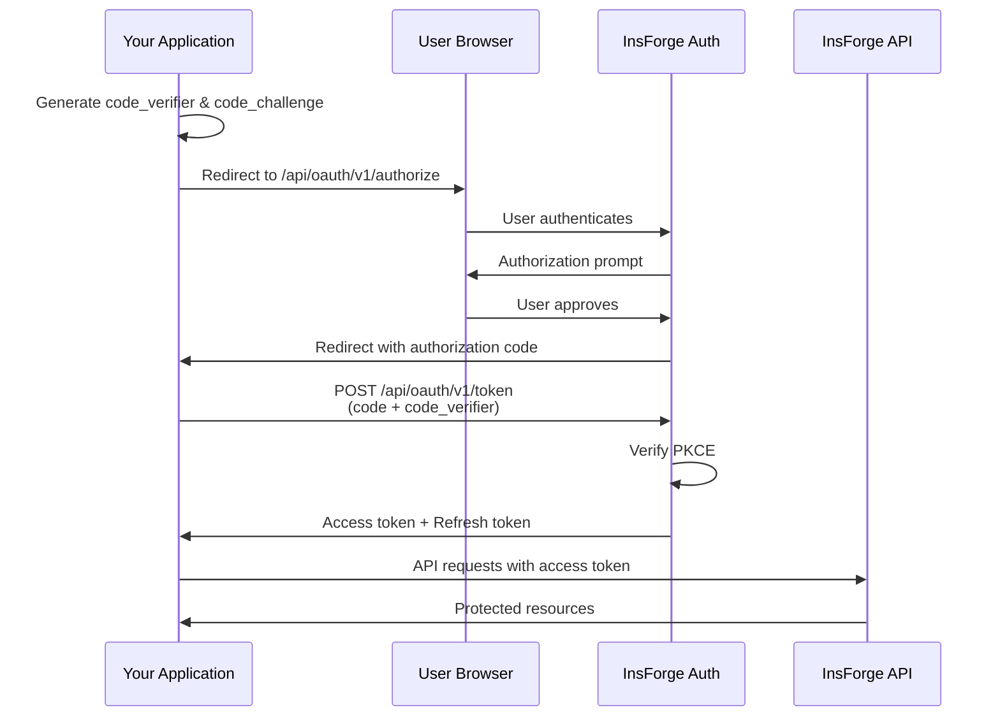

## Overview

InsForge can function as an OAuth 2.0 identity provider, allowing third-party applications to authenticate users with "Sign in with InsForge". This enables developers building on your platform to leverage InsForge's authentication system without managing their own user credentials.

## Use Cases

<CardGroup cols={2}>
  <Card title="Developer Platforms" icon="code">
    Enable third-party developers to build integrations with "Sign in with InsForge" while you maintain control over user data access.
  </Card>

  <Card title="AI Agents & MCP" icon="robot">
    Authenticate AI agents and LLM tools via Model Context Protocol with OAuth-based authorization.
  </Card>

  <Card title="Partner Applications" icon="handshake">
    Allow partner applications to authenticate users against your InsForge project without sharing credentials.
  </Card>

  <Card title="CLI & Desktop Apps" icon="terminal">
    Issue OAuth tokens to command-line tools and desktop applications that need API access.
  </Card>
</CardGroup>

## OAuth 2.0 Flow

InsForge implements the **Authorization Code flow with PKCE** (Proof Key for Code Exchange), the most secure OAuth flow for both web and native applications.



## Getting Started

<Steps>
  <Step title="Register Your Application">
    Contact InsForge to register your application as an OAuth client. You'll receive:
    - **Client ID**: Public identifier for your application
    - **Client Secret**: Confidential key for server-side token exchange
    - **Allowed Redirect URIs**: URLs where users can be redirected after authorization
  </Step>

  <Step title="Configure Scopes">
    Define which permissions your application needs:

    | Scope | Description |
    |-------|-------------|
    | `user:read` | Read user profile information |
    | `organizations:read` | List user's organizations |
    | `projects:read` | Read project metadata |
    | `projects:write` | Create and modify projects |
  </Step>

  <Step title="Implement Authorization Flow">
    Integrate the OAuth flow into your application using the endpoints below.
  </Step>
</Steps>

## Endpoints

### Authorization Endpoint

Redirect users to this endpoint to initiate the OAuth flow.

```
GET https://api.insforge.dev/api/oauth/v1/authorize
```

**Query Parameters:**

| Parameter | Required | Description |
|-----------|----------|-------------|
| `client_id` | Yes | Your application's client ID |
| `redirect_uri` | Yes | URL to redirect after authorization (must be pre-registered) |
| `response_type` | Yes | Must be `code` |
| `scope` | Yes | Space-separated list of scopes |
| `state` | Yes | Random string for CSRF protection |
| `code_challenge` | Yes | PKCE code challenge (base64url-encoded SHA256 hash) |
| `code_challenge_method` | Yes | Must be `S256` |

**Example:**

```
https://api.insforge.dev/api/oauth/v1/authorize?
  client_id=clf_abc123xyz&
  redirect_uri=https://example.com/callback&
  response_type=code&
  scope=user:read%20organizations:read&
  state=random_state_string&
  code_challenge=E9Melhoa2OwvFrEMTJguCHaoeK1t8URWbuGJSstw-cM&
  code_challenge_method=S256
```

### Token Endpoint

Exchange the authorization code for access and refresh tokens.

```
POST https://api.insforge.dev/api/oauth/v1/token
```

**Request Body (JSON):**

```json
{
  "grant_type": "authorization_code",
  "code": "AUTH_CODE_FROM_CALLBACK",
  "redirect_uri": "https://example.com/callback",
  "client_id": "clf_abc123xyz",
  "client_secret": "your_client_secret",
  "code_verifier": "your_original_code_verifier"
}
```

**Response:**

```json
{
  "access_token": "eyJhbGciOiJIUzI1NiIs...",
  "refresh_token": "eyJhbGciOiJIUzI1NiIs...",
  "token_type": "Bearer",
  "expires_in": 3600
}
```

### Refresh Token

Exchange a refresh token for a new access token.

```
POST https://api.insforge.dev/api/oauth/v1/token
```

**Request Body (JSON):**

```json
{
  "grant_type": "refresh_token",
  "refresh_token": "your_refresh_token",
  "client_id": "clf_abc123xyz",
  "client_secret": "your_client_secret"
}
```

### User Profile Endpoint

Retrieve the authenticated user's profile information.

```
GET https://api.insforge.dev/auth/v1/profile
Authorization: Bearer {access_token}
```

**Response:**

```json
{
  "user": {
    "id": "uuid-string",
    "email": "user@example.com",
    "profile": {
      "name": "John Doe",
      "avatar_url": "https://..."
    },
    "email_verified": true,
    "created_at": "2025-01-01T00:00:00Z"
  }
}
```

## Implementation Guide

### Generate PKCE Parameters

PKCE adds an extra layer of security by ensuring the application that started the flow is the same one completing it.

<Tabs>
  <Tab title="Node.js">
```javascript
const crypto = require('crypto');

// Generate a random code verifier (keep this secret, stored server-side)
function generateCodeVerifier() {
  return crypto.randomBytes(32).toString('base64url');
}

// Generate the code challenge from the verifier
function generateCodeChallenge(verifier) {
  return crypto
    .createHash('sha256')
    .update(verifier)
    .digest('base64url');
}

// Usage
const codeVerifier = generateCodeVerifier();
const codeChallenge = generateCodeChallenge(codeVerifier);

// Store codeVerifier in session, send codeChallenge to authorization endpoint
```
  </Tab>
  <Tab title="Python">
```python
import secrets
import hashlib
import base64

def generate_code_verifier():
    return secrets.token_urlsafe(32)

def generate_code_challenge(verifier):
    digest = hashlib.sha256(verifier.encode()).digest()
    return base64.urlsafe_b64encode(digest).rstrip(b'=').decode()

# Usage
code_verifier = generate_code_verifier()
code_challenge = generate_code_challenge(code_verifier)

# Store code_verifier in session, send code_challenge to authorization endpoint
```
  </Tab>
  <Tab title="Browser (Web Crypto)">
```javascript
async function generateCodeVerifier() {
  const array = new Uint8Array(32);
  crypto.getRandomValues(array);
  return base64UrlEncode(array);
}

async function generateCodeChallenge(verifier) {
  const encoder = new TextEncoder();
  const data = encoder.encode(verifier);
  const digest = await crypto.subtle.digest('SHA-256', data);
  return base64UrlEncode(new Uint8Array(digest));
}

function base64UrlEncode(buffer) {
  return btoa(String.fromCharCode(...buffer))
    .replace(/\+/g, '-')
    .replace(/\//g, '_')
    .replace(/=+$/, '');
}
```
  </Tab>
</Tabs>

### Complete Server-Side Example

Here's a complete Express.js implementation:

```javascript
const express = require('express');
const crypto = require('crypto');
const session = require('express-session');

const app = express();
app.use(express.json());
app.use(session({ secret: 'your-session-secret', resave: false, saveUninitialized: true }));

const config = {
  clientId: 'clf_your_client_id',
  clientSecret: 'your_client_secret',
  insforgeUrl: 'https://api.insforge.dev',
  redirectUri: 'http://localhost:3000/auth/callback',
  scopes: 'user:read organizations:read'
};

// Step 1: Initiate OAuth flow
app.get('/auth/login', (req, res) => {
  // Generate PKCE parameters
  const codeVerifier = crypto.randomBytes(32).toString('base64url');
  const codeChallenge = crypto
    .createHash('sha256')
    .update(codeVerifier)
    .digest('base64url');

  // Generate state for CSRF protection
  const state = crypto.randomBytes(16).toString('hex');

  // Store in session
  req.session.codeVerifier = codeVerifier;
  req.session.oauthState = state;

  // Build authorization URL
  const authUrl = new URL(`${config.insforgeUrl}/api/oauth/v1/authorize`);
  authUrl.searchParams.set('client_id', config.clientId);
  authUrl.searchParams.set('redirect_uri', config.redirectUri);
  authUrl.searchParams.set('response_type', 'code');
  authUrl.searchParams.set('scope', config.scopes);
  authUrl.searchParams.set('state', state);
  authUrl.searchParams.set('code_challenge', codeChallenge);
  authUrl.searchParams.set('code_challenge_method', 'S256');

  res.redirect(authUrl.toString());
});

// Step 2: Handle callback
app.get('/auth/callback', async (req, res) => {
  const { code, state, error } = req.query;

  // Check for errors
  if (error) {
    return res.status(400).send(`OAuth error: ${error}`);
  }

  // Validate state to prevent CSRF
  if (state !== req.session.oauthState) {
    return res.status(403).send('Invalid state parameter');
  }

  try {
    // Exchange code for tokens
    const tokenResponse = await fetch(`${config.insforgeUrl}/api/oauth/v1/token`, {
      method: 'POST',
      headers: { 'Content-Type': 'application/json' },
      body: JSON.stringify({
        grant_type: 'authorization_code',
        code,
        redirect_uri: config.redirectUri,
        client_id: config.clientId,
        client_secret: config.clientSecret,
        code_verifier: req.session.codeVerifier
      })
    });

    const tokens = await tokenResponse.json();

    if (!tokenResponse.ok) {
      throw new Error(tokens.error || 'Token exchange failed');
    }

    // Fetch user profile
    const profileResponse = await fetch(`${config.insforgeUrl}/auth/v1/profile`, {
      headers: { 'Authorization': `Bearer ${tokens.access_token}` }
    });

    const { user } = await profileResponse.json();

    // Store tokens and user in session
    req.session.accessToken = tokens.access_token;
    req.session.refreshToken = tokens.refresh_token;
    req.session.user = user;

    // Clean up PKCE data
    delete req.session.codeVerifier;
    delete req.session.oauthState;

    res.redirect('/dashboard');
  } catch (err) {
    console.error('OAuth callback error:', err);
    res.status(500).send('Authentication failed');
  }
});

// Step 3: Use access token for API calls
app.get('/api/organizations', async (req, res) => {
  if (!req.session.accessToken) {
    return res.status(401).json({ error: 'Not authenticated' });
  }

  const response = await fetch(`${config.insforgeUrl}/organizations/v1`, {
    headers: { 'Authorization': `Bearer ${req.session.accessToken}` }
  });

  const data = await response.json();
  res.json(data);
});

app.listen(3000, () => console.log('Server running on http://localhost:3000'));
```

### Popup Mode for SPAs

For single-page applications, you can open the OAuth flow in a popup window:

```javascript
function loginWithPopup() {
  const width = 500;
  const height = 600;
  const left = window.screenX + (window.outerWidth - width) / 2;
  const top = window.screenY + (window.outerHeight - height) / 2;

  const popup = window.open(
    '/auth/login?mode=popup',
    'insforge-oauth',
    `width=${width},height=${height},left=${left},top=${top}`
  );

  // Listen for completion message from popup
  window.addEventListener('message', (event) => {
    if (event.origin !== window.location.origin) return;

    if (event.data.type === 'oauth-complete') {
      popup.close();
      // Handle successful authentication
      window.location.reload();
    }
  });
}
```

In your callback handler, post a message to the parent window:

```javascript
// In callback route, after successful token exchange
if (req.query.mode === 'popup') {
  res.send(`
    <script>
      window.opener.postMessage({ type: 'oauth-complete' }, window.location.origin);
      window.close();
    </script>
  `);
}
```

## Security Considerations

<CardGroup cols={2}>
  <Card title="Always Use PKCE" icon="shield-check">
    PKCE is mandatory for all OAuth flows. It prevents authorization code interception attacks.
  </Card>

  <Card title="Validate State" icon="fingerprint">
    Always verify the state parameter in callbacks to prevent CSRF attacks.
  </Card>

  <Card title="Secure Token Storage" icon="lock">
    Store access tokens in memory or secure httpOnly cookies. Never expose tokens in URLs or localStorage.
  </Card>

  <Card title="Use HTTPS" icon="globe">
    All OAuth endpoints require HTTPS in production. Never transmit tokens over unencrypted connections.
  </Card>

  <Card title="Short Token Expiry" icon="clock">
    Access tokens expire in 1 hour. Use refresh tokens to obtain new access tokens without re-authentication.
  </Card>

  <Card title="Scope Minimization" icon="minimize">
    Request only the scopes your application needs. Users are more likely to approve limited permissions.
  </Card>
</CardGroup>

## Token Claims

Access tokens are JWTs containing the following claims:

| Claim | Description |
|-------|-------------|
| `sub` | User ID (UUID) |
| `email` | User's email address |
| `role` | User role (`authenticated`) |
| `client_id` | OAuth client ID that requested the token |
| `scope` | Granted scopes |
| `iat` | Issued at timestamp |
| `exp` | Expiration timestamp |
| `iss` | Issuer (`insforge`) |
| `aud` | Audience (`insforge-api`) |

## Error Handling

### Authorization Errors

If authorization fails, users are redirected to your `redirect_uri` with error parameters:

```
https://example.com/callback?error=access_denied&error_description=User%20denied%20access
```

Common error codes:

| Error | Description |
|-------|-------------|
| `invalid_request` | Missing or invalid parameters |
| `unauthorized_client` | Client not authorized for this grant type |
| `access_denied` | User denied the authorization request |
| `invalid_scope` | Requested scope is invalid or unknown |

### Token Errors

Token endpoint errors return JSON:

```json
{
  "error": "invalid_grant",
  "error_description": "Authorization code has expired"
}
```

| Error | Description |
|-------|-------------|
| `invalid_grant` | Code expired, already used, or verifier mismatch |
| `invalid_client` | Client authentication failed |
| `invalid_request` | Missing required parameters |

## Rate Limits

OAuth endpoints are rate-limited to prevent abuse:

| Endpoint | Limit |
|----------|-------|
| `/authorize` | 100 requests per minute per IP |
| `/token` | 50 requests per minute per client |
| `/profile` | 100 requests per minute per token |

## Resources

<Card title="OAuth Example Repository" icon="github" href="https://github.com/InsForge/insforge-oauth-example">
  Complete working example showing how to integrate "Sign in with InsForge" into your application.
</Card>

