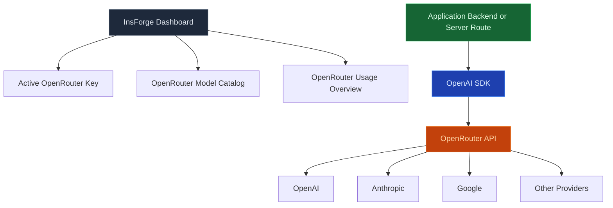

使用模型閘道透過一個 OpenAI 相容的端點呼叫聊天、串流和嵌入模型。InsForge 持有提供商金鑰，追蹤每個專案的使用情況，並透過 [OpenRouter](https://openrouter.ai) 路由流量，因此您的應用程式代碼永遠不會直接看到 Anthropic、OpenAI 或 Mistral 認證。

<Frame caption="一個 OpenAI 相容的端點，具有按提供商存取、隨時可複製的程式碼和使用追蹤。">
  
</Frame>

<Note>
  **想要執行 AI 程式碼，而不是呼叫模型？** 使用 [Edge Functions](/core-concepts/functions/overview) 來協調提示、檢索和工具。模型閘道是呼叫；函式是圍繞它的程式。
</Note>

## 功能

### OpenAI 相容的 API

將任何 OpenAI SDK 或 `openai` 相容的程式庫指向 `https://<project>.insforge.dev/v1`，它就能運作。`/v1/chat/completions`、`/v1/embeddings` 和 `/v1/models` 都表現得像上游規範。

### 串流

用於聊天完成的伺服器傳送事件。使用串流端點的方式與 OpenAI 相同；閘道在令牌從提供商到達時轉發它們。

### 嵌入

從 OpenRouter 支援的任何嵌入模型產生密集向量。使用 [pgvector](/core-concepts/database/pgvector) 將結果儲存在 Postgres 中以進行語義搜尋。

### 按專案配額

每個專案都有自己的速率限制和支出上限。達到它時，閘道傳回乾淨的 429，而不是將提供商配額狀態洩漏到您的應用程式中。

### 使用追蹤

每個請求都用模型、令牌計數和成本進行記錄。從儀表板、CLI 或 MCP 查詢使用情況 — 帳單自動與 OpenRouter 的發票對帳。

### 多提供商路由

透過變更請求中的模型名稱，在 Anthropic、OpenAI、Mistral、Llama、Gemini 和數十個其他提供商之間切換。應用程式代碼不會改變。

## 使用它進行建置

<CardGroup cols={2}>
  <Card title="TypeScript SDK" icon="js" href="/sdks/typescript/ai">
    從 Node、瀏覽器和邊緣運行時聊天、串流和嵌入。
  </Card>

  <Card title="Swift SDK" icon="swift" href="/sdks/swift/ai">
    用於 iOS 和 macOS 的原生 Swift AI 用戶端。
  </Card>

  <Card title="Kotlin SDK" icon="android" href="/sdks/kotlin/ai">
    用於 Android 和 JVM 的協程優先 AI 用戶端。
  </Card>

  <Card title="REST API" icon="code" href="/sdks/rest/ai">
    普通 HTTP AI 端點，可從任何語言呼叫。
  </Card>
</CardGroup>

## 下一步

- 設定 [CLI](/quickstart) 以連結您的專案（建議的路徑）。
- 瀏覽 [TypeScript SDK 參考](/sdks/typescript/ai) 以瞭解聊天和嵌入模式。
