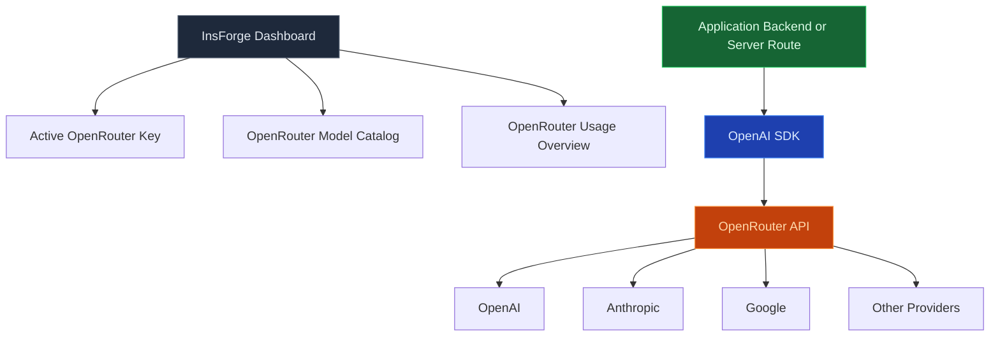

使用模型閘道為您的專案佈建 OpenRouter 金鑰、瀏覽模型目錄並追蹤支出和各模型用量。您的應用程式使用該金鑰直接呼叫 [OpenRouter](https://openrouter.ai)，因此一次整合即可存取來自 Anthropic、OpenAI、Mistral、Google 和數十個其他提供商的聊天、串流和嵌入模型。

<Frame caption="儀表板中的模型閘道頁面：目前金鑰、按提供商存取、隨時可複製的程式碼和使用圖表。">
  
</Frame>

<Note>
  **想要執行 AI 程式碼，而不是呼叫模型？** 使用 [Edge Functions](/core-concepts/functions/overview) 來協調提示、檢索和工具。模型閘道是呼叫；函式是圍繞它的程式。
</Note>

```mermaid
graph TB
    Dashboard[InsForge Dashboard] --> Key[Active OpenRouter Key]
    Dashboard --> Catalog[OpenRouter Model Catalog]
    Dashboard --> Metrics[OpenRouter Usage Overview]

    App[Application Backend or Server Route] --> SDK[OpenAI SDK]
    SDK --> OpenRouter[OpenRouter API]

    OpenRouter --> OpenAI[OpenAI]
    OpenRouter --> Anthropic[Anthropic]
    OpenRouter --> Google[Google]
    OpenRouter --> More[Other Providers]

    style Dashboard fill:#1e293b,stroke:#475569,color:#e2e8f0
    style App fill:#166534,stroke:#22c55e,color:#dcfce7
    style SDK fill:#1e40af,stroke:#3b82f6,color:#dbeafe
    style OpenRouter fill:#c2410c,stroke:#fb923c,color:#fed7aa
```

## 功能

### OpenAI 相容的 API

將儀表板中佈建的金鑰複製到僅伺服器端的 `OPENROUTER_API_KEY` 中，然後將任何 OpenAI SDK 或 `openai` 相容的程式庫指向 `https://openrouter.ai/api/v1`。[TypeScript SDK](/sdks/typescript/ai) 和 [REST](/sdks/rest/ai) 參考中提供了可用的程式碼片段。

<Warning>
  佈建的金鑰是伺服器端認證。請將 OpenRouter 呼叫置於後端路由、伺服器動作或邊緣函式之後，切勿將該金鑰打包進瀏覽器程式碼。
</Warning>

### 串流

用於聊天完成的伺服器傳送事件。像使用 OpenAI 那樣設定 `stream: true`，令牌會隨提供商產生而到達。

### 嵌入

從 OpenRouter 支援的任何嵌入模型產生密集向量。使用 [pgvector](/core-concepts/database/pgvector) 將結果儲存在 Postgres 中以進行語義搜尋。

### 支出與用量

儀表板中的模型閘道頁面從 OpenRouter 讀取您金鑰的活動資料：總支出，每日、每週和每月用量，剩餘額度及其重設日期，以及按模型的明細。

### 多提供商路由

透過變更請求中的模型名稱，在 Anthropic、OpenAI、Mistral、Llama、Gemini 和數十個其他提供商之間切換。應用程式代碼不會改變。

## 使用它進行建置

<CardGroup cols={2}>
  <Card title="TypeScript SDK" icon="js" href="/sdks/typescript/ai">
    從 Node、瀏覽器和邊緣運行時聊天、串流和嵌入。
  </Card>

  <Card title="Swift SDK" icon="swift" href="/sdks/swift/ai">
    用於 iOS 和 macOS 的原生 Swift AI 用戶端。
  </Card>

  <Card title="Kotlin SDK" icon="android" href="/sdks/kotlin/ai">
    用於 Android 和 JVM 的協程優先 AI 用戶端。
  </Card>

  <Card title="REST API" icon="code" href="/sdks/rest/ai">
    普通 HTTP AI 端點，可從任何語言呼叫。
  </Card>
</CardGroup>

## 下一步

- 設定 [CLI](/quickstart) 以連結您的專案（建議的路徑）。
- 瀏覽 [TypeScript SDK 參考](/sdks/typescript/ai) 以瞭解聊天和嵌入模式。
