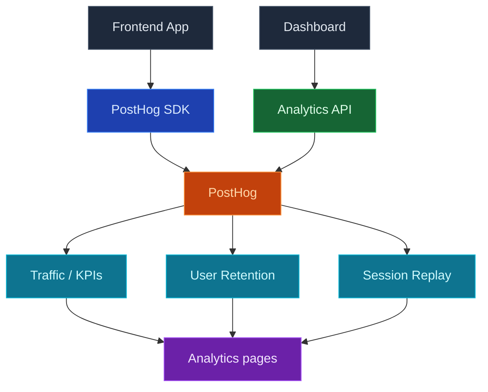

使用 InsForge 分析來瞭解人們如何實際使用您的應用程式：頁面流量、保留和工作階段回放，所有這些都透過將 PostHog 專案連接到您的 InsForge 後端來進行。連接後，儀表板在您的 PostHog 資料上呈現流量、使用者保留和工作階段回放頁面，無需離開 InsForge。

只需點擊一次連接 PostHog，將設定提示放入您的編碼代理中，以便它執行 PostHog 嚮導並在您的前端安裝 PostHog SDK，然後分析頁面開始填充。

<Frame caption="分析儀表板：隨著時間推移的 KPI 加上按頁面、國家和裝置的細分。">
  
</Frame>

<Note>
  PostHog 仍然是事件、儀表板、見解和錄製的真實來源。InsForge 為日常檢查呈現一個集中的子集，然後對於超出其範圍的任何內容都深入連結到 PostHog。
</Note>



## 功能

### 一鍵 PostHog 連接

從儀表板中的分析頁面連接 PostHog。InsForge 為您配置或連結 PostHog 專案，儲存認證到伺服器端，並在連接成功後解鎖流量、保留和工作階段回放頁面。

### 透過 PostHog 嚮導的 SDK 設定

連接後，空狀態會提示您一個設定提示，您可以將其貼到您的編碼代理中：

```
I want to add product analytics to this project. Read the current directory and use the InsForge skill to set up PostHog analytics by running `npx @insforge/cli posthog setup`.
```

`@insforge/cli posthog setup` 將您的 InsForge 專案連結到 PostHog，然後列印官方 [PostHog 嚮導](https://posthog.com/docs/libraries/wizard) 命令 (`npx -y @posthog/wizard@latest`) 供您（或您的代理）接下來執行。嚮導檢測您的框架，安裝正確的 PostHog SDK，並放入初始化程式碼，以便頁面瀏覽、自動擷取事件和工作階段錄製開始流動。

### 流量

您選定的時間範圍內的 KPI（訪客、頁面瀏覽、工作階段、跳出率和趨勢），加上按頁面、國家和裝置類型的細分。對於第一次"本週應用程式的表現如何"的檢查而無需打開 PostHog 很有用。

### 使用者保留

從您的 PostHog 事件建構的隊列保留圖表。選擇一個時間範圍，看看有多少使用者在隨後的幾天或幾週內回來。

### 工作階段回放

最近工作階段錄製的分頁清單，包含持續時間、個人和深入連結到 PostHog 的完整回放播放器。當在流量或保留中發現異常後，可幫助您觀察使用者實際做了什麼。

### 設定和中斷連接

分析設定對話（側邊欄中的齒輪圖示）讓管理員審查連結的 PostHog 專案，直接跳轉到 PostHog，並在需要時中斷連接。中斷連接只會中斷 InsForge ↔ PostHog 連結；您的 PostHog 專案、事件和錄製保持不變。

## 概念

<CardGroup cols={2}>
  <Card title="PostHog 產品分析" icon="chart-mixed" href="https://posthog.com/docs/product-analytics">
    分析頁面後面的事件、自動擷取、見解和儀表板。
  </Card>

  <Card title="PostHog 工作階段回放" icon="circle-play" href="https://posthog.com/docs/session-replay">
    錄製如何被擷取、編輯和回放。
  </Card>
</CardGroup>

## 使用它進行建置

<CardGroup cols={2}>
  <Card title="PostHog 嚮導" icon="wand-magic-sparkles" href="https://posthog.com/docs/libraries/wizard">
    自動檢測您的框架，安裝正確的 PostHog SDK，並新增初始化程式碼。
  </Card>

  <Card title="PostHog JavaScript SDK" icon="js" href="https://posthog.com/docs/libraries/js">
    在嚮導設定的基礎上擷取自訂事件。
  </Card>

  <Card title="InsForge CLI" icon="terminal" href="/quickstart">
    `npx @insforge/cli posthog setup` 將您的 InsForge 專案連結到 PostHog，然後列印嚮導命令。
  </Card>
</CardGroup>

## 下一步

- 在儀表板中開啟分析頁面，點擊 **連接 PostHog**。
- 將設定提示貼到您的編碼代理中，然後執行它列印的 `@posthog/wizard` 命令，將 SDK 連接到您的應用程式。
- 如果您想從終端管理連接，設定 [CLI](/quickstart)。
