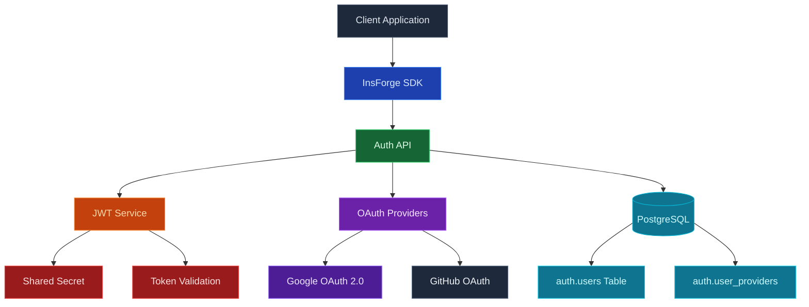

使用 InsForge 驗證來處理您的應用程式的註冊、登入、工作階段和身份。使用者可以使用電子郵件和密碼、魔法連結、一次性代碼、OAuth 提供商（Google、GitHub、Apple 等）或您自己的任何符合 OIDC 的身份提供商進行登入。InsForge 在登入時發出 JSON Web Token，平台上的每個其他產品都使用相同的令牌。

<Frame caption="配置的登入方法：電子郵件和密碼、Google 和 GitHub OAuth。">
  
</Frame>

<Note>
  **驗證**是檢查使用者是否就是他們所聲稱的人。**授權**是檢查他們可以做什麼。InsForge 直接處理前者，並透過讀取驗證 JWT 的 [列級安全](/core-concepts/database/overview) 原則來增強後者。
</Note>

## 功能

### 電子郵件和密碼

預設值。新使用者使用電子郵件和密碼註冊，收到確認電子郵件，並在登入時接收工作階段 JWT。密碼重設、電子郵件驗證和暴力破解限制都是內建的。

<Note>
  **自託管？** 傳送這些電子郵件，包括無密碼的魔法連結和一次性代碼登入，都需要電子郵件服務商。已連接雲端的專案會自動使用託管寄件服務；自託管實例必須先設定 [Custom SMTP](/core-concepts/messaging/custom-smtp)，否則驗證、重設和登入郵件都無法送達。
</Note>

### 魔法連結和一次性密碼

向使用者的電子郵件傳送一次性連結或六位數代碼。無密碼登入、帳戶復原和步進驗證都使用相同的基礎。

### OAuth 提供商

對 Google、GitHub、Apple、Microsoft、GitLab、Discord 等的一流支援。透過 URL 新增自訂 OAuth 2.0 / OIDC 提供商（Keycloak、Okta、Auth0、您自己的 IdP），無需撰寫提供商特定的程式碼。

### OAuth 伺服器模式

將 InsForge 本身作為 OAuth 2.0 / OIDC 身份提供商執行，用於您自己的下游應用程式。有關完整設定，請參閱 [OAuth 伺服器指南](/oauth-server)。

### 列級安全

驗證 JWT 自動流經每個 InsForge SDK 呼叫。Postgres RLS 原則從令牌讀取聲明，並逐列決定使用者可以讀取和寫入的內容。無論請求命中資料庫、儲存還是即時通道，相同的身份和相同的原則都適用。

### 資料庫中的 `auth.users`

使用者狀態存在於專案的 Postgres 資料庫中的 `auth` 架構中。透過外鍵將 `auth.users` 連接到您的應用程式資料表，透過觸發器對身份變更做出反應，並以與備份其他所有內容相同的方式備份整個事物。

## 使用它進行建置

<CardGroup cols={2}>
  <Card title="TypeScript SDK" icon="js" href="/sdks/typescript/auth">
    從 Node、瀏覽器和邊緣註冊、登入和管理工作階段。
  </Card>

  <Card title="Swift SDK" icon="swift" href="/sdks/swift/auth">
    用於 iOS 和 macOS 的原生 Swift 驗證用戶端。
  </Card>

  <Card title="Kotlin SDK" icon="android" href="/sdks/kotlin/auth">
    用於 Android 和 JVM 的協程優先驗證用戶端。
  </Card>

  <Card title="REST API" icon="code" href="/sdks/rest/auth">
    普通 HTTP 驗證端點，可從任何語言呼叫。
  </Card>
</CardGroup>

## 下一步

- 設定 [CLI](/quickstart) 以連結您的專案（建議的路徑）。
- 瀏覽 [TypeScript SDK 參考](/sdks/typescript/auth) 以瞭解登入模式。
