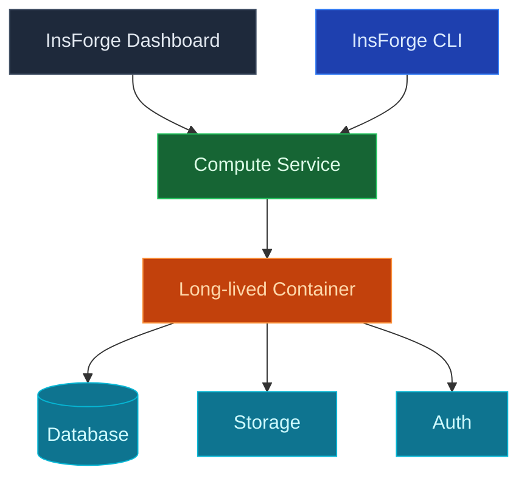

使用 InsForge 自訂運算在您的專案旁執行長期容器：佇列工作者、背景處理器、AI 推理迴圈、websocket 伺服器、網頁爬蟲，任何需要保持執行的程序。

<Note>
  **只需要處理一個請求？** 請求/回應的工作與短任務請使用 [Edge Functions](/core-concepts/functions/overview)。自訂運算適用於需要持續執行的程序。
</Note>


```mermaid
graph TB
    Dashboard[InsForge Dashboard] --> Service[Compute Service]
    CLI[InsForge CLI] --> Service

    Service --> Container[Long-lived Container]

    Container --> DB[(Database)]
    Container --> Storage[Storage]
    Container --> Auth[Auth]

    style Dashboard fill:#1e293b,stroke:#475569,color:#e2e8f0
    style CLI fill:#1e40af,stroke:#3b82f6,color:#dbeafe
    style Service fill:#166534,stroke:#22c55e,color:#dcfce7
    style Container fill:#c2410c,stroke:#fb923c,color:#fed7aa
    style DB fill:#0e7490,stroke:#06b6d4,color:#cffafe
    style Storage fill:#0e7490,stroke:#06b6d4,color:#cffafe
    style Auth fill:#0e7490,stroke:#06b6d4,color:#cffafe
```

## 功能

### 容器部署

把任何 Docker 映像交給 InsForge 就能執行。可以指向 registry 上已建置好的映像，也可以上傳建置內容，讓 InsForge 依您的 `Dockerfile` 建置。不需要學習額外的建置流程。

### 存取您的專案

容器需要的認證由您以服務的環境變數設定——專案 URL、API key、S3 認證，取決於這個工作負載會用到什麼。InsForge 不會替您注入任何內容，因此容器能存取什麼完全由您決定。

自行託管時，compute 容器預設會加入專案自己的網路，因此在容器內 `postgres:5432` 與 `postgrest:3000` 可以直接以名稱解析，與 edge functions 完全相同——不需要繞經公開網路。

### 資源

記憶體與 CPU 依服務設定。每個服務執行一個實例；需要多個工作者就建立多個服務。

### 日誌

每個容器都有結構化日誌，可依服務與時間範圍查詢。在 dashboard、CLI 或 MCP 中檢視，不必 `kubectl exec` 進容器。

### Secrets 與環境變數

依服務設定環境變數與 secrets，與 edge function 的 secrets 分開。輪替時不需要重新部署。

<Warning>
  **尚不支援永久磁碟區。** 容器狀態可跨重新啟動與主機重新開機保留，但變更映像、環境變數或連接埠會重建容器，容器內寫入的內容會遺失。需要保留的資料請放進專案的 Postgres 或 Storage。
</Warning>

## 自行託管：啟用 compute

在 InsForge Cloud 上 compute 完全代管，您無需設定。自行託管時，由您決定容器在哪裡執行。目前提供兩種 provider，在其中一種設定完成之前，compute 端點都會回傳 `503 COMPUTE_NOT_CONFIGURED`。

<Tabs>
  <Tab title="Docker（您自己的主機）">
    容器執行在與 InsForge 相同的 Docker daemon 上，與 InsForge 容器互為同層容器。不需要註冊任何服務，也沒有按容器計費。

    啟用方式是一個明確的動作：把 Docker socket 掛載進 InsForge 容器。compose 檔案裡已經為此準備好一行，取消註解即可：

    ```yaml
    services:
      insforge:
        volumes:
          - ${DOCKER_SOCKET_PATH:-/var/run/docker.sock}:${DOCKER_SOCKET_PATH:-/var/run/docker.sock}
    ```

    這就是全部的改動。socket 在 Linux 上是 `660 root:docker`，在 Docker Desktop 上是 `root:root`，group id 又因主機而異，所以容器會在啟動時從 socket 上讀出這個 group 並加入，然後再降權到應用使用者。無需查詢，也無需設定。

    重新啟動整個 stack。socket 可連線時驅動會自行註冊，並輸出 `Compute provider "docker" ready`。

    <Warning>
      **Docker socket 在主機上等同於 root。** 能存取它的人都可以啟動一個讀取整個檔案系統的容器，因此掛載它應當是一個有意識的決定。InsForge 自行建構每個容器的 spec，從不轉送呼叫方提供的選項，因此即使 InsForge API key 外洩，攻擊者也無法要求特權容器或主機 bind mount——但 socket 本身的權限，仍等同於擁有它的帳號。
    </Warning>

    選用設定：

    | 變數 | 預設值 | 作用 |
    | --- | --- | --- |
    | `DOCKER_SOCKET_PATH` | `/var/run/docker.sock` | 指向 rootless Docker（`$XDG_RUNTIME_DIR/docker.sock`）或 Podman（`/run/podman/podman.sock`）的 socket。compose 檔案會把它掛載到容器內的相同路徑，一個值同時涵蓋兩側。 |
    | `COMPUTE_ISOLATE_NETWORK` | 關閉 | 讓 compute 容器不加入專案網路。預設關閉，因為緊鄰資料庫與儲存正是它的意義所在。 |
    | `COMPUTE_BUILD_MAX_CONTEXT` | `64mb` | 上傳建置內容的上限。整個 tar 會緩衝在記憶體中，主機記憶體小就調低它。 |
    | `COMPUTE_BUILD_UPLOAD_IDLE_TIMEOUT` | `30` | 上傳多少秒沒有任何資料就視為停滯。每收到一段資料都會重設，因此慢但仍在傳輸的連線不會被中斷。 |
  </Tab>

  <Tab title="Fly.io">
    容器執行在您自己的 [Fly.io](https://fly.io) 帳號下。在 `.env` 中用兩個環境變數啟用：

    - `FLY_API_TOKEN`：Fly.io API token，用 `fly tokens create org -o <your-org>` 產生。把 CLI 印出的整行都貼進來，`FlyV1` 前綴會自動處理。InsForge 用它來建立和管理您的 compute 容器。
    - `FLY_ORG`：您的 Fly organization slug，用 `fly orgs list` 查看。容器會建立在此 org 之下。

    兩者都必填。只有 token 而沒有 org，就沒有可認證的對象；只有 org 而沒有 token，則無法呼叫。設定完成後重新啟動容器。
  </Tab>
</Tabs>

若兩者都已設定，既有服務仍由建立它的 provider 管理，新服務預設交給 Fly。將 `COMPUTE_PROVIDER` 設為 `fly`、`docker` 或 `off` 可明確指定。

### 選擇服務的連線方式

每個服務選擇一種 ingress 模式。有哪些模式取決於 provider，預設值也一樣：單一主機上預設為 `none`，因為大多數 compute——佇列工作者、處理器、推理迴圈——根本不接收傳入流量；而 Fly 會為每個 app 配置主機名稱，因此只提供 `host`。省略該欄位時採用目前 provider 的預設值；若要求 provider 無法提供的模式，會被轉換為它支援的模式。

| 模式 | 行為 |
| --- | --- |
| `none` | 僅能在專案內部網路存取。不發佈主機連接埠，也不公告 URL。 |
| `port` | 發佈在 daemon 指派的主機連接埠上。設定 `COMPUTE_PUBLIC_HOST` 後 InsForge 才會公告 URL；留空則不回傳 URL，而不是給出一個可能無法解析的位址。 |
| `host` | 透過您自行路由的主機名稱存取。將 `COMPUTE_DOMAIN` 設為基礎網域。 |

發佈的連接埠預設繫結到 `127.0.0.1`。用 `COMPUTE_BIND_ADDRESS` 變更——Docker 自身的預設會繫結所有介面（含 IPv6），在可從外部連線的主機上，這等於把容器直接暴露到網際網路。

用 `COMPUTE_DEFAULT_INGRESS` 設定整個部署的預設值。`host` 模式下 InsForge 只公告主機名稱，不負責 TLS 終止與流量路由——請像您已經為 dashboard 所做的那樣，在前面自行執行一個閘道（Caddy、Traefik、nginx）。

### 從原始碼建置

部署已建置好的映像不需要額外步驟：以映像位址建立服務，它就會被拉取並啟動。

若要讓 InsForge 建置您的 `Dockerfile`，先保留服務，再將建置內容以 tar 上傳：

```bash
# 1. 保留服務名稱（此時還沒有映像），並保存回傳的 id
ID=$(curl -sX POST "$INSFORGE_URL/api/compute/services/deploy" \
  -H "x-api-key: $INSFORGE_API_KEY" -H 'Content-Type: application/json' \
  -d '{"name":"worker","port":8080,"memory":512}' | jq -r .id)

# 2. 上傳建置內容；回應中包含建置日誌與已部署的映像 tag
tar --no-xattrs -cf context.tar -C ./worker .
curl -X POST "$INSFORGE_URL/api/compute/services/$ID/build" \
  -H "x-api-key: $INSFORGE_API_KEY" -H 'Content-Type: application/x-tar' \
  --data-binary @context.tar
```

若 `Dockerfile` 不在建置內容的根目錄，請加上 `?dockerfile=docker/Dockerfile`；該路徑必須留在建置內容之內。同一時間只會執行一個建置——第二個上傳會直接得到 `429`，而不會被緩衝下來。在 macOS 上打包時請加 `--no-xattrs`（或 `COPYFILE_DISABLE=1`）：Linux daemon 無法套用的擴充屬性會導致整份建置內容被拒絕。

### 平台支援

| 層級 | 平台 | 說明 |
| --- | --- | --- |
| 已驗證 | Linux 上的 Docker Compose、Docker Desktop（macOS） | 兩條部署路徑都做過端到端測試，包括主機重新開機，以及 Amazon Linux 2023 上 SELinux enforcing 模式。 |
| 預期可用 | Dokploy、Coolify、Containarium | socket 掛載方式相同；尚未針對 compute 實測。 |
| 不支援 | 不提供 Docker socket 的代管容器平台 | 沒有可以對話的 daemon。 |

### 兩種 provider 的差異

向 `GET /api/metadata` 請求 `compute` 區段——它會回報已設定的 provider 以及各自的能力，讓工具不再提供那些會被忽略的選項。

| | Docker | Fly.io |
| --- | --- | --- |
| 區域 | 單一主機 | 可選擇 |
| 縮減至零 | 不支援 | 支援 |
| Ingress 模式 | `none`、`port`、`host` | 主機名稱 |
| 原始碼建置 | 向 InsForge 上傳建置內容 | 由 CLI 使用 `flyctl` 建置 |

## 下一步

- 設定 [CLI](/quickstart) 以連結您的專案（建議的路徑）。
- 如果您只需要請求/回應，請參閱 [Edge Functions](/core-concepts/functions/overview)。
