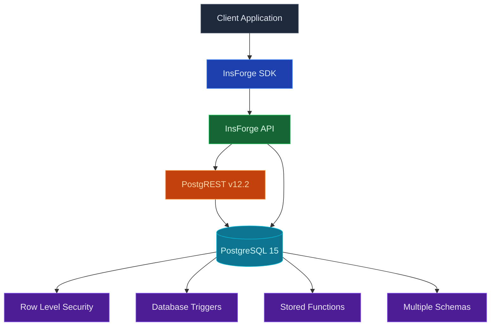

每個 InsForge 專案都配備一個完整的 [Postgres](https://www.postgresql.org/) 資料庫。每個資料表自動成為類型化的 REST 和 SDK 端點。驗證令牌透過列級安全範圍化每個讀寫。相同的 Postgres 處理關聯式查詢、透過 pgvector 的語義搜尋和即時變更源。

<Frame caption="資料表編輯器：類型化列、內聯編輯、CSV 匯入和 SQL 工作室。">
  
</Frame>

<Note>
  **在尋找檔案儲存？** 使用 [Storage](/core-concepts/storage/overview) 來儲存影像、PDF 和其他二進制內容。資料庫儲存列；儲存儲存物件。
</Note>

## 功能

### 資料表作為 API

定義資料表，您立即取得 REST 端點加上類型化的 SDK 用戶端。沒有程式碼產生步驟。驗證 JWT 透過 RLS 範圍化每個查詢。

### 遷移

追蹤和應用有序的 SQL 變更。[Migrations](/core-concepts/database/migrations) 在您的存放庫中作為普通 `.sql` 檔案提供，使用 `npx @insforge/cli db migrations up --all` 或透過 MCP 工具應用。

### 分支

旋轉隔離的資料庫分支來根據生產資料副本測試風險架構變更。查看 [Branching](/agent-native/branching)。

### pgvector

用於嵌入的原生向量搜尋，具有 HNSW 和 IVFFlat 索引。查看 [pgvector](/core-concepts/database/pgvector)。

### 列級安全

Postgres RLS 原則在列級別強制執行存取。原則讀取驗證 JWT，因此相同的規則適用於 REST 查詢、SDK 呼叫、即時訂閱和儲存請求。

### 連線字串

用標準的 `postgresql://` 連線字串，讓外部 Postgres 工具（`psql`、BI 儀表板、ORM，或執行在虛擬機上的 worker）直接連到你專案的資料庫。在 [dashboard](https://insforge.dev) 打開專案，點 **Connect**（同樣的內容也在 **Project Settings** 裡），查看 **Connection String**。你會拿到完整的 URL，以及各個參數——host、database、user、port 和 password——密碼旁有顯示/隱藏開關，複製前可以先顯示出來。這是直連，最適合虛擬機、長時間執行的容器這類持久、長連線的用戶端。你的應用程式碼通常用不到它，因為每張資料表本身就是 REST 和 SDK 端點，但當某個工具需要原生 Postgres 存取時，它隨時可用。

## 概念

<CardGroup cols={2}>
  <Card title="Migrations" icon="layer-group" href="/core-concepts/database/migrations">
    安全地依次應用 SQL 變更。
  </Card>
  <Card title="Branching" icon="code-branch" href="/agent-native/branching">
    用於預覽和風險變更的隔離資料庫。
  </Card>
  <Card title="pgvector" icon="brain" href="/core-concepts/database/pgvector">
    用於嵌入的向量搜尋。
  </Card>
</CardGroup>

## 使用它進行建置

<CardGroup cols={2}>
  <Card title="TypeScript SDK" icon="js" href="/sdks/typescript/database">
    從 Node、瀏覽器和邊緣進行類型化查詢、插入和更新。
  </Card>

  <Card title="Swift SDK" icon="swift" href="/sdks/swift/database">
    用於 iOS 和 macOS 的原生 Swift 資料庫用戶端。
  </Card>

  <Card title="Kotlin SDK" icon="android" href="/sdks/kotlin/database">
    用於 Android 和 JVM 的協程優先資料庫用戶端。
  </Card>

  <Card title="REST API" icon="code" href="/sdks/rest/database">
    普通 HTTP 資料庫端點，可從任何語言呼叫。
  </Card>
</CardGroup>

## 下一步

- 設定 [CLI](/quickstart) 以連結您的專案（建議的路徑）。
- 瀏覽 [TypeScript SDK 參考](/sdks/typescript/database) 以瞭解類型化查詢。
