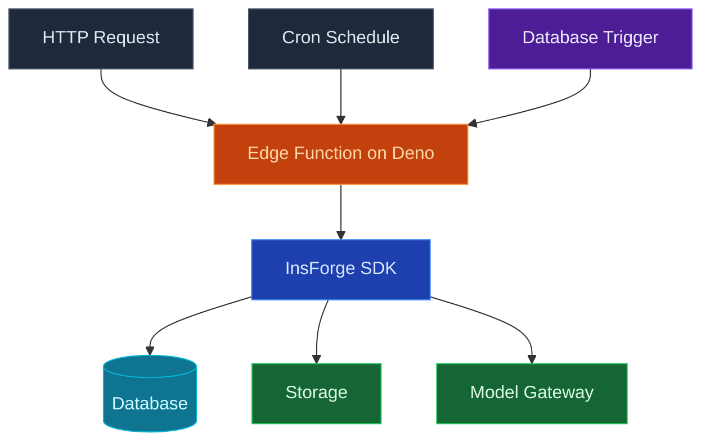

使用 InsForge Edge Functions 在 [Deno](https://deno.com) 上執行 TypeScript，部署在接近您的使用者的地方以實現低延遲。函式可以從任何用戶端按需呼叫、從資料庫觸發器連結，或排程在 cron 運算式上執行。執行時開箱即用地提供標準 fetch、串流回應和 ESM 匯入。

<Note>
  **需要一個保持執行的流程？** 使用 [Compute](/core-concepts/compute/overview) 以獲取佇列背景工作、AI 推理迴圈和任何具狀態的東西。Edge Functions 用於請求/回應和短期工作。
</Note>

## 功能

### HTTP 觸發器

每個函式都可在 `https://<project>.insforge.dev/functions/<name>` 上存取。標準 fetch 輸入，標準 `Response` 輸出。串流、JSON、重新導向和 websocket 都可以運作。

### 排程

將 cron 運算式附加到函式，InsForge 會按時呼叫它，失敗時重試。有關 cron 語法和執行模型，請查看 [Schedules](/core-concepts/functions/schedules)。

### 資料庫觸發器

將函式連接以在對資料表的 `INSERT`、`UPDATE` 或 `DELETE` 上觸發。函式接收列有效負荷並使用服務角色 JWT 執行，因此它可以執行特權後續寫入。

### 祕密和環境變數

為每個函式設定環境變數和祕密。儀表板、CLI 和 MCP 都讀寫相同的儲存區；祕密永遠不會透過您的存放庫往返。

### 日誌

每次呼叫都會擷取結構化日誌，可按狀態、持續時間和函式名稱查詢。InsForge MCP `get-function-logs` 工具允許您的代理在不離開編輯器的情況下診斷失敗。

### Deno 標準程式庫

使用 [Deno 標準程式庫](https://jsr.io/@std) 和來自 `jsr.io`、`esm.sh` 或 `npm:` 說明符的任何 ESM 模組。您無需執行打包程式，也沒有 `node_modules` 目錄來運送。

## 概念

<CardGroup cols={2}>
  <Card title="Schedules" icon="clock" href="/core-concepts/functions/schedules">
    在 cron 運算式上執行函式，而不是回應請求。
  </Card>
</CardGroup>

## 使用它進行建置

<CardGroup cols={2}>
  <Card title="TypeScript SDK" icon="js" href="/sdks/typescript/functions">
    從 Node、瀏覽器和邊緣呼叫和串流函式。
  </Card>

  <Card title="Swift SDK" icon="swift" href="/sdks/swift/functions">
    從 iOS 和 macOS 應用呼叫函式。
  </Card>

  <Card title="Kotlin SDK" icon="android" href="/sdks/kotlin/functions">
    從 Android 和 JVM 應用呼叫函式。
  </Card>

  <Card title="REST API" icon="code" href="/sdks/rest/functions">
    普通 HTTP 函式端點，可從任何語言呼叫。
  </Card>
</CardGroup>

## 下一步

- 設定 [CLI](/quickstart) 以連結您的專案（建議的路徑）。
- 瀏覽 [TypeScript SDK 參考](/sdks/typescript/functions) 以瞭解呼叫模式。
