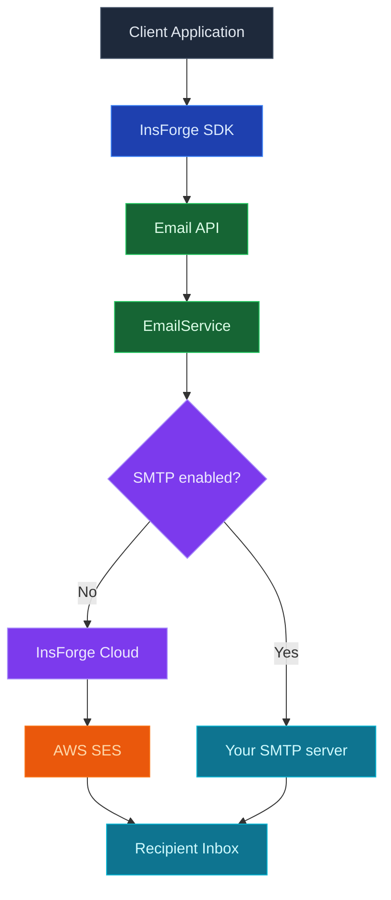

InsForge Messaging 從您的專案傳送交易性通知：收據、摘要、密碼重設代碼、通知匯總、任何您本來會為其接入 SendGrid、Postmark 或 Twilio 的東西。電子郵件是第一個通道；SMS 和推送在路線圖上，將共享相同的 API 表面。

<Note>
  **只是傳送驗證電子郵件？** 魔法連結、驗證代碼和密碼重設已內建在 [Authentication](/core-concepts/authentication/overview) 中。您只需要這個產品用於驗證之外的交易性訊息。
</Note>

<Warning>
  **自託管？** 託管的 InsForge Cloud 寄件服務僅對已連接雲端的專案可用。在自託管實例上，必須先設定 [Custom SMTP](/core-concepts/messaging/custom-smtp)，任何電子郵件才能發出，包括驗證郵件。郵件提供方可用前，InsForge 會拒絕開啟強制電子郵件驗證；驗證仍為強制狀態時，也無法關閉唯一的 SMTP 提供方。如果註冊時驗證郵件傳送失敗，API 會傳回錯誤，並提示透過 `POST /api/auth/email/send-verification` 重試。
</Warning>

## 通道

<CardGroup cols={3}>
  <Card title="Email" icon="envelope" href="/core-concepts/messaging/custom-smtp">
    託管 SMTP 或使用您自己的提供商。範本、交付追蹤和 webhook 事件。
  </Card>

  <Card title="SMS" icon="message">
    即將推出。相同的 API，後端使用 Twilio 或 Sinch。
  </Card>

  <Card title="Push" icon="bell">
    即將推出。透過單個端點的 APNs 和 FCM。
  </Card>
</CardGroup>

## 功能

### 一個 API，每個通道

今天電子郵件的相同 `emails.send()` 形狀，當它們著陸時 SMS 和推送跟隨。切換通道是欄位變更，而不是重寫。

### 託管交付或使用您自己的

透過 InsForge Cloud（今天用於電子郵件的 AWS SES）傳送以獲得零設定，或在您需要控制交付能力和寄件人聲譽時插入您自己的提供商。請參閱 [Custom SMTP](/core-concepts/messaging/custom-smtp)。

### 範本

按名稱選擇範本，傳遞變數，InsForge 呈現並傳送。範本可編輯每個專案；四個驗證範本 (`email-verification-*`、`reset-password-*`) 帶有合理的預設值。

### 交付追蹤

傳送事件 (`accepted`、`delivered`、`bounced`、`complained`) 按訊息記錄。在 Postgres 中查詢稽核資料表、透過 webhook 訂閱或觀察儀表板。

### 速率限制

按專案和按計畫的限制可以防止流氓迴圈融化交付能力。從儀表板配置，在閘道處強制執行。

## 概念

<CardGroup cols={2}>
  <Card title="Custom SMTP" icon="envelope" href="/core-concepts/messaging/custom-smtp">
    使用您自己的 SMTP 提供商（SendGrid、Postmark、AWS SES 等）。
  </Card>
</CardGroup>

## 使用它進行建置

<CardGroup cols={2}>
  <Card title="TypeScript SDK" icon="js" href="/sdks/typescript/email">
    從 Node、瀏覽器和邊緣執行時傳送郵件。
  </Card>

  <Card title="REST API" icon="code" href="/sdks/rest/overview">
    普通 HTTP 訊息端點，可從任何語言呼叫。
  </Card>
</CardGroup>

## 下一步

- 設定 [CLI](/quickstart) 以連結您的專案（建議的路徑）。
- 瀏覽 [TypeScript SDK 參考](/sdks/typescript/email) 以瞭解傳送模式。
