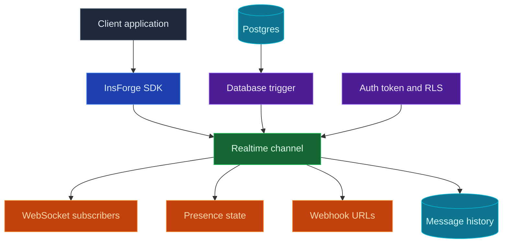

當你的應用程式需要在不重新整理頁面的情況下更新時，可以使用 InsForge Realtime。用戶端訂閱像 `order:123` 或 `chat:room-1` 這樣的頻道，然後透過 WebSocket 接收資料庫變更、廣播與線上狀態更新。當另一個服務需要接收事件時，頻道也可以將相同的訊息分發到 webhook URL。

<Frame caption="Realtime 控制台：頻道模式、訊息歷史、權限與保留設定。">
  
</Frame>

<Note>
  **需要在資料庫變更後執行伺服器端程式碼？** 把那段商業邏輯放進 [Edge Function](/core-concepts/functions/overview)，並從資料庫觸發器呼叫它。當變更需要傳遞給已連接的用戶端或已設定的 webhook 端點時，請使用 Realtime。
</Note>



## 功能

### 頻道

頻道是用戶端可以加入的具名主題。共用房間請使用精確名稱，若每筆記錄都需要自己的即時串流，可使用像 `order:%` 這樣的模式。

### 資料庫變更

當一次資料表寫入應變成應用程式的即時事件時，請使用資料庫變更功能。在你要監看的資料表上建立一個觸發器。在其觸發器函式中，呼叫預先定義的 `realtime.publish(channel, event, payload)` 函式，以決定哪個頻道接收訊息、用戶端要處理哪個事件名稱，以及它們會收到什麼酬載（payload）。

對於像 `order:%` 這樣的頻道模式，觸發器可以為每筆訂單發佈一個事件：

```sql
CREATE OR REPLACE FUNCTION public.notify_order_status()
RETURNS TRIGGER AS $$
BEGIN
  PERFORM realtime.publish(
    'order:' || NEW.id::text,
    'status_changed',
    jsonb_build_object(
      'id', NEW.id,
      'status', NEW.status,
      'updatedAt', NEW.updated_at
    )
  );

  RETURN NEW;
END;
$$ LANGUAGE plpgsql SECURITY DEFINER;

CREATE TRIGGER order_status_realtime
  AFTER UPDATE OF status ON public.orders
  FOR EACH ROW
  WHEN (OLD.status IS DISTINCT FROM NEW.status)
  EXECUTE FUNCTION public.notify_order_status();
```

然後從應用程式端透過 SDK 訂閱：

```typescript
const channel = `order:${orderId}`;

await insforge.realtime.connect();

const subscription = await insforge.realtime.subscribe(channel);
if (!subscription.ok) {
  throw new Error(subscription.error.message);
}

insforge.realtime.on('status_changed', (message) => {
  renderOrderStatus(message.status);
});
```

### 用戶端廣播

用戶端可以向已經加入的頻道發佈訊息。可用於聊天、輸入中提示、游標、協作編輯訊號，以及其他不需要從資料庫寫入開始的使用者對使用者更新。

```typescript
await insforge.realtime.publish(`chat:${roomId}`, 'typing', {
  userId,
  isTyping: true
});
```

### Webhook

當另一個服務需要接收每則訊息時，可以為頻道附加 webhook URL。InsForge 會把事件酬載發佈到每個已設定的 URL，附上包含事件名稱、頻道與訊息 ID 的標頭，重試暫時性的網路失敗，並在訊息歷史中記錄 webhook 傳送次數。

### 線上狀態（Presence）

線上狀態（Presence）用來追蹤誰在頻道中上線。用戶端在訂閱時會收到目前的成員快照，之後會在成員上線或離線時收到 `presence:join` 與 `presence:leave` 事件。請把持久化的房間成員關係、角色與權限存放在你自己的資料表中；線上狀態只提供上線狀態。

```typescript
const response = await insforge.realtime.subscribe(`chat:${roomId}`);

if (response.ok) {
  renderOnlineMembers(response.presence.members);
}

insforge.realtime.on('presence:join', (message) => {
  addOnlineMember(message.member);
});

insforge.realtime.on('presence:leave', (message) => {
  removeOnlineMember(message.member.presenceId);
});
```

### 資料列層級安全性

即時功能在原型開發階段可以保持開放，之後再用 Postgres RLS 鎖定。使用 `realtime.channels` 上的 `SELECT` 政策來控制誰可以訂閱，使用 `realtime.messages` 上的 `INSERT` 政策來控制誰可以從用戶端發佈。

以下政策只允許已驗證的使用者在訂單屬於自己時，訂閱 `order:<id>` 頻道：

```sql
ALTER TABLE realtime.channels ENABLE ROW LEVEL SECURITY;

CREATE POLICY "users_subscribe_own_orders"
ON realtime.channels
FOR SELECT
TO authenticated
USING (
  pattern = 'order:%'
  AND EXISTS (
    SELECT 1
    FROM public.orders
    WHERE id = NULLIF(split_part(realtime.channel_name(), ':', 2), '')::uuid
      AND user_id = auth.uid()
  )
);
```

請在訂閱政策中使用 `realtime.channel_name()`，因為用戶端訂閱的是已解析的頻道（例如 `order:123`），而 `realtime.channels` 儲存的是模式（例如 `order:%`）。

### 訊息歷史

每個已傳送的事件都會記錄 WebSocket 與 webhook 的傳送次數。當你需要偵錯即時行為時，控制台可以查看最近的訊息、傳送統計資料與保留設定。

## 開始建置

<CardGroup cols={2}>
  <Card title="TypeScript SDK" icon="js" href="/sdks/typescript/realtime">
    從 Node、瀏覽器與邊緣環境訂閱頻道、發佈事件並追蹤線上狀態。
  </Card>

  <Card title="Swift SDK" icon="swift" href="/sdks/swift/realtime">
    適用於 iOS 與 macOS 的原生 Swift 即時用戶端。
  </Card>

  <Card title="Kotlin SDK" icon="android" href="/sdks/kotlin/realtime">
    以協程為優先、適用於 Android 與 JVM 的即時用戶端。
  </Card>

  <Card title="REST and WebSocket API" icon="code" href="/sdks/rest/realtime">
    從任何語言使用原始的 Socket.IO 合約。
  </Card>
</CardGroup>

## 後續步驟

- 設定 [CLI](/quickstart) 以連結你的專案。
- 在即時控制台中建立頻道。
- 使用 [TypeScript SDK 參考文件](/sdks/typescript/realtime) 了解用戶端訂閱。
- 當另一個服務需要相同的事件串流時，為頻道新增 webhook URL。
