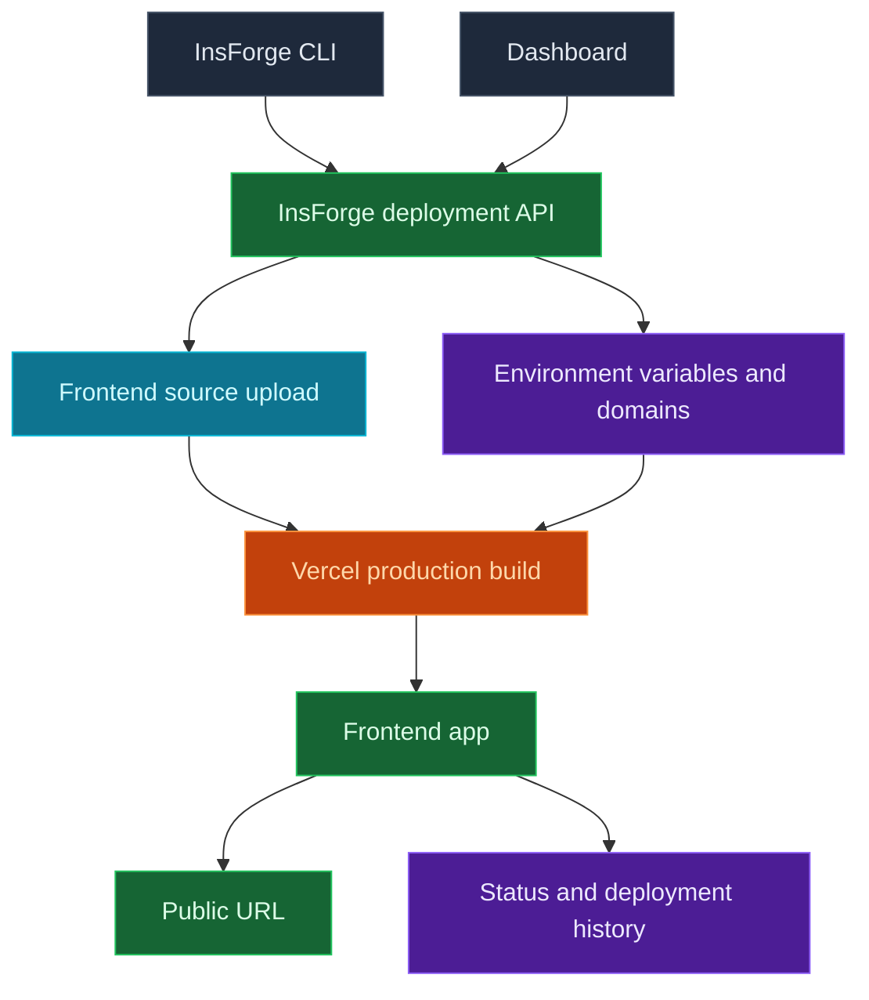

使用 InsForge Sites 來部署屬於您專案的面向瀏覽器的應用程式。InsForge CLI 會透過 InsForge 上傳您的前端原始碼，InsForge 再建立一個 Vercel 正式環境部署。儀表板會追蹤 URL、狀態、部署歷史、環境變數與網域。

<Frame caption="Sites 儀表板：狀態、網域、環境變數與部署歷史。">
  
</Frame>

<Note>
  **需要部署容器或後端服務？** 若是背景工作程式、佇列、WebSocket 伺服器與長時間執行的服務，請使用 [Compute](/core-concepts/compute/overview)。Sites 則用於前端網站以及會產生託管網頁應用程式的框架建置。
</Note>



## 功能

### CLI 部署

從您應用程式的原始碼目錄進行部署。CLI 會上傳原始碼樹，略過僅限本機使用的檔案，例如 `node_modules`、`.git`、建置輸出與 `.env` 檔案，接著透過 InsForge 啟動 Vercel 建置。

```bash
npx @insforge/cli deployments deploy ./frontend
```

### 框架建置

部署 React、Vue、Svelte、Next.js、靜態網站及其他前端專案。InsForge 會將原始碼檔案傳送至 Vercel，並由框架偵測與專案檔案（例如 `package.json` 與 `vercel.json`）決定應用程式如何建置。

### 環境變數

從儀表板管理提供者環境變數。僅針對可安全公開於瀏覽器程式碼中的值，使用如 `VITE_` 或 `NEXT_PUBLIC_` 的公開前綴。

```bash
npx @insforge/cli deployments env list
npx @insforge/cli deployments env set VITE_INSFORGE_URL https://your-project.region.insforge.app
npx @insforge/cli deployments env set VITE_INSFORGE_ANON_KEY ik_xxx
```

### 部署歷史

在部署紀錄頁面檢視先前的執行紀錄、同步 Vercel 狀態、檢查中繼資料，並取消進行中的部署。

```bash
npx @insforge/cli deployments list
npx @insforge/cli deployments status deployment_123 --sync
npx @insforge/cli deployments cancel deployment_123
```

### 網域

每個就緒的部署都會取得一個預設 URL，格式為 `https://<appkey>.insforge.site`。您也可以在 `https://<slug>.insforge.site` 設定一個由 InsForge 管理的 slug。若要使用自訂網域，請在儀表板中新增該網域，並依其提供的 DNS 記錄進行設定，通常子網域會使用 CNAME。

## 疑難排解

### 用戶端路由上的 404: NOT_FOUND

在瀏覽器中處理路由的單頁應用（React Router、Vue Router 等）在深層連結或重新整理頁面命中伺服器上沒有對應檔案的路徑時，可能會回傳 `404: NOT_FOUND`。由於 InsForge 在 Vercel 上建置您的站台，請在專案根目錄新增一個 `vercel.json`，將所有路徑重寫到 `index.html`，讓瀏覽器端路由接管：

```json
{
  "rewrites": [{ "source": "/(.*)", "destination": "/index.html" }]
}
```

然後重新部署：

```bash
npx @insforge/cli deployments deploy ./frontend
```

如果 404 出現在首次載入時，而不僅僅是在子路由上，那麼很可能是建置輸出目錄與您的框架不相符。Vercel 會從 `package.json` 和 `vercel.json` 偵測該目錄，因此請確認您的建置產生了預期的輸出資料夾。

## 以此進行部署

<CardGroup cols={2}>
  <Card title="CLI 快速入門" icon="terminal" href="/quickstart">
    連接您的專案，並從應用程式目錄執行 InsForge CLI 指令。
  </Card>
</CardGroup>

## 後續步驟

- 設定 [CLI](/quickstart) 並連接您的專案。
- 從儀表板或使用 `npx @insforge/cli deployments env set` 新增瀏覽器安全的環境變數。
- 執行 `npx @insforge/cli deployments deploy ./frontend`。
