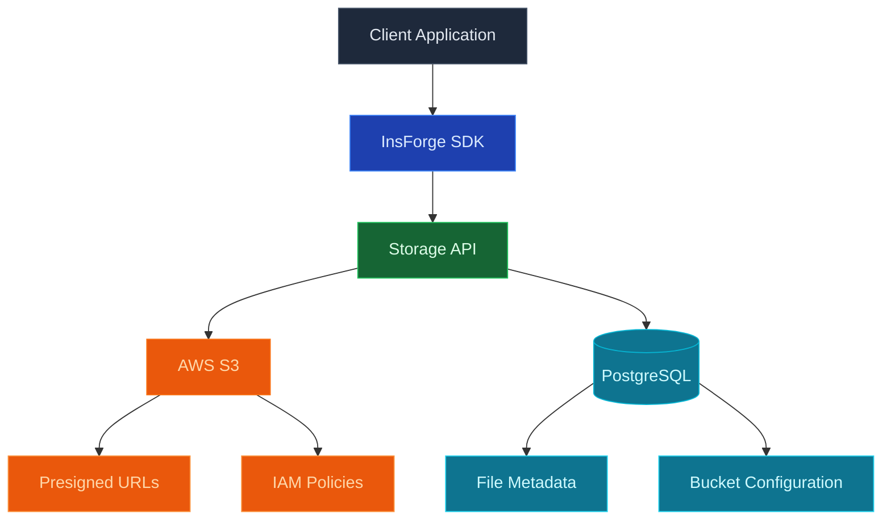

使用 InsForge 來儲存和提供大型二進制檔案：影像、影片、PDF、音訊、備份、任何您不會放在資料庫列中的東西。每個專案都取得一個 S3 相容的儲存貯體。檔案透過簽署的 URL 提供，存取原則遵循與資料庫相同的列級安全模型，S3 API 與 rclone、AWS CLI、Terraform 和任何語言的 SDK 配合使用。

<Frame caption="儲存瀏覽器：儲存貯體、檔案清單和上傳，都在與資料庫相同的 RLS 後面。">
  
</Frame>

<Note>
  **在尋找結構化資料？** 使用 [Database](/core-concepts/database/overview) 來取得列、關聯和查詢。儲存保存物件；資料庫保存列。將檔案中繼資料（所有者、名稱、大小、內容類型）保留在資料庫資料表中，將位元組保留在儲存中。
</Note>

## 功能

### S3 相容的 API

將任何 S3 用戶端指向您的專案的儲存貯體。原生 AWS 認證、原生多部分上傳、原生預簽署 URL。請參閱 [S3 compatibility](/core-concepts/storage/s3-compatibility)。

### 簽署的 URL

產生有時間限制的 URL 以共享私有物件，無需暴露您的認證。SDK 和 REST API 都為上傳和下載發出簽署的 URL。

### 列級安全

儲存原則讀取與資料庫查詢相同的驗證 JWT。可以 `SELECT` 列的同一使用者可以 `GET` 列參考的檔案，所以您永遠不需要維護一套單獨的儲存權限。

### 儲存貯體

使用單獨的存取原則將物件分組到儲存貯體中。公開儲存貯體直接透過 HTTPS 提供檔案；私有儲存貯體需要簽署的 URL 或經過驗證的請求。

### 直接上傳

瀏覽器和行動用戶端使用預簽署的 URL 直接上傳到儲存。後端從不代理位元組。

## 概念

<CardGroup cols={2}>
  <Card title="S3 compatibility" icon="bucket" href="/core-concepts/storage/s3-compatibility">
    使用原生認證將任何 S3 用戶端指向您的專案的儲存貯體。
  </Card>
</CardGroup>

## 使用它進行建置

<CardGroup cols={2}>
  <Card title="TypeScript SDK" icon="js" href="/sdks/typescript/storage">
    從 Node、瀏覽器和邊緣上傳、下載、列表和管理物件。
  </Card>

  <Card title="Swift SDK" icon="swift" href="/sdks/swift/storage">
    用於 iOS 和 macOS 的原生 Swift 儲存用戶端。
  </Card>

  <Card title="Kotlin SDK" icon="android" href="/sdks/kotlin/storage">
    用於 Android 和 JVM 的協程優先儲存用戶端。
  </Card>

  <Card title="REST API" icon="code" href="/sdks/rest/storage">
    普通 HTTP 儲存端點，可從任何語言呼叫。
  </Card>
</CardGroup>

## 下一步

- 設定 [CLI](/quickstart) 以連結您的專案（建議的路徑）。
- 瀏覽 [TypeScript SDK 參考](/sdks/typescript/storage) 以瞭解上傳和下載。
