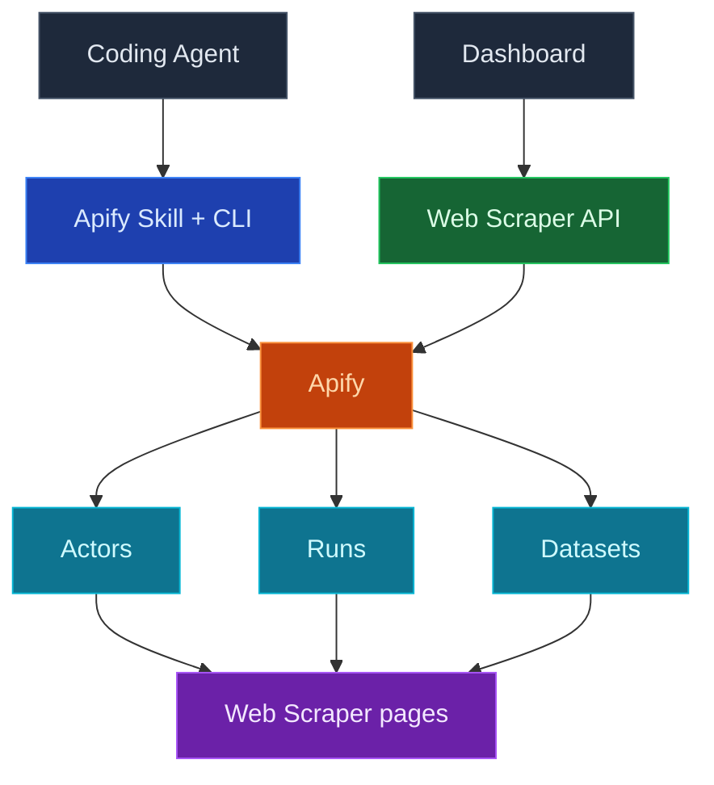

使用 InsForge Web Scraper 讓您的編碼代理即時存取外部資料：只需連接一次您自己的 Apify 帳號，您的代理就可以依需求執行擷取工具（Apify 稱之為 actor），同時儀表板會顯示您的 actor、執行歷程和擷取到的資料集，不需要離開 InsForge。

一鍵連接 Apify，然後將擷取提示貼到您的編碼代理中。代理會使用您由 InsForge 代管的 Apify 權杖進行身分驗證，為工作挑選合適的 actor，並回傳結果。

<Frame caption="Web Scraper 儀表板：已連接的 actor 及其最近一次執行時間與總執行次數。">
  
</Frame>

<Note>
  Apify 始終是 actor、執行紀錄與資料集的權威來源。InsForge 呈現用於日常檢查的精簡子集，對於超出此範圍的內容，則深層連結至 Apify 主控台。Web Scraper 整合僅在 InsForge Cloud 上提供；自架部署在這些路由上會回傳 `501 Not Implemented`。
</Note>



## 功能

### 一鍵連接 Apify

在儀表板中的 Web Scraper 頁面連接 Apify。InsForge 會引導您完成 Apify OAuth 流程，在伺服器端儲存憑證，並持續為您刷新存取權杖。原始權杖絕不會出現在您的程式碼庫或前端中；代理與函式會在需要時向後端取得即時權杖。

### 透過您的編碼代理進行擷取

連接完成後，空白狀態畫面會提供一段擷取提示，您可以將其貼到您的編碼代理中：

```
Use the insforge webscraper apify skill to scrape <what you want> and return the results.
```

在此提示背後，`npx @insforge/cli webscraper apify login` 會取得您由 InsForge 代管的 Apify 權杖，以無頭方式（不需要瀏覽器 OAuth）對本機 Apify CLI 進行身分驗證，並安裝 Apify 代理技能。之後，代理會從 Apify Store 挑選一個 actor、啟動執行，並讀回結果。

### Actors

您最近使用過或建立的 actor，包含其最近執行時間與總執行次數。每一列都會深層連結至 Apify 主控台，以進行完整的 actor 設定。

### Runs

最近的擷取工具執行紀錄，包含狀態（成功、失敗、執行中）、開始時間，以及以美元計的費用。不必開啟 Apify，即可快速確認「昨晚的擷取任務是否成功執行，花費了多少」。

### Dataset

由您的執行所產生的資料集，包含項目數量、建立時間，以及產生該資料集的 actor。深層連結至 Apify 儲存空間，您可以在其中檢視或匯出項目。

### 將擷取到的資料存入您的資料庫

擷取結果預設存放在 Apify 資料集中；除非您需要，否則不會寫入您專案的 Postgres 資料庫。對於小規模擷取，您的代理可以直接回傳結果。對於任何您想保留或依排程更新的內容，可以讓代理部署一個[邊緣函式](/core-concepts/functions/overview)或[運算服務](/core-concepts/compute/overview)，從 Apify 取得資料集並將資料列新增或更新至資料表中。

### 設定與中斷連接

Web Scraper 設定對話框（側邊欄中的齒輪圖示）會顯示已連接的 Apify 帳號、方案與資料保留原則，並提供連結至 Apify 主控台，同時讓管理員可以中斷連接。中斷連接僅會停止 InsForge 使用您的 Apify 憑證；您的 Apify 帳號、actor 與資料集將維持完整，您隨時都可以重新連接。

## 概念

<CardGroup cols={2}>
  <Card title="Apify actor" icon="robot" href="https://docs.apify.com/platform/actors">
    每次執行背後的無伺服器擷取工具，從現成的 Store actor 到您自己的 actor 皆可。
  </Card>

  <Card title="Apify 儲存空間" icon="database" href="https://docs.apify.com/platform/storage/dataset">
    資料集如何儲存擷取的項目，以及如何透過 API 匯出或取得它們。
  </Card>
</CardGroup>

## 以此為基礎進行開發

<CardGroup cols={2}>
  <Card title="InsForge CLI" icon="terminal" href="/quickstart">
    `npx @insforge/cli webscraper apify connect` 會將您的專案連結至 Apify，然後登入您的本機代理。
  </Card>

  <Card title="Apify Store" icon="store" href="https://apify.com/store">
    數以千計針對常見目標的現成 actor，從 Google Maps 到社群平台應有盡有。
  </Card>

  <Card title="Apify API 用戶端" icon="js" href="https://docs.apify.com/api/client/js/">
    從您的邊緣函式或運算服務中呼叫 actor 並讀取資料集。
  </Card>
</CardGroup>

## 下一步

- 開啟儀表板中的 Web Scraper 頁面，點擊 **Connect Apify**。
- 將擷取提示貼到您的編碼代理中，並告訴它您想擷取的內容。
- 當某次擷取值得保留時，請您的代理透過[邊緣函式](/core-concepts/functions/overview)或[排程](/core-concepts/functions/schedules)將資料集存入資料表中。
