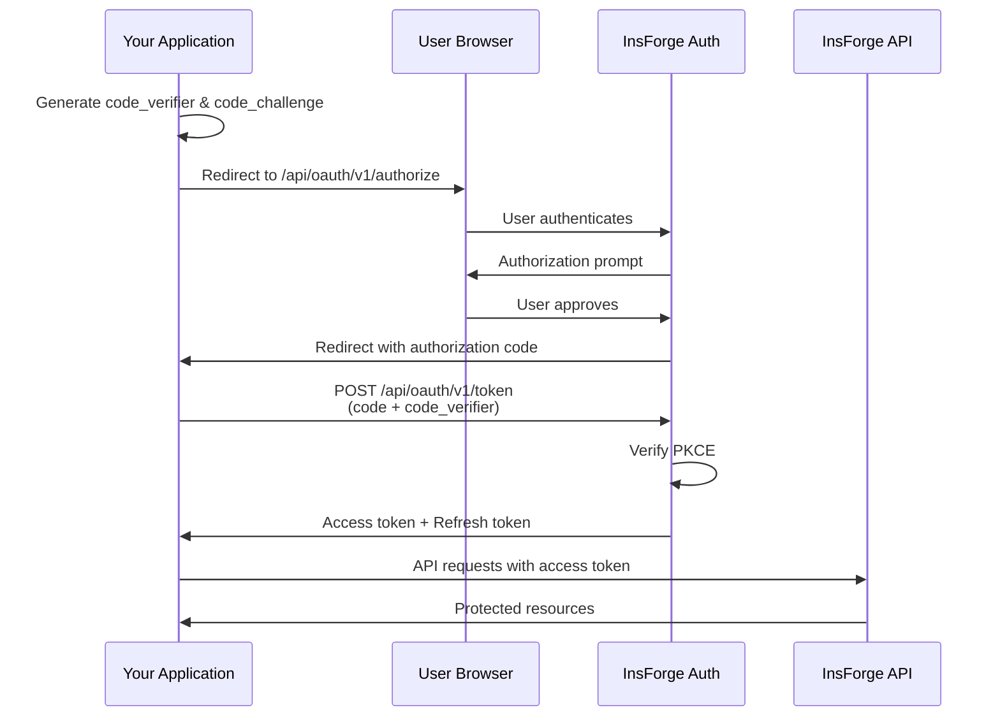

## 總覽

InsForge 可以作為 OAuth 2.0 身分提供者，允許第三方應用程式透過「使用 InsForge 登入」來驗證使用者身分。這讓在您的平台上進行開發的開發者能夠運用 InsForge 的身分驗證系統，而不必自行管理使用者憑證。

## 使用情境

<CardGroup cols={2}>
  <Card title="開發者平台" icon="code">
    允許第三方開發者使用「使用 InsForge 登入」建立整合，同時您仍保有對使用者資料存取的控制權。
  </Card>

  <Card title="AI 代理與 MCP" icon="robot">
    透過以 OAuth 為基礎的授權，使用 Model Context Protocol 驗證 AI 代理與 LLM 工具的身分。
  </Card>

  <Card title="合作夥伴應用程式" icon="handshake">
    允許合作夥伴應用程式針對您的 InsForge 專案驗證使用者身分，而不必共享憑證。
  </Card>

  <Card title="CLI 與桌面應用程式" icon="terminal">
    為需要 API 存取權限的命令列工具與桌面應用程式核發 OAuth 權杖。
  </Card>
</CardGroup>

## OAuth 2.0 流程

InsForge 實作了搭配 PKCE（Proof Key for Code Exchange，程式碼交換驗證金鑰）的**授權碼流程**（Authorization Code flow），這是適用於 Web 與原生應用程式最安全的 OAuth 流程。



## 快速開始

<Steps>
  <Step title="註冊您的應用程式">
    聯絡 InsForge 將您的應用程式註冊為 OAuth 用戶端。您將取得：
    - **Client ID（用戶端 ID）**：您應用程式的公開識別碼
    - **Client Secret（用戶端密鑰）**：用於伺服器端權杖交換的機密金鑰
    - **Allowed Redirect URIs（允許的重新導向 URI）**：使用者在授權後可被重新導向到的 URL
  </Step>

  <Step title="設定範圍（Scopes）">
    定義您的應用程式需要哪些權限：

    | 範圍 | 說明 |
    |-------|-------------|
    | `user:read` | 讀取使用者個人資料資訊 |
    | `organizations:read` | 列出使用者所屬的組織 |
    | `projects:read` | 讀取專案中繼資料 |
    | `projects:write` | 建立與修改專案 |
  </Step>

  <Step title="實作授權流程">
    使用下方的端點將 OAuth 流程整合到您的應用程式中。
  </Step>
</Steps>

## 端點

### 授權端點

將使用者重新導向到此端點以啟動 OAuth 流程。

```
GET https://api.insforge.dev/api/oauth/v1/authorize
```

**查詢參數：**

| 參數 | 是否必需 | 說明 |
|-----------|----------|-------------|
| `client_id` | 是 | 您應用程式的用戶端 ID |
| `redirect_uri` | 是 | 授權後重新導向的 URL（必須事先註冊） |
| `response_type` | 是 | 必須為 `code` |
| `scope` | 是 | 以空格分隔的範圍清單 |
| `state` | 是 | 用於 CSRF 防護的隨機字串 |
| `code_challenge` | 是 | PKCE 代碼質詢（經 base64url 編碼的 SHA256 雜湊值） |
| `code_challenge_method` | 是 | 必須為 `S256` |

**範例：**

```
https://api.insforge.dev/api/oauth/v1/authorize?
  client_id=clf_abc123xyz&
  redirect_uri=https://example.com/callback&
  response_type=code&
  scope=user:read%20organizations:read&
  state=random_state_string&
  code_challenge=E9Melhoa2OwvFrEMTJguCHaoeK1t8URWbuGJSstw-cM&
  code_challenge_method=S256
```

### 權杖端點

用授權碼交換存取權杖與更新權杖。

```
POST https://api.insforge.dev/api/oauth/v1/token
```

**請求本文（JSON）：**

```json
{
  "grant_type": "authorization_code",
  "code": "AUTH_CODE_FROM_CALLBACK",
  "redirect_uri": "https://example.com/callback",
  "client_id": "clf_abc123xyz",
  "client_secret": "your_client_secret",
  "code_verifier": "your_original_code_verifier"
}
```

**回應：**

```json
{
  "access_token": "eyJhbGciOiJIUzI1NiIs...",
  "refresh_token": "eyJhbGciOiJIUzI1NiIs...",
  "token_type": "Bearer",
  "expires_in": 3600
}
```

### 更新權杖

用更新權杖交換新的存取權杖。

```
POST https://api.insforge.dev/api/oauth/v1/token
```

**請求本文（JSON）：**

```json
{
  "grant_type": "refresh_token",
  "refresh_token": "your_refresh_token",
  "client_id": "clf_abc123xyz",
  "client_secret": "your_client_secret"
}
```

### 使用者個人資料端點

取得已驗證使用者的個人資料資訊。

```
GET https://api.insforge.dev/auth/v1/profile
Authorization: Bearer {access_token}
```

**回應：**

```json
{
  "user": {
    "id": "uuid-string",
    "email": "user@example.com",
    "profile": {
      "name": "John Doe",
      "avatar_url": "https://..."
    },
    "email_verified": true,
    "created_at": "2025-01-01T00:00:00Z"
  }
}
```

## 實作指南

### 產生 PKCE 參數

PKCE 透過確保發起流程的應用程式與完成流程的應用程式為同一個，增加了一層額外的安全保障。

<Tabs>
  <Tab title="Node.js">
```javascript
const crypto = require('crypto');

// Generate a random code verifier (keep this secret, stored server-side)
function generateCodeVerifier() {
  return crypto.randomBytes(32).toString('base64url');
}

// Generate the code challenge from the verifier
function generateCodeChallenge(verifier) {
  return crypto
    .createHash('sha256')
    .update(verifier)
    .digest('base64url');
}

// Usage
const codeVerifier = generateCodeVerifier();
const codeChallenge = generateCodeChallenge(codeVerifier);

// Store codeVerifier in session, send codeChallenge to authorization endpoint
```
  </Tab>
  <Tab title="Python">
```python
import secrets
import hashlib
import base64

def generate_code_verifier():
    return secrets.token_urlsafe(32)

def generate_code_challenge(verifier):
    digest = hashlib.sha256(verifier.encode()).digest()
    return base64.urlsafe_b64encode(digest).rstrip(b'=').decode()

# Usage
code_verifier = generate_code_verifier()
code_challenge = generate_code_challenge(code_verifier)

# Store code_verifier in session, send code_challenge to authorization endpoint
```
  </Tab>
  <Tab title="瀏覽器（Web Crypto）">
```javascript
async function generateCodeVerifier() {
  const array = new Uint8Array(32);
  crypto.getRandomValues(array);
  return base64UrlEncode(array);
}

async function generateCodeChallenge(verifier) {
  const encoder = new TextEncoder();
  const data = encoder.encode(verifier);
  const digest = await crypto.subtle.digest('SHA-256', data);
  return base64UrlEncode(new Uint8Array(digest));
}

function base64UrlEncode(buffer) {
  return btoa(String.fromCharCode(...buffer))
    .replace(/\+/g, '-')
    .replace(/\//g, '_')
    .replace(/=+$/, '');
}
```
  </Tab>
</Tabs>

### 完整的伺服器端範例

這是一個完整的 Express.js 實作範例。首先，建立一個包含您憑證的 `.env` 檔案：

```bash
# .env - DO NOT commit this file to version control
SESSION_SECRET=your-secure-random-secret-min-32-chars
INSFORGE_CLIENT_ID=clf_your_client_id
INSFORGE_CLIENT_SECRET=your_client_secret
INSFORGE_URL=https://api.insforge.dev
REDIRECT_URI=http://localhost:3000/auth/callback
```

<Note>
使用以下指令產生安全的工作階段密鑰：`node -e "console.log(require('crypto').randomBytes(32).toString('hex'))"`
</Note>

接著實作 OAuth 流程：

```javascript
require('dotenv').config();
const express = require('express');
const crypto = require('crypto');
const session = require('express-session');

const app = express();

// Validate required environment variables
const requiredEnvVars = ['SESSION_SECRET', 'INSFORGE_CLIENT_ID', 'INSFORGE_CLIENT_SECRET'];
for (const envVar of requiredEnvVars) {
  if (!process.env[envVar]) {
    console.error(`Missing required environment variable: ${envVar}`);
    process.exit(1);
  }
}

app.use(express.json());
app.use(session({
  secret: process.env.SESSION_SECRET,
  resave: false,
  saveUninitialized: true,
  cookie: { secure: process.env.NODE_ENV === 'production' }
}));

const config = {
  clientId: process.env.INSFORGE_CLIENT_ID,
  clientSecret: process.env.INSFORGE_CLIENT_SECRET,
  insforgeUrl: process.env.INSFORGE_URL || 'https://api.insforge.dev',
  redirectUri: process.env.REDIRECT_URI || 'http://localhost:3000/auth/callback',
  scopes: 'user:read organizations:read'
};

// Step 1: Initiate OAuth flow
app.get('/auth/login', (req, res) => {
  // Generate PKCE parameters
  const codeVerifier = crypto.randomBytes(32).toString('base64url');
  const codeChallenge = crypto
    .createHash('sha256')
    .update(codeVerifier)
    .digest('base64url');

  // Generate state for CSRF protection
  const state = crypto.randomBytes(16).toString('hex');

  // Store in session
  req.session.codeVerifier = codeVerifier;
  req.session.oauthState = state;

  // Build authorization URL
  const authUrl = new URL(`${config.insforgeUrl}/api/oauth/v1/authorize`);
  authUrl.searchParams.set('client_id', config.clientId);
  authUrl.searchParams.set('redirect_uri', config.redirectUri);
  authUrl.searchParams.set('response_type', 'code');
  authUrl.searchParams.set('scope', config.scopes);
  authUrl.searchParams.set('state', state);
  authUrl.searchParams.set('code_challenge', codeChallenge);
  authUrl.searchParams.set('code_challenge_method', 'S256');

  res.redirect(authUrl.toString());
});

// Step 2: Handle callback
app.get('/auth/callback', async (req, res) => {
  const { code, state, error } = req.query;

  // Check for errors
  if (error) {
    return res.status(400).send(`OAuth error: ${error}`);
  }

  // Validate state to prevent CSRF
  if (state !== req.session.oauthState) {
    return res.status(403).send('Invalid state parameter');
  }

  try {
    // Exchange code for tokens
    const tokenResponse = await fetch(`${config.insforgeUrl}/api/oauth/v1/token`, {
      method: 'POST',
      headers: { 'Content-Type': 'application/json' },
      body: JSON.stringify({
        grant_type: 'authorization_code',
        code,
        redirect_uri: config.redirectUri,
        client_id: config.clientId,
        client_secret: config.clientSecret,
        code_verifier: req.session.codeVerifier
      })
    });

    const tokens = await tokenResponse.json();

    if (!tokenResponse.ok) {
      throw new Error(tokens.error || 'Token exchange failed');
    }

    // Fetch user profile
    const profileResponse = await fetch(`${config.insforgeUrl}/auth/v1/profile`, {
      headers: { 'Authorization': `Bearer ${tokens.access_token}` }
    });

    const { user } = await profileResponse.json();

    // Store tokens and user in session
    req.session.accessToken = tokens.access_token;
    req.session.refreshToken = tokens.refresh_token;
    req.session.user = user;

    // Clean up PKCE data
    delete req.session.codeVerifier;
    delete req.session.oauthState;

    res.redirect('/dashboard');
  } catch (err) {
    console.error('OAuth callback error:', err);
    res.status(500).send('Authentication failed');
  }
});

// Step 3: Use access token for API calls
app.get('/api/organizations', async (req, res) => {
  if (!req.session.accessToken) {
    return res.status(401).json({ error: 'Not authenticated' });
  }

  const response = await fetch(`${config.insforgeUrl}/organizations/v1`, {
    headers: { 'Authorization': `Bearer ${req.session.accessToken}` }
  });

  const data = await response.json();
  res.json(data);
});

app.listen(3000, () => console.log('Server running on http://localhost:3000'));
```

### 單頁應用程式的彈出視窗模式

對於單頁應用程式（SPA），您可以在彈出視窗中開啟 OAuth 流程：

```javascript
function loginWithPopup() {
  const width = 500;
  const height = 600;
  const left = window.screenX + (window.outerWidth - width) / 2;
  const top = window.screenY + (window.outerHeight - height) / 2;

  const popup = window.open(
    '/auth/login?mode=popup',
    'insforge-oauth',
    `width=${width},height=${height},left=${left},top=${top}`
  );

  // Listen for completion message from popup
  window.addEventListener('message', (event) => {
    if (event.origin !== window.location.origin) return;

    if (event.data.type === 'oauth-complete') {
      popup.close();
      // Handle successful authentication
      window.location.reload();
    }
  });
}
```

在您的回呼處理常式中，向父視窗傳送訊息：

```javascript
// In callback route, after successful token exchange
if (req.query.mode === 'popup') {
  res.send(`
    <script>
      window.opener.postMessage({ type: 'oauth-complete' }, window.location.origin);
      window.close();
    </script>
  `);
}
```

## 安全注意事項

<CardGroup cols={2}>
  <Card title="務必使用 PKCE" icon="shield-check">
    所有 OAuth 流程都必須使用 PKCE。它可以防止授權碼遭攔截攻擊。
  </Card>

  <Card title="驗證 State 參數" icon="fingerprint">
    務必在回呼中驗證 state 參數，以防止 CSRF 攻擊。
  </Card>

  <Card title="安全的權杖儲存" icon="lock">
    將存取權杖儲存在記憶體中或安全的 httpOnly cookie 中。切勿將權杖暴露在 URL 或 localStorage 中。
  </Card>

  <Card title="使用 HTTPS" icon="globe">
    正式環境中所有 OAuth 端點皆要求使用 HTTPS。切勿透過未加密的連線傳輸權杖。
  </Card>

  <Card title="較短的權杖有效期限" icon="clock">
    存取權杖將於 1 小時後過期。使用更新權杖即可在不必重新驗證身分的情況下取得新的存取權杖。
  </Card>

  <Card title="最小化範圍" icon="minimize">
    僅請求您應用程式所需的範圍。使用者較願意核准有限的權限。
  </Card>
</CardGroup>

## 權杖聲明（Claims）

存取權杖是包含以下聲明的 JWT：

| 聲明 | 說明 |
|-------|-------------|
| `sub` | 使用者 ID（UUID） |
| `email` | 使用者的電子郵件地址 |
| `role` | 使用者角色（`authenticated`） |
| `client_id` | 請求該權杖的 OAuth 用戶端 ID |
| `scope` | 已授予的範圍 |
| `iat` | 簽發時間戳記 |
| `exp` | 過期時間戳記 |
| `iss` | 簽發者（`insforge`） |
| `aud` | 受眾（`insforge-api`） |

## 錯誤處理

### 授權錯誤

若授權失敗，使用者將被重新導向到您的 `redirect_uri`，並附帶錯誤參數：

```
https://example.com/callback?error=access_denied&error_description=User%20denied%20access
```

常見錯誤代碼：

| 錯誤 | 說明 |
|-------|-------------|
| `invalid_request` | 缺少參數或參數無效 |
| `unauthorized_client` | 用戶端未獲授權使用此授權類型 |
| `access_denied` | 使用者拒絕了授權請求 |
| `invalid_scope` | 請求的範圍無效或未知 |

### 權杖錯誤

權杖端點的錯誤將以 JSON 格式回傳：

```json
{
  "error": "invalid_grant",
  "error_description": "Authorization code has expired"
}
```

| 錯誤 | 說明 |
|-------|-------------|
| `invalid_grant` | 授權碼已過期、已被使用，或驗證器不相符 |
| `invalid_client` | 用戶端身分驗證失敗 |
| `invalid_request` | 缺少必要的參數 |

## 速率限制

OAuth 端點受到速率限制以防止濫用：

| 端點 | 限制 |
|----------|-------|
| `/authorize` | 每個 IP 每分鐘 100 次請求 |
| `/token` | 每個用戶端每分鐘 50 次請求 |
| `/profile` | 每個權杖每分鐘 100 次請求 |

## 資源

<Card title="OAuth 範例儲存庫" icon="github" href="https://github.com/InsForge/insforge-oauth-example">
  完整可執行的範例，展示如何將「使用 InsForge 登入」整合到您的應用程式中。
</Card>
