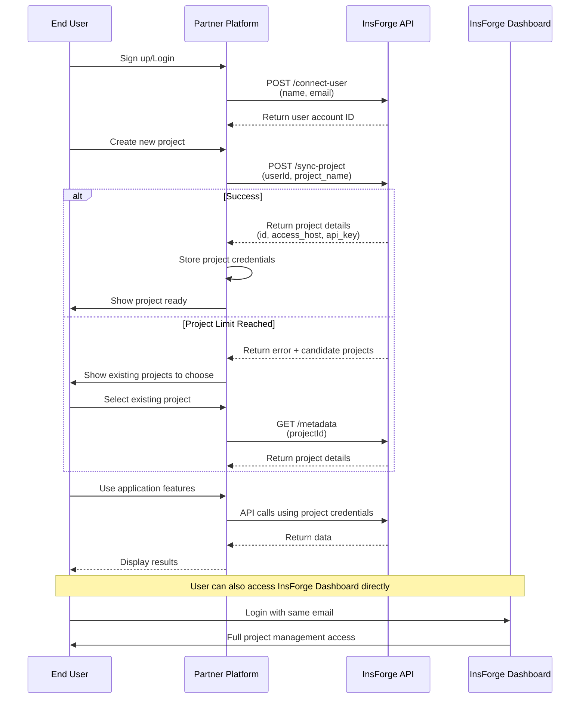
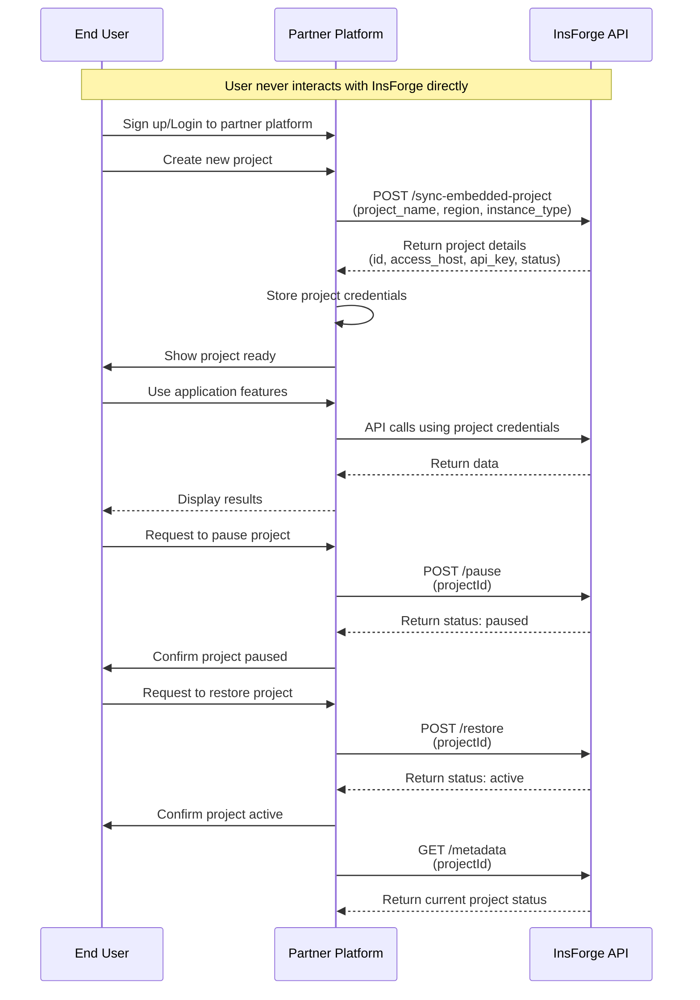

## 概觀

InsForge 提供兩種合作夥伴模式，能將我們的後端即服務（Backend-as-a-Service）平台無縫整合到您的應用程式中。無論您是在尋找聯合品牌解決方案，還是完全白標的體驗，我們都有適合您的合作夥伴模式。

## 合作夥伴模式

<CardGroup cols={2}>
  <Card title="聯合品牌合作夥伴關係" icon="handshake">
    非常適合希望將 InsForge 與自身服務一併提供的平台。
    整合流程非常簡單——開發者只需一鍵即可連接到 InsForge 平台，不需要複雜的 OAuth 流程。
  </Card>
  <Card title="白標合作夥伴關係" icon="tag">
    適合尋求對使用者體驗擁有完全掌控權的平台。
    提供完整的專案生命週期管理，包括專案儀表板整合。開發者不需要離開您的合作夥伴平台即可完成所有操作。
  </Card>
</CardGroup>

## 合作夥伴權益

<CardGroup cols={2}>
  <Card title="可擴展的基礎架構" icon="server">
    運用我們強大的後端基礎架構，不需要承擔維護和擴展的負擔
  </Card>
  <Card title="彈性的整合方式" icon="plug">
    從多種整合選項中選擇最適合您應用需求的方式
  </Card>
  <Card title="收益分潤" icon="handshake">
    享有我們為合作夥伴應用提供的具競爭力的收益分潤模式
  </Card>
  <Card title="技術支援" icon="headset">
    獲得專屬的技術支援與資源，確保整合順利進行
  </Card>
</CardGroup>

## 快速開始

<Steps>
  <Step title="申請合作夥伴關係">
    透過我們的[合作夥伴信箱](mailto:partnerships@insforge.dev)提交您的合作夥伴申請。
    請註明您感興趣的是聯合品牌還是白標合作夥伴關係。
  </Step>

  <Step title="取得合作夥伴憑證">
    一經核准，您將取得：
    - **合作夥伴 ID**：您唯一的合作夥伴識別碼
    - **密鑰**：用於 API 存取的身分驗證金鑰
    - 整合文件與支援
  </Step>

  <Step title="設定身分驗證">
    所有 API 請求都必須包含您的密鑰以進行身分驗證：

    ```bash
    curl -X POST https://api.insforge.dev/partnership/v1/YOUR_PARTNER_ID/endpoint \
      -H "Content-Type: application/json" \
      -H "X-Partnership-Secret: YOUR_SECRET_KEY"
    ```
  </Step>

  <Step title="開始整合">
    根據您的合作夥伴模式，使用我們的 API 端點開始整合。
  </Step>
</Steps>

## 依合作夥伴類型劃分的功能

### 聯合品牌功能
在聯合品牌模式下，開發者明確知道自己是 InsForge 平台的使用者（透過相同的電子郵件位址關聯）。登入 InsForge 平台後，開發者對透過合作夥伴建立的專案擁有完整的管理權限，並需要依照 InsForge 的計費方案付費。

合作夥伴平台可以：
- 將使用者帳號（姓名、電子郵件）與 InsForge 同步
- 將專案同步至 InsForge
- 查詢專案連接資訊，以運用已完成的後端能力。

### 白標功能
在白標模式下，開發者不知道 InsForge 的存在，也無法在 InsForge 平台上看到合作夥伴建立的專案。

合作夥伴平台可以：
- 建立嵌入式專案
- 查詢專案中繼資料，以運用已完成的後端能力。
- 暫停專案
- 還原專案
- 刪除專案
- 取得專案的存取授權權杖
- 取得專案的使用情況
- 取得所有合作夥伴專案的彙總使用情況（用於計費）

## API 參考

<Tabs>
  <Tab title="聯合品牌 API">

    ### 連接使用者帳號
    將使用者帳號資訊與 InsForge 同步。

    ```bash
    POST /partnership/v1/:partnerId/connect-user
    ```

    **請求主體：**
    ```json
    {
      "name": "John Doe",      // required
      "email": "john@example.com" // required
    }
    ```

    **回應：**
    ```json
    {
      "account": {
        "id": "uuid-string"
      }
    }
    ```

    ### 同步專案
    為特定使用者建立或同步專案。

    ```bash
    POST /partnership/v1/:partnerId/:userId/sync-project
    ```

    **請求主體：**
    ```json
    {
      "project_name": "my-project",  // required
      "region": "us-east",         // optional, "us-east", "us-west", "ap-southeast", "eu-central", default: "us-east"
      "instance_type": "nano"      // optional, "nano", "micro", "small", "medium", "large", "xl", "2xl", "4xl", "8xl", "16xl", default: "nano"
    }
    ```

    **回應：**
    ```json
    {
      "success": true,
      "project": {
        "id": "uuid-string",
        "access_host": "https://project.us-east.insforge.app",
        "api_key": "project-api-key",
        "status": "active"
      }
    }
    ```

    #### 處理專案數量限制
    注意：由於 InsForge 免費方案有專案數量限制，來自合作夥伴平台的專案同步作業可能會失敗。在這種情況下，回應內容將為：

    ```json
    {
      "success": false,
      "message": "Free plan allows up to 2 active projects. Please upgrade your plan to create more projects.",
      "candidate_projects": [
        {
          "id": "uuid-string",
          "access_host": "https://project2.us-east.insforge.app",
          "api_key": "project-api-key",
          "status": "active"
        }
      ]
    }
    ```

    合作夥伴可以引導使用者選擇現有專案進行連接，而不是每次都建立新專案。

    ### 取得專案中繼資料
    擷取特定專案的連接資訊。

    ```bash
    GET /partnership/v1/:partnerId/:userId/:projectId/metadata
    ```

    **回應：**
    ```json
    {
      "project": {
        "id": "uuid-string",
        "access_host": "https://project.us-east.insforge.app",
        "api_key": "project-api-key",
        "status": "active"
      }
    }
    ```

  </Tab>
  <Tab title="白標 API">

    ### 同步嵌入式專案
    為白標合作夥伴建立嵌入式專案。

    ```bash
    POST /partnership/v1/:partnerId/sync-embedded-project
    ```

    **請求主體：**
    ```json
    {
      "project_name": "embedded-project",  // required
      "region": "us-east",               // optional, "us-east", "us-west", "ap-southeast", "eu-central", default: "us-east"
      "instance_type": "nano"            // optional, "nano", "micro", "small", "medium", "large", "xl", "2xl", "4xl", "8xl", "16xl", default: "nano"
    }
    ```

    **回應：**
    ```json
    {
      "success": true,
      "project": {
        "id": "uuid-string",
        "access_host": "https://project.us-east.insforge.app",
        "api_key": "project-api-key",
        "status": "active"
      }
    }
    ```

    ### 取得專案中繼資料
    擷取特定專案的中繼資料。

    ```bash
    GET /partnership/v1/:partnerId/:projectId/metadata
    ```

    **回應：**
    ```json
    {
      "project": {
        "id": "uuid-string",
        "access_host": "https://project.us-east.insforge.app",
        "api_key": "project-api-key",
        "region": "us-east",
        "instance_type": "nano",
        "last_activity_at": "2025-01-21T10:30:00Z",
        "status": "active"
      }
    }
    ```

    ### 暫停專案
    暫停一個運作中的專案以節省資源。

    ```bash
    POST /partnership/v1/:partnerId/:projectId/pause
    ```

    **請求主體：**
    ```json
    {
      "wait_for_completion": true  // optional
    }
    ```

    **回應：**
    ```json
    {
      "project": {
        "id": "uuid-string",
        "status": "paused"
      }
    }
    ```

    ### 還原專案
    將已暫停的專案還原為運作中狀態。

    ```bash
    POST /partnership/v1/:partnerId/:projectId/restore
    ```

    **請求主體：**
    ```json
    {
      "wait_for_completion": true  // optional
    }
    ```

    **回應：**
    ```json
    {
      "project": {
        "id": "uuid-string",
        "status": "active"
      }
    }
    ```

    ### 刪除專案
    永久刪除一個專案。此操作無法復原。

    ```bash
    DELETE /partnership/v1/:partnerId/:projectId
    ```

    **回應 (200 OK)：**
    ```json
    {
      "message": "Project deleted successfully",
      "requestId": "xhiahif-fehfe-feae"
    }
    ```

    ### 產生專案授權
    產生用於專案存取的短期非對稱 JWT 權杖。此權杖以 RSA 私鑰簽署，可透過公開的 JWKS 端點進行驗證。權杖有效期限為 10 分鐘。

    ```bash
    POST /partnership/v1/:partnerId/:projectId/authorization
    ```

    **回應：**
    ```json
    {
      "code": "eyJhbGciOiJSUzI1NiIsInR5cCI6IkpXVCIsImtpZCI6Imluc2ZvcmdlLWtleS0yMDI1LTA4LTEzIn0...",
      "expires_in": 600,
      "type": "Bearer"
    }
    ```

    ### 取得專案使用情況
    擷取特定專案在指定日期範圍內的使用量指標。回傳彙總統計資料以及按日細分的使用量指標。若未指定日期，則回傳最近 7 天的資料。

    ```bash
    GET /partnership/v1/:partnerId/:projectId/usage?start_date=2025-11-10&end_date=2025-11-18
    ```

    **查詢參數：**
    - `start_date`（選填）：起始日期，格式為 YYYY-MM-DD（預設為 7 天前）
    - `end_date`（選填）：結束日期，格式為 YYYY-MM-DD（預設為今天）

    **回應：**
    ```json
    {
      "project": {
        "id": "uuid-string",
        "name": "project-name",
        "status": "active",
        "last_activity_at": "2025-11-18T10:30:00Z"
      },
      "period": {
        "start": "2025-11-10T00:00:00Z",
        "end": "2025-11-18T23:59:59Z"
      },
      "summary": {
        "max_database_size_bytes": 1048576,
        "max_file_storage_bytes": 5242880,
        "total_ai_tokens": 15000,
        "total_mcp_calls": 120,
        "total_egress_bytes": 2097152,
        "total_ai_credits": 1.5,
        "total_email_requests": 50,
        "total_function_calls": 300,
        "total_ec2_compute": 3600
      },
      "daily_usage": [
        {
          "usage_date": "2025-11-10",
          "database_size_bytes": 1048576,
          "file_storage_bytes": 5242880,
          "ai_tokens": 1500,
          "mcp_calls": 12,
          "egress_bytes": 204800,
          "ai_credits": 0.15,
          "email_requests": 5,
          "function_calls": 30,
          "ec2_compute": 3600
        }
      ]
    }
    ```

    ### 取得合作夥伴總使用量
    擷取您合作夥伴關係下所有專案在指定日期範圍內的彙總使用量指標。此端點專為計費與報告用途設計，提供資源消耗的統一檢視。

    ```bash
    GET /partnership/v1/:partnerId/usage?start_date=2025-11-01&end_date=2025-11-30
    ```

    **查詢參數：**
    - `start_date`（選填）：起始日期，格式為 YYYY-MM-DD（預設為 7 天前）
    - `end_date`（選填）：結束日期，格式為 YYYY-MM-DD（預設為今天）

    **回應：**
    ```json
    {
      "partnership": {
        "id": "ps_abc123xyz",
        "name": "Partner Name"
      },
      "period": {
        "start": "2025-11-01T00:00:00Z",
        "end": "2025-11-30T23:59:59Z"
      },
      "summary": {
        "database_bytes": 10485760,
        "storage_bytes": 52428800,
        "ai_tokens": 150000,
        "mcp_calls": 1200,
        "egress_bytes": 20971520,
        "ai_credits": 15.5,
        "email_requests": 500,
        "function_calls": 3000,
        "ec2_compute": 36000
      }
    }
    ```

    **使用量指標類型：**

    | 指標 | 類型 | 說明 |
    |--------|------|-------------|
    | `database_bytes` | 峰值 | 峰值資料庫總佔用量（每日加總，取跨日最大值） |
    | `storage_bytes` | 峰值 | 峰值儲存總佔用量（每日加總，取跨日最大值） |
    | `ai_tokens` | 累計 | 消耗的 AI token 總數 |
    | `mcp_calls` | 累計 | 發出的 MCP/工具呼叫總數 |
    | `egress_bytes` | 累計 | 資料傳輸總量（來源站 + CDN） |
    | `ai_credits` | 累計 | 消耗的 AI 額度總量 |
    | `email_requests` | 累計 | 已寄送的電子郵件總數 |
    | `function_calls` | 累計 | 無伺服器函式呼叫總數 |
    | `ec2_compute` | 累計 | 使用的運算秒數總量 |

    <Note>
    此端點包含指定日期範圍內已刪除專案的使用情況，以確保計費準確無誤。
    </Note>

  </Tab>
</Tabs>

## 整合範例

### 聯合品牌整合流程

以下時序圖說明了聯合品牌合作夥伴關係的整合流程：



```typescript
// 1. Connect user account
const connectUser = async (name: string, email: string) => {
  const response = await fetch(
    `https://api.insforge.dev/partnership/v1/${PARTNER_ID}/connect-user`,
    {
      method: 'POST',
      headers: {
        'X-Partnership-Secret': `${SECRET_KEY}`,
        'Content-Type': 'application/json'
      },
      body: JSON.stringify({ name, email })
    }
  );

  const { account } = await response.json();
  return account.id;
};

// 2. Create project for user
const createProject = async (userId: string, projectName: string) => {
  const response = await fetch(
    `https://api.insforge.dev/partnership/v1/${PARTNER_ID}/${userId}/sync-project`,
    {
      method: 'POST',
      headers: {
        'X-Partnership-Secret': `${SECRET_KEY}`,
        'Content-Type': 'application/json'
      },
      body: JSON.stringify({
        project_name: projectName,
        region: 'us-east',
        instance_type: 'nano'
      })
    }
  );

  const data = await response.json();
  if (data.success) {
    return data.project;
  }
  throw new Error(data.message);
};

// 3. Use project credentials
console.log(project.access_host);
console.log(project.api_key);
```

### 白標整合流程

以下時序圖說明了白標合作夥伴關係的整合流程：



```typescript
// 1. Create embedded project
const createEmbeddedProject = async (projectName: string) => {
  const response = await fetch(
    `https://api.insforge.dev/partnership/v1/${PARTNER_ID}/sync-embedded-project`,
    {
      method: 'POST',
      headers: {
        'X-Partnership-Secret': `${SECRET_KEY}`,
        'Content-Type': 'application/json'
      },
      body: JSON.stringify({
        project_name: projectName,
        region: 'eu-west',
        instance_type: 'small'
      })
    }
  );

  const data = await response.json();
  if (data.success) {
    return data.project;
  }
  throw new Error(data.message);
};

// 2. Manage project lifecycle
const pauseProject = async (projectId: string) => {
  const response = await fetch(
    `https://api.insforge.dev/partnership/v1/${PARTNER_ID}/${projectId}/pause`,
    {
      method: 'POST',
      headers: {
        'X-Partnership-Secret': `${SECRET_KEY}`,
        'Content-Type': 'application/json'
      },
      body: JSON.stringify({
        wait_for_completion: true
      })
    }
  );

  const { project } = await response.json();
  console.log(`Project ${project.id} status: ${project.status}`);
};

const restoreProject = async (projectId: string) => {
  const response = await fetch(
    `https://api.insforge.dev/partnership/v1/${PARTNER_ID}/${projectId}/restore`,
    {
      method: 'POST',
      headers: {
        'X-Partnership-Secret': `${SECRET_KEY}`,
        'Content-Type': 'application/json'
      },
      body: JSON.stringify({
        wait_for_completion: true
      })
    }
  );

  const { project } = await response.json();
  console.log(`Project ${project.id} status: ${project.status}`);
};

// 3. Delete project
const deleteProject = async (projectId: string) => {
  const response = await fetch(
    `https://api.insforge.dev/partnership/v1/${PARTNER_ID}/${projectId}`,
    {
      method: 'DELETE',
      headers: {
        'X-Partnership-Secret': `${SECRET_KEY}`
      }
    }
  );

  if (response.ok) {
    const data = await response.json();
    console.log(data.message); // "Project deleted successfully"
    console.log(`Request ID: ${data.requestId}`);
  } else {
    throw new Error(`Failed to delete project: ${response.status}`);
  }
};

// 4. Get partnership total usage (for billing)
const getPartnershipUsage = async (startDate: string, endDate: string) => {
  const params = new URLSearchParams({ start_date: startDate, end_date: endDate });
  const response = await fetch(
    `https://api.insforge.dev/partnership/v1/${PARTNER_ID}/usage?${params}`,
    {
      method: 'GET',
      headers: {
        'X-Partnership-Secret': `${SECRET_KEY}`
      }
    }
  );

  const data = await response.json();
  console.log(`Period: ${data.period.start} to ${data.period.end}`);
  console.log(`Database: ${data.summary.database_bytes} bytes (peak)`);
  console.log(`Storage: ${data.summary.storage_bytes} bytes (peak)`);
  console.log(`AI Credits: ${data.summary.ai_credits}`);
  console.log(`Egress: ${data.summary.egress_bytes} bytes`);
  return data;
};
```

## 參數與回應參考

### 專案地區數值
InsForge 提供全球化的部署能力。每個專案都可以部署到不同的地區：
- `us-east` - 美國東岸
- `us-west` - 美國西岸
- `ap-southeast` - 亞太東南
- `eu-central` - 歐洲中部

未來將依需求增加更多地區。

### 專案執行個體類型數值
根據您專案的業務需求，InsForge 提供以下資源類型：
- `nano` - 用於開發的最小資源
- `micro` - 用於測試和開發的基礎資源
- `small` - 輕量級工作負載
- `medium` - 標準應用程式
- `large` - 生產環境工作負載
- `xl` - 高效能應用程式
- `2xl` - 企業級應用程式
- `4xl` - 大規模營運
- `8xl` - 關鍵任務系統
- `16xl` - 最高效能

### 專案狀態數值

專案可以具有以下狀態值：

- **active**：專案正在運作且可存取
- **paused**：專案已暫停（僅限白標）

## 錯誤處理

所有 API 端點都會回傳一致的錯誤回應：

```json
{
  "success": false,
  "message": "Detailed error message describing what went wrong"
}
```

常見錯誤情境：
- 身分驗證憑證無效
- 找不到專案
- 請求的操作權限不足
- 請求參數無效

## 下一步

- 與我們的團隊安排一次[技術評估會議](https://calendly.com/tony-chang-insforge/45min)
