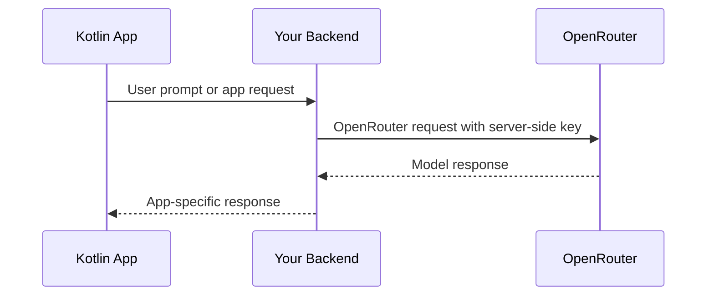

## 概述

InsForge 為模型閘道專案預配了一個 OpenRouter API 金鑰。新的 Kotlin 應用程式應從受信任的伺服器端程式碼、後端 API 或其他安全邊界呼叫 OpenRouter。不要將 OpenRouter 金鑰嵌入 Android 或桌面用戶端二進位檔案中。

以前的 InsForge Kotlin AI SDK 方法已被棄用為相容性包裝函式。使用 InsForge SDK 來實現資料庫、身份驗證、儲存空間、函式和即時功能；使用 OpenRouter 來進行模型呼叫。

## 建議的架構



## 伺服器端 OpenRouter 呼叫

從您的後端使用 OpenAI SDK 或 REST。對於 TypeScript 後端：

```typescript
import OpenAI from 'openai';

const openai = new OpenAI({
  baseURL: 'https://openrouter.ai/api/v1',
  apiKey: process.env.OPENROUTER_API_KEY,
});

const completion = await openai.chat.completions.create({
  model: 'openai/gpt-4o-mini',
  messages: [{ role: 'user', content: 'Summarize this note.' }],
});
```

## 從 Kotlin 呼叫您的後端

```kotlin
import io.ktor.client.HttpClient
import io.ktor.client.call.body
import io.ktor.client.plugins.contentnegotiation.ContentNegotiation
import io.ktor.client.request.header
import io.ktor.client.request.post
import io.ktor.client.request.setBody
import io.ktor.http.ContentType
import io.ktor.http.contentType
import io.ktor.serialization.kotlinx.json.json
import kotlinx.serialization.Serializable

@Serializable
data class ChatRequest(val prompt: String)

@Serializable
data class ChatResponse(val text: String)

val http = HttpClient {
    install(ContentNegotiation) {
        json()
    }
}

suspend fun sendPrompt(prompt: String, sessionToken: String): ChatResponse {
    return http.post("https://your-app.example/api/chat") {
        header("Authorization", "Bearer $sessionToken")
        contentType(ContentType.Application.Json)
        setBody(ChatRequest(prompt))
    }.body()
}
```

對您的後端路由使用應用工作階段權杖或另一個使用者範圍的認證。切勿從 Kotlin 用戶端傳送 OpenRouter 金鑰。

## 舊版 InsForge AI 方法

這些 Kotlin SDK 方法已為新的 AI 整合棄用：

- `client.ai.listModels()`
- `client.ai.chatCompletion(...)`
- `client.ai.chatCompletionStream(...)`
- `client.ai.generateEmbeddings(...)`
- `client.ai.generateImage(...)`

它們針對已棄用的 InsForge AI 代理。新的整合應使用儀表板中的 OpenRouter 金鑰，並遵循 OpenRouter 目前的 API 文件來瞭解模型參數和功能。
