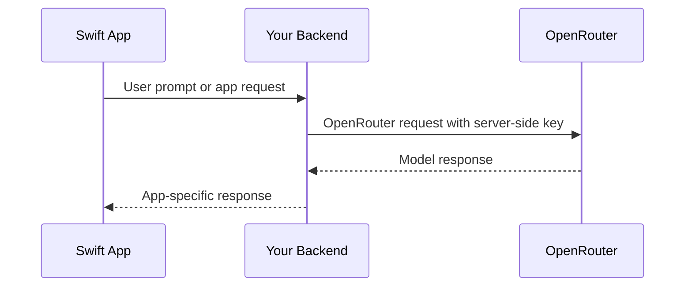

## 概覽

InsForge 為模型閘道專案提供 OpenRouter API 金鑰。新的 Swift 應用應該從受信的伺服端程式碼、後端 API 或其他安全邊界直接呼叫 OpenRouter。不要在 iOS、macOS、tvOS 或 watchOS 應用二進制檔案中嵌入 OpenRouter 金鑰。

之前的 InsForge Swift AI SDK 方法已棄用，是相容性包裝器。使用 InsForge SDK 處理資料庫、身份驗證、儲存體、函數和即時通訊；使用 OpenRouter 進行模型呼叫。

## 推薦架構



## 伺服端 OpenRouter 呼叫

使用 OpenAI SDK 或 REST 從後端呼叫。對於 TypeScript 後端：

```typescript
import OpenAI from 'openai';

const openai = new OpenAI({
  baseURL: 'https://openrouter.ai/api/v1',
  apiKey: process.env.OPENROUTER_API_KEY,
});

const completion = await openai.chat.completions.create({
  model: 'openai/gpt-4o-mini',
  messages: [{ role: 'user', content: 'Summarize this note.' }],
});
```

## 從 Swift 呼叫後端

```swift
struct ChatRequest: Encodable {
    let prompt: String
}

struct ChatResponse: Decodable {
    let text: String
}

func sendPrompt(_ prompt: String, sessionToken: String) async throws -> ChatResponse {
    let url = URL(string: "https://your-app.example/api/chat")!
    var request = URLRequest(url: url)
    request.httpMethod = "POST"
    request.setValue("Bearer \\(sessionToken)", forHTTPHeaderField: "Authorization")
    request.setValue("application/json", forHTTPHeaderField: "Content-Type")
    request.httpBody = try JSONEncoder().encode(ChatRequest(prompt: prompt))

    let (data, response) = try await URLSession.shared.data(for: request)
    guard let httpResponse = response as? HTTPURLResponse,
          (200..<300).contains(httpResponse.statusCode) else {
        throw URLError(.badServerResponse)
    }

    return try JSONDecoder().decode(ChatResponse.self, from: data)
}
```

為後端路由使用應用工作階段令牌或其他使用者範圍的認證。不要從 Swift 用戶端傳送 OpenRouter 金鑰。

## 遺留 InsForge AI 方法

這些 Swift SDK 方法已棄用，不應用於新的 AI 整合：

- `insforge.ai.chatCompletion(...)`
- `insforge.ai.generateEmbeddings(...)`
- `insforge.ai.generateImage(...)`
- `insforge.ai.listModels()`

它們針對已棄用的 InsForge AI 代理。新整合應使用儀表板中的 OpenRouter 金鑰，並按照 OpenRouter 當前 API 文件了解模型參數和功能。
