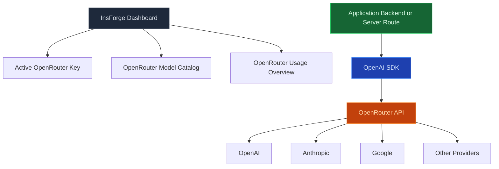

使用模型网关通过一个 OpenAI 兼容的端点调用聊天、流式和嵌入模型。InsForge 保有提供商密钥，跟踪每个项目的使用情况，并通过 [OpenRouter](https://openrouter.ai) 路由流量，因此您的应用代码永远不会直接看到 Anthropic、OpenAI 或 Mistral 凭证。

<Frame caption="一个 OpenAI 兼容的端点，具有按提供商访问、随时可复制的代码和使用跟踪。">
  
</Frame>

<Note>
  **想要运行 AI 代码，而不是调用模型？** 使用 [Edge Functions](/core-concepts/functions/overview) 来协调提示、检索和工具。模型网关是调用；函数是围绕它的程序。
</Note>

## 功能

### OpenAI 兼容的 API

将任何 OpenAI SDK 或 `openai` 兼容的库指向 `https://<project>.insforge.dev/v1`，它就能工作。`/v1/chat/completions`、`/v1/embeddings` 和 `/v1/models` 都表现得像上游规范。

### 流式处理

用于聊天完成的服务器发送事件。使用流式端点的方式与 OpenAI 相同；网关在令牌从提供商到达时转发它们。

### 嵌入

从 OpenRouter 支持的任何嵌入模型生成密集向量。使用 [pgvector](/core-concepts/database/pgvector) 将结果存储在 Postgres 中以进行语义搜索。

### 按项目配额

每个项目都有自己的速率限制和支出上限。达到它时，网关返回干净的 429，而不是将提供商配额状态泄漏到您的应用中。

### 使用跟踪

每个请求都用模型、令牌计数和成本进行记录。从仪表盘、CLI 或 MCP 查询使用情况 — 账单自动与 OpenRouter 的发票对账。

### 多提供商路由

通过更改请求中的模型名称，在 Anthropic、OpenAI、Mistral、Llama、Gemini 和数十个其他提供商之间切换。应用代码不会改变。

## 使用它进行构建

<CardGroup cols={2}>
  <Card title="TypeScript SDK" icon="js" href="/sdks/typescript/ai">
    从 Node、浏览器和边缘运行时聊天、流式和嵌入。
  </Card>

  <Card title="Swift SDK" icon="swift" href="/sdks/swift/ai">
    用于 iOS 和 macOS 的原生 Swift AI 客户端。
  </Card>

  <Card title="Kotlin SDK" icon="android" href="/sdks/kotlin/ai">
    用于 Android 和 JVM 的协程优先 AI 客户端。
  </Card>

  <Card title="REST API" icon="code" href="/sdks/rest/ai">
    普通 HTTP AI 端点，可从任何语言调用。
  </Card>
</CardGroup>

## 下一步

- 设置 [CLI](/quickstart) 以链接您的项目（推荐的路径）。
- 浏览 [TypeScript SDK 参考](/sdks/typescript/ai) 以了解聊天和嵌入模式。
