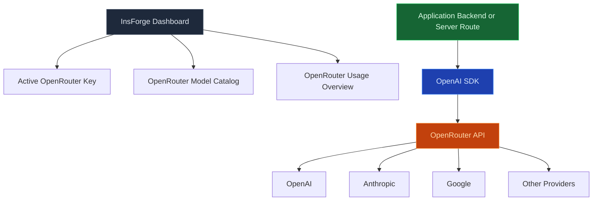

使用模型网关为您的项目预配 OpenRouter 密钥、浏览模型目录并跟踪支出和各模型用量。您的应用使用该密钥直接调用 [OpenRouter](https://openrouter.ai)，因此一次集成即可访问来自 Anthropic、OpenAI、Mistral、Google 和数十个其他提供商的聊天、流式和嵌入模型。

<Frame caption="仪表盘中的模型网关页面：当前密钥、按提供商访问、随时可复制的代码和使用图表。">
  
</Frame>

<Note>
  **想要运行 AI 代码，而不是调用模型？** 使用 [Edge Functions](/core-concepts/functions/overview) 来协调提示、检索和工具。模型网关是调用；函数是围绕它的程序。
</Note>

```mermaid
graph TB
    Dashboard[InsForge Dashboard] --> Key[Active OpenRouter Key]
    Dashboard --> Catalog[OpenRouter Model Catalog]
    Dashboard --> Metrics[OpenRouter Usage Overview]

    App[Application Backend or Server Route] --> SDK[OpenAI SDK]
    SDK --> OpenRouter[OpenRouter API]

    OpenRouter --> OpenAI[OpenAI]
    OpenRouter --> Anthropic[Anthropic]
    OpenRouter --> Google[Google]
    OpenRouter --> More[Other Providers]

    style Dashboard fill:#1e293b,stroke:#475569,color:#e2e8f0
    style App fill:#166534,stroke:#22c55e,color:#dcfce7
    style SDK fill:#1e40af,stroke:#3b82f6,color:#dbeafe
    style OpenRouter fill:#c2410c,stroke:#fb923c,color:#fed7aa
```

## 功能

### OpenAI 兼容的 API

将仪表盘中预配的密钥复制到仅服务器端的 `OPENROUTER_API_KEY` 中，然后将任何 OpenAI SDK 或 `openai` 兼容的库指向 `https://openrouter.ai/api/v1`。[TypeScript SDK](/sdks/typescript/ai) 和 [REST](/sdks/rest/ai) 参考中提供了可用的代码片段。

<Warning>
  预配的密钥是服务器端凭证。请将 OpenRouter 调用置于后端路由、服务器操作或边缘函数之后，切勿将该密钥打包进浏览器代码。
</Warning>

### 流式处理

用于聊天完成的服务器发送事件。像使用 OpenAI 那样设置 `stream: true`，令牌会随提供商生成而到达。

### 嵌入

从 OpenRouter 支持的任何嵌入模型生成密集向量。使用 [pgvector](/core-concepts/database/pgvector) 将结果存储在 Postgres 中以进行语义搜索。

### 支出与用量

仪表盘中的模型网关页面从 OpenRouter 读取您密钥的活动数据：总支出，每日、每周和每月用量，剩余额度及其重置日期，以及按模型的明细。

### 多提供商路由

通过更改请求中的模型名称，在 Anthropic、OpenAI、Mistral、Llama、Gemini 和数十个其他提供商之间切换。应用代码不会改变。

## 使用它进行构建

<CardGroup cols={2}>
  <Card title="TypeScript SDK" icon="js" href="/sdks/typescript/ai">
    从 Node、浏览器和边缘运行时聊天、流式和嵌入。
  </Card>

  <Card title="Swift SDK" icon="swift" href="/sdks/swift/ai">
    用于 iOS 和 macOS 的原生 Swift AI 客户端。
  </Card>

  <Card title="Kotlin SDK" icon="android" href="/sdks/kotlin/ai">
    用于 Android 和 JVM 的协程优先 AI 客户端。
  </Card>

  <Card title="REST API" icon="code" href="/sdks/rest/ai">
    普通 HTTP AI 端点，可从任何语言调用。
  </Card>
</CardGroup>

## 下一步

- 设置 [CLI](/quickstart) 以链接您的项目（推荐的路径）。
- 浏览 [TypeScript SDK 参考](/sdks/typescript/ai) 以了解聊天和嵌入模式。
