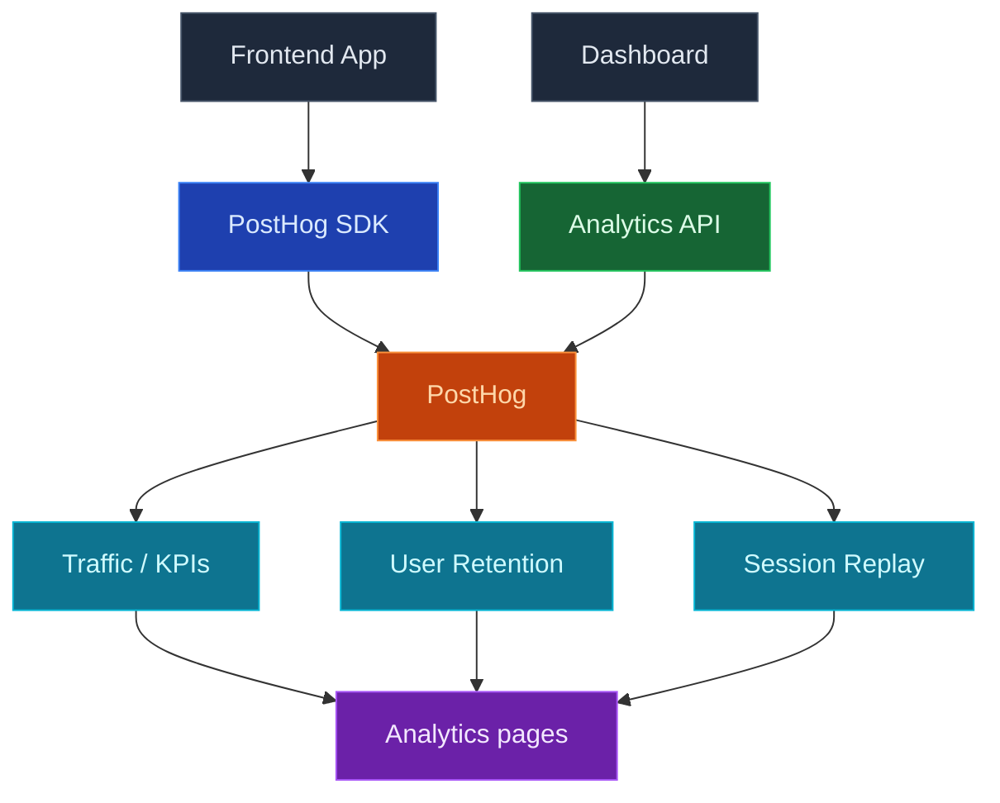

使用 InsForge 分析来了解人们如何实际使用您的应用：页面流量、保留和会话回放，所有这些都通过将 PostHog 项目连接到您的 InsForge 后端来进行。连接后，仪表盘在您的 PostHog 数据上呈现流量、用户保留和会话回放页面，无需离开 InsForge。

只需点击一次连接 PostHog，将设置提示放入您的编码代理中，以便它运行 PostHog 向导并在您的前端安装 PostHog SDK，然后分析页面开始填充。

<Frame caption="分析仪表盘：随着时间推移的 KPI 加上按页面、国家和设备的细分。">
  
</Frame>

<Note>
  PostHog 仍然是事件、仪表盘、见解和录制的真实来源。InsForge 为日常检查呈现一个集中的子集，然后对于超出其范围的任何内容都深入链接到 PostHog。
</Note>



## 功能

### 一键 PostHog 连接

从仪表盘中的分析页面连接 PostHog。InsForge 为您配置或链接 PostHog 项目，存储凭证到服务器端，并在连接成功后解锁流量、保留和会话回放页面。

### 通过 PostHog 向导的 SDK 设置

连接后，空状态会提示您一个设置提示，您可以将其粘贴到您的编码代理中：

```
I want to add product analytics to this project. Read the current directory and use the InsForge skill to set up PostHog analytics by running `npx @insforge/cli posthog setup`.
```

`@insforge/cli posthog setup` 将您的 InsForge 项目链接到 PostHog，然后打印官方 [PostHog 向导](https://posthog.com/docs/libraries/wizard) 命令 (`npx -y @posthog/wizard@latest`) 供您（或您的代理）接下来运行。向导检测您的框架，安装正确的 PostHog SDK，并放入初始化代码，以便页面浏览、自动捕获事件和会话录制开始流动。

### 流量

您选定的时间范围内的 KPI（访客、页面浏览、会话、跳出率和趋势），加上按页面、国家和设备类型的细分。对于第一次"本周应用的表现如何"的检查而无需打开 PostHog 很有用。

### 用户保留

从您的 PostHog 事件构建的队列保留图表。选择一个时间范围，看看有多少用户在随后的几天或几周内回来。

### 会话回放

最近会话录制的分页列表，包含持续时间、个人和深入链接到 PostHog 的完整回放播放器。当在流量或保留中发现异常后，可帮助您观察用户实际做了什么。

### 设置和断开连接

分析配置对话（侧栏中的齿轮图标）让管理员审查链接的 PostHog 项目，直接跳转到 PostHog，并在需要时断开连接。断开连接只会断开 InsForge ↔ PostHog 链接；您的 PostHog 项目、事件和录制保持不变。

## 概念

<CardGroup cols={2}>
  <Card title="PostHog 产品分析" icon="chart-mixed" href="https://posthog.com/docs/product-analytics">
    分析页面后面的事件、自动捕获、见解和仪表盘。
  </Card>

  <Card title="PostHog 会话回放" icon="circle-play" href="https://posthog.com/docs/session-replay">
    录制如何被捕获、编辑和回放。
  </Card>
</CardGroup>

## 使用它进行构建

<CardGroup cols={2}>
  <Card title="PostHog 向导" icon="wand-magic-sparkles" href="https://posthog.com/docs/libraries/wizard">
    自动检测您的框架，安装正确的 PostHog SDK，并添加初始化代码。
  </Card>

  <Card title="PostHog JavaScript SDK" icon="js" href="https://posthog.com/docs/libraries/js">
    在向导设置的基础上捕获自定义事件。
  </Card>

  <Card title="InsForge CLI" icon="terminal" href="/quickstart">
    `npx @insforge/cli posthog setup` 将您的 InsForge 项目链接到 PostHog，然后打印向导命令。
  </Card>
</CardGroup>

## 下一步

- 在仪表盘中打开分析页面，点击 **连接 PostHog**。
- 将设置提示粘贴到您的编码代理中，然后运行它打印的 `@posthog/wizard` 命令，将 SDK 连接到您的应用。
- 如果您想从终端管理连接，设置 [CLI](/quickstart)。
