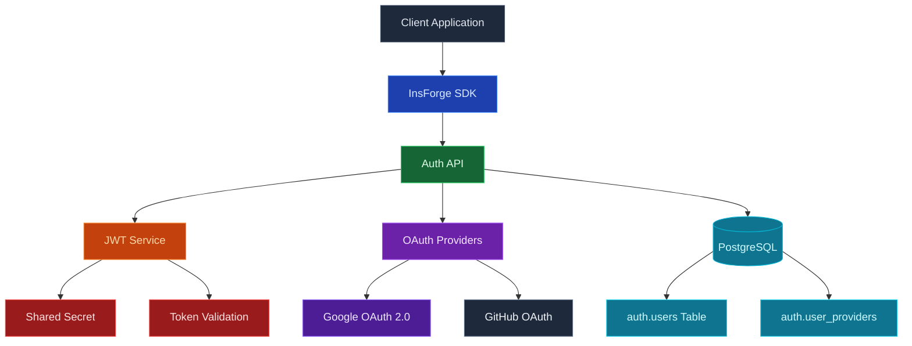

使用 InsForge 身份验证来处理您的应用程序的注册、登录、会话和身份。用户可以使用电子邮件和密码、魔法链接、一次性代码、OAuth 提供程序（Google、GitHub、Apple 等）或您自己的任何符合 OIDC 的身份提供程序进行登录。InsForge 在登录时发出 JSON Web Token，平台上的每个其他产品都使用相同的令牌。

<Frame caption="配置的登录方法：电子邮件和密码、Google 和 GitHub OAuth。">
  
</Frame>

<Note>
  **身份验证**是检查用户是否就是他们所声称的人。**授权**是检查他们可以做什么。InsForge 直接处理前者，并通过读取身份验证 JWT 的 [行级安全](/core-concepts/database/overview) 策略来增强后者。
</Note>

## 功能

### 电子邮件和密码

默认值。新用户使用电子邮件和密码注册，收到确认电子邮件，并在登录时接收会话 JWT。密码重置、电子邮件验证和暴力破解限制都是内置的。

### 魔法链接和一次性密码

向用户的电子邮件发送一次性链接或六位数代码。无密码登录、账户恢复和步进身份验证都使用相同的基础。

### OAuth 提供程序

对 Google、GitHub、Apple、Microsoft、GitLab、Discord 等的一流支持。通过 URL 添加自定义 OAuth 2.0 / OIDC 提供程序（Keycloak、Okta、Auth0、您自己的 IdP），无需编写特定于提供程序的代码。

### OAuth 服务器模式

将 InsForge 本身作为 OAuth 2.0 / OIDC 身份提供程序运行，用于您自己的下游应用程序。有关完整设置，请参阅 [OAuth 服务器指南](/oauth-server)。

### 行级安全

身份验证 JWT 自动流经每个 InsForge SDK 调用。Postgres RLS 策略从令牌读取声明，并逐行决定用户可以读取和写入的内容。无论请求命中数据库、存储还是实时通道，相同的身份和相同的策略都适用。

### 数据库中的 `auth.users`

用户状态存在于项目的 Postgres 数据库中的 `auth` 架构中。通过外键将 `auth.users` 连接到您的应用程序表，通过触发器对身份更改做出反应，并以与备份其他所有内容相同的方式备份整个事物。

## 使用它进行构建

<CardGroup cols={2}>
  <Card title="TypeScript SDK" icon="js" href="/sdks/typescript/auth">
    从 Node、浏览器和边缘注册、登录和管理会话。
  </Card>

  <Card title="Swift SDK" icon="swift" href="/sdks/swift/auth">
    用于 iOS 和 macOS 的原生 Swift 身份验证客户端。
  </Card>

  <Card title="Kotlin SDK" icon="android" href="/sdks/kotlin/auth">
    用于 Android 和 JVM 的协程优先身份验证客户端。
  </Card>

  <Card title="REST API" icon="code" href="/sdks/rest/auth">
    普通 HTTP 身份验证端点，可从任何语言调用。
  </Card>
</CardGroup>

## 下一步

- 设置 [CLI](/quickstart) 以链接您的项目（推荐的路径）。
- 浏览 [TypeScript SDK 参考](/sdks/typescript/auth) 以了解登录模式。
