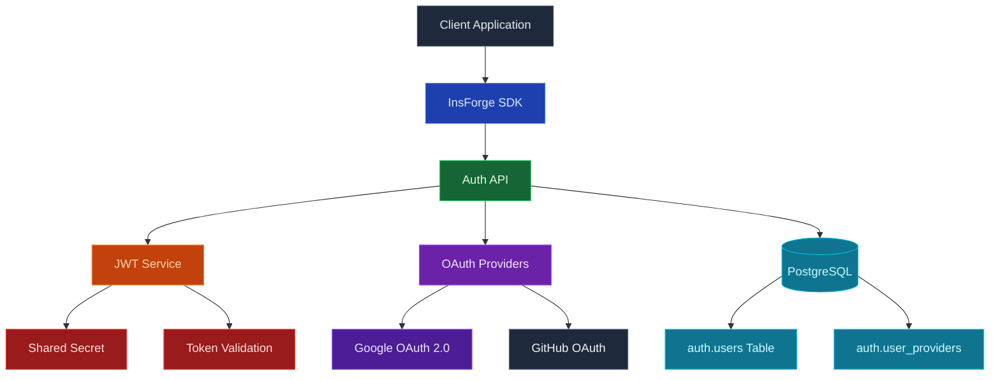

使用 InsForge 身份验证来处理您的应用程序的注册、登录、会话和身份。用户可以使用电子邮件和密码、魔法链接、一次性代码、OAuth 提供程序（Google、GitHub、Apple 等）或您自己的任何符合 OIDC 的身份提供程序进行登录。InsForge 在登录时发出 JSON Web Token，平台上的每个其他产品都使用相同的令牌。

<Frame caption="配置的登录方法：电子邮件和密码、Google 和 GitHub OAuth。">
  
</Frame>

<Note>
  **身份验证**是检查用户是否就是他们所声称的人。**授权**是检查他们可以做什么。InsForge 直接处理前者，并通过读取身份验证 JWT 的 [行级安全](/core-concepts/database/overview) 策略来增强后者。
</Note>


```mermaid
graph TB
    Client[Client Application] --> SDK[InsForge SDK]
    SDK --> AuthAPI[Auth API]

    AuthAPI --> JWT[JWT Service]
    AuthAPI --> OAuth[OAuth Providers]
    AuthAPI --> DB[(PostgreSQL)]

    OAuth --> Google[Google OAuth 2.0]
    OAuth --> GitHub[GitHub OAuth]

    JWT --> Secret[Shared Secret]
    JWT --> Validation[Token Validation]

    DB --> Users[auth.users Table]
    DB --> Providers[auth.user_providers]

    style Client fill:#1e293b,stroke:#475569,color:#e2e8f0
    style SDK fill:#1e40af,stroke:#3b82f6,color:#dbeafe
    style AuthAPI fill:#166534,stroke:#22c55e,color:#dcfce7
    style JWT fill:#c2410c,stroke:#fb923c,color:#fed7aa
    style OAuth fill:#6b21a8,stroke:#a855f7,color:#f3e8ff
    style DB fill:#0e7490,stroke:#06b6d4,color:#cffafe
    style Secret fill:#991b1b,stroke:#ef4444,color:#fee2e2
    style Google fill:#4c1d95,stroke:#8b5cf6,color:#ede9fe
    style GitHub fill:#1e293b,stroke:#64748b,color:#f1f5f9
    style Validation fill:#991b1b,stroke:#ef4444,color:#fee2e2
    style Users fill:#0e7490,stroke:#22d3ee,color:#cffafe
    style Providers fill:#0e7490,stroke:#22d3ee,color:#cffafe
```

## 功能

### 电子邮件和密码

默认值。新用户使用电子邮件和密码注册，收到确认电子邮件，并在登录时接收会话 JWT。密码重置、电子邮件验证和暴力破解限制都是内置的。

<Note>
  **自托管？** 发送这些电子邮件，包括无密码的魔法链接和一次性代码登录，都需要电子邮件服务商。已连接云的项目会自动使用托管发件服务；自托管实例必须先配置 [Custom SMTP](/core-concepts/messaging/custom-smtp)，否则验证、重置和登录邮件都无法送达。
</Note>

### 魔法链接和一次性密码

向用户的电子邮件发送一次性链接或六位数代码。无密码登录、账户恢复和步进身份验证都使用相同的基础。

### OAuth 提供程序

对 Google、GitHub、Apple、Microsoft、GitLab、Discord 等的一流支持。通过 URL 添加自定义 OAuth 2.0 / OIDC 提供程序（Keycloak、Okta、Auth0、您自己的 IdP），无需编写特定于提供程序的代码。

### OAuth 服务器模式

将 InsForge 本身作为 OAuth 2.0 / OIDC 身份提供程序运行，用于您自己的下游应用程序。有关完整设置，请参阅 [OAuth 服务器指南](/oauth-server)。

### 行级安全

身份验证 JWT 自动流经每个 InsForge SDK 调用。Postgres RLS 策略从令牌读取声明，并逐行决定用户可以读取和写入的内容。无论请求命中数据库、存储还是实时通道，相同的身份和相同的策略都适用。

### 数据库中的 `auth.users`

用户状态存在于项目的 Postgres 数据库中的 `auth` 架构中。通过外键将 `auth.users` 连接到您的应用程序表，通过触发器对身份更改做出反应，并以与备份其他所有内容相同的方式备份整个事物。

## 设置内置 OAuth 提供商

内置提供商（Google、GitHub、Apple、Microsoft、GitLab、Discord 等）按项目配置。以 **GitHub** 为例：

<Steps>
  <Step title="在提供商处注册 OAuth 应用">
    在提供商的开发者控制台中（GitHub 为 [Developer settings → OAuth Apps](https://github.com/settings/developers)），创建一个新的 OAuth 应用。将 **Authorization callback URL** 设置为您项目的回调端点：

    ```
    <project-api-url>/api/auth/oauth/github/callback
    ```

    提供商随后会签发 **Client ID** 和 **Client Secret**。
  </Step>
  <Step title="在 InsForge 中启用该提供商">
    在 InsForge 仪表板中，打开 **Auth Methods**，启用 **GitHub**，并粘贴上一步获得的 **Client ID** 和 **Client Secret**。如果不设置自定义 scope，GitHub 默认使用 `user:email`，以便 InsForge 读取账户的电子邮件地址。
    {/* TODO: confirm dashboard location — exact per-provider toggle under Auth Methods not verifiable from code */}
  </Step>
  <Step title="在应用中让用户登录">
    使用 `'github'` 作为提供商键调用 `signInWithOAuth()`：

    ```typescript
    await insforge.auth.signInWithOAuth('github', {
      redirectTo: 'http://localhost:3000/dashboard',
    });
    ```

    同样的调用适用于任何已启用的提供商——将 `'github'` 替换为 `'google'`、`'apple'` 等即可。完整选项列表见 [`signInWithOAuth` 参考](/sdks/typescript/auth)。
  </Step>
</Steps>

<Note>
  想以编程方式配置提供商？管理员 OAuth 配置 API（`POST /api/auth/oauth/configs`，需要管理员密钥）存储的字段与仪表板写入的相同：`provider`、`clientId`、`clientSecret` 和 `scopes`。
</Note>

## 使用它进行构建

<CardGroup cols={2}>
  <Card title="TypeScript SDK" icon="js" href="/sdks/typescript/auth">
    从 Node、浏览器和边缘注册、登录和管理会话。
  </Card>

  <Card title="Swift SDK" icon="swift" href="/sdks/swift/auth">
    用于 iOS 和 macOS 的原生 Swift 身份验证客户端。
  </Card>

  <Card title="Kotlin SDK" icon="android" href="/sdks/kotlin/auth">
    用于 Android 和 JVM 的协程优先身份验证客户端。
  </Card>

  <Card title="REST API" icon="code" href="/sdks/rest/auth">
    普通 HTTP 身份验证端点，可从任何语言调用。
  </Card>
</CardGroup>

## 下一步

- 设置 [CLI](/quickstart) 以链接您的项目（推荐的路径）。
- 浏览 [TypeScript SDK 参考](/sdks/typescript/auth) 以了解登录模式。
