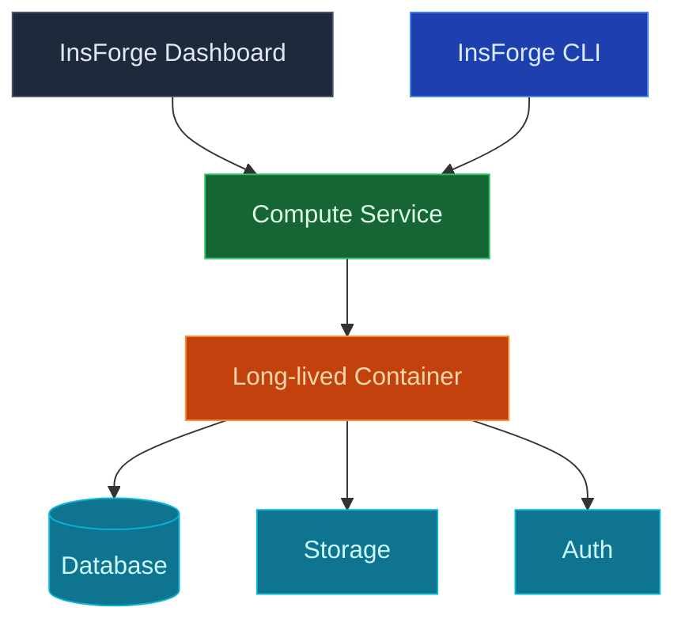

使用 InsForge 自定义计算在您的项目旁运行长期容器：队列工作者、后台处理器、AI 推理循环、websocket 服务器、爬虫、任何需要保持运行的东西。容器使用函数会使用的相同凭证附加到您的项目的数据库、存储和身份验证。

<Note>
  **只需要处理请求？** 对请求/响应工作和短工作使用 [Edge Functions](/core-concepts/functions/overview)。自定义计算适用于需要连续运行的流程。
</Note>

## 功能

### 容器部署

将任何 Docker 映像推送到 InsForge，它就会运行。使用来自您的存储库的 `Dockerfile` 或指向注册表上的预构建映像。无需学习专有的构建管道。

### 项目链接凭证

容器作为环境变量接收 InsForge 项目 URL、服务角色 JWT 和 S3 存储凭证。连接到 Postgres、调用 SDK 并读取对象，无需配置任何东西。

### 缩放

对于单个工作者运行一个实例，或对无状态工作负载进行水平缩放。内存、CPU 和副本计数可以按服务配置。

### 日志

每个容器的结构化日志，可按服务和时间范围查询。在仪表盘、CLI 或 MCP 中跟踪，无需 `kubectl exec` 进入任何东西。

### 秘密和环境变量

为每个服务设置环境变量和秘密，与您的边缘函数秘密分开。不需重新部署即可轮换。

## 自托管：启用 compute

Custom Compute 把您的容器跑在 [Fly.io](https://fly.io) 上。在 InsForge Cloud 上这部分完全托管，您无需配置。自托管时，您使用自己的 Fly 账号，通过 `.env` 中的两个环境变量启用 compute：

- `FLY_API_TOKEN`：Fly.io API token，用 `fly tokens create org` 生成。InsForge 用它来创建和管理您的 compute 容器。
- `FLY_ORG`：您的 Fly organization slug，用 `fly orgs list` 查看。容器会创建在此 org 之下。

两者都必填。只有 token 而没有 org，就没有可认证的对象；只有 org 而没有 token，则无法调用。设置完成后重启容器。两者齐备之前，compute 接口都会返回 `503 COMPUTE_NOT_CONFIGURED`。

## 下一步

- 设置 [CLI](/quickstart) 以链接您的项目（推荐的路径）。
- 如果您只需要请求/响应，请查看 [Edge Functions](/core-concepts/functions/overview)。
