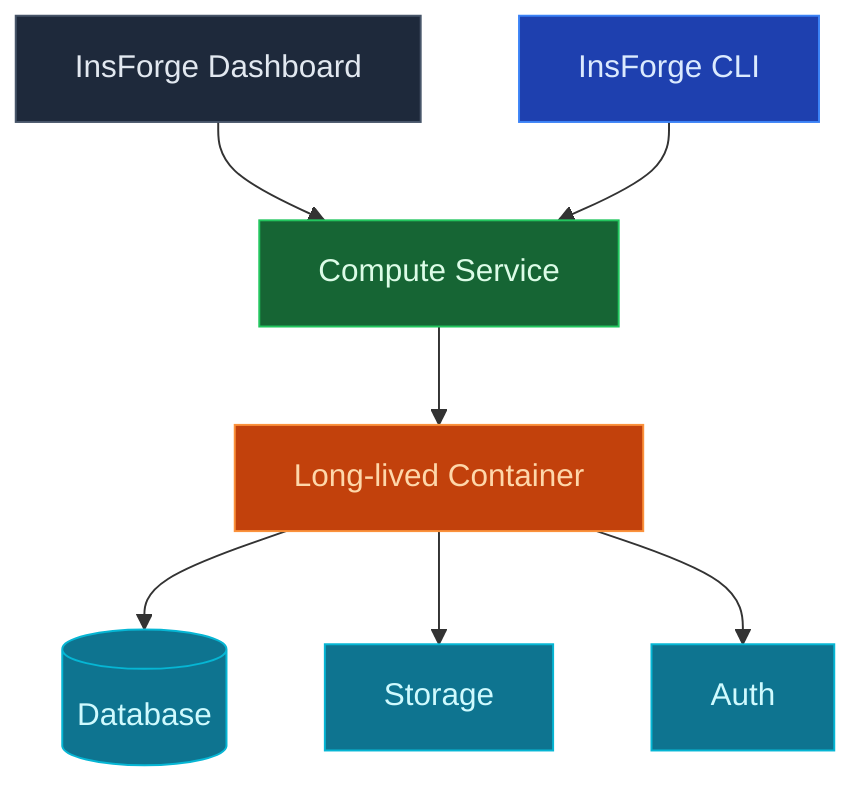

用 InsForge Custom Compute 在项目旁运行长期存活的容器：队列 worker、后台处理器、AI 推理循环、websocket 服务、爬虫，任何需要持续运行的进程。

<Note>
  **只是要处理一个请求？** 请求/响应类的工作和短任务用 [Edge Functions](/core-concepts/functions/overview)。Custom Compute 面向需要持续运行的进程。
</Note>


```mermaid
graph TB
    Dashboard[InsForge Dashboard] --> Service[Compute Service]
    CLI[InsForge CLI] --> Service

    Service --> Container[Long-lived Container]

    Container --> DB[(Database)]
    Container --> Storage[Storage]
    Container --> Auth[Auth]

    style Dashboard fill:#1e293b,stroke:#475569,color:#e2e8f0
    style CLI fill:#1e40af,stroke:#3b82f6,color:#dbeafe
    style Service fill:#166534,stroke:#22c55e,color:#dcfce7
    style Container fill:#c2410c,stroke:#fb923c,color:#fed7aa
    style DB fill:#0e7490,stroke:#06b6d4,color:#cffafe
    style Storage fill:#0e7490,stroke:#06b6d4,color:#cffafe
    style Auth fill:#0e7490,stroke:#06b6d4,color:#cffafe
```

## 功能

### 容器部署

把任何 Docker 镜像交给 InsForge 就能跑起来。可以指向 registry 上已构建好的镜像，也可以上传构建上下文，让 InsForge 用你的 `Dockerfile` 来构建。不需要学习额外的构建流水线。

### 访问你的项目

容器需要的凭据由你以服务的环境变量形式设置——项目 URL、API key、S3 凭据，取决于这个工作负载用到什么。InsForge 不会替你注入任何东西，因此容器能访问什么完全由你决定。

自托管时，compute 容器默认加入项目自己的网络，所以在容器内 `postgres:5432` 和 `postgrest:3000` 可以直接按名字解析，和 edge functions 完全一样——不需要绕一圈公网。

### 资源

内存和 CPU 按服务配置。每个服务运行一个实例；需要多个 worker 就创建多个服务。

### 日志

按容器输出结构化日志，可按服务和时间范围查询。在 dashboard、CLI 或 MCP 里查看，不用 `kubectl exec` 进容器。

### Secrets 与环境变量

按服务设置环境变量和 secrets，与 edge function 的 secrets 分开。轮换时不需要重新部署。

<Warning>
  **暂不支持持久化卷。** 容器状态可以跨重启和宿主机重启保留，但修改镜像、环境变量或端口会重建容器，容器内写入的内容会丢失。需要保留的数据请放进项目的 Postgres 或 Storage。
</Warning>

## 自托管：启用 compute

在 InsForge Cloud 上 compute 完全托管，你无需配置。自托管时，由你决定容器跑在哪里。目前有两种 provider，在配置好其中一种之前，compute 接口都会返回 `503 COMPUTE_NOT_CONFIGURED`。

<Tabs>
  <Tab title="Docker（你自己的宿主机）">
    容器跑在运行 InsForge 的同一个 Docker daemon 上，与 InsForge 容器互为兄弟容器。不需要注册任何服务，也没有按容器计费。

    启用方式是一个明确的动作：把 Docker socket 挂载进 InsForge 容器。compose 文件里已经为此准备好了一行，取消注释即可：

    ```yaml
    services:
      insforge:
        volumes:
          - ${DOCKER_SOCKET_PATH:-/var/run/docker.sock}:${DOCKER_SOCKET_PATH:-/var/run/docker.sock}
    ```

    这就是全部改动。socket 在 Linux 上是 `660 root:docker`，在 Docker Desktop 上是 `root:root`，group id 又因宿主机而异，所以容器会在启动时从 socket 上读出这个 group 并加入，然后再降权到应用用户。无需查询，也无需设置。

    重启整个 stack。socket 可访问时驱动会自行注册，并输出 `Compute provider "docker" ready`。

    <Warning>
      **Docker socket 在宿主机上等同于 root。** 能访问它的人都可以启动一个读取整个文件系统的容器，所以挂载它应当是一个有意识的决定。InsForge 自己构造每个容器的 spec，从不转发调用方提供的选项，因此即使 InsForge API key 泄漏，攻击者也无法要求特权容器或宿主机 bind mount——但 socket 本身的权限，依然等同于拥有它的账号。
    </Warning>

    可选配置：

    | 变量 | 默认值 | 作用 |
    | --- | --- | --- |
    | `DOCKER_SOCKET_PATH` | `/var/run/docker.sock` | 指向 rootless Docker（`$XDG_RUNTIME_DIR/docker.sock`）或 Podman（`/run/podman/podman.sock`）的 socket。compose 文件会把它挂载到容器内的同一路径，一个值同时覆盖两侧。 |
    | `COMPUTE_ISOLATE_NETWORK` | 关闭 | 让 compute 容器不加入项目网络。默认关闭，因为紧邻数据库和存储正是它的意义所在。 |
    | `COMPUTE_BUILD_MAX_CONTEXT` | `64mb` | 上传的构建上下文上限。整个 tar 包会缓存在内存里，宿主机内存小就调低它。 |
    | `COMPUTE_BUILD_UPLOAD_IDLE_TIMEOUT` | `30` | 上传在多少秒内没有任何数据就视为卡住。每收到一段数据都会重置，所以慢但仍在传输的连接不会被切断。 |
  </Tab>

  <Tab title="Fly.io">
    容器跑在你自己的 [Fly.io](https://fly.io) 账号下。在 `.env` 里用两个环境变量启用：

    - `FLY_API_TOKEN`：Fly.io API token，用 `fly tokens create org -o <your-org>` 生成。把 CLI 打印的整行都粘进来，`FlyV1` 前缀会自动处理。InsForge 用它来创建和管理 compute 容器。
    - `FLY_ORG`：你的 Fly organization slug，用 `fly orgs list` 查看。容器会创建在这个 org 下。

    两者都必填。只有 token 而没有 org，就没有可认证的对象；只有 org 而没有 token，则无法调用。设置完成后重启容器。
  </Tab>
</Tabs>

如果两者都配置了，已有服务仍由创建它的 provider 管理，新服务默认走 Fly。把 `COMPUTE_PROVIDER` 设为 `fly`、`docker` 或 `off` 可以显式指定。

### 选择服务如何被访问

每个服务选择一种 ingress 模式。有哪些模式取决于 provider，默认值也一样：单机上默认是 `none`，因为大多数 compute——队列 worker、处理器、推理循环——根本不接收入站流量；而 Fly 会给每个 app 一个主机名，因此只提供 `host`。省略该字段时采用当前 provider 的默认值；请求一个 provider 无法提供的模式时，会被强制改为它支持的模式。

| 模式 | 行为 |
| --- | --- |
| `none` | 只能在项目内网访问。不发布宿主机端口，也不公布 URL。 |
| `port` | 发布在 daemon 分配的宿主机端口上。设置 `COMPUTE_PUBLIC_HOST` 后 InsForge 才会公布 URL；留空则不返回 URL，而不是给出一个可能无法解析的地址。 |
| `host` | 通过你自己路由的主机名访问。把 `COMPUTE_DOMAIN` 设为基础域名。 |

发布的端口默认绑定到 `127.0.0.1`。用 `COMPUTE_BIND_ADDRESS` 修改——Docker 自己的默认行为是绑定所有网卡（含 IPv6），在可被公网访问的宿主机上，这等于把容器直接暴露到互联网。

用 `COMPUTE_DEFAULT_INGRESS` 设置整个部署的默认值。`host` 模式下 InsForge 只公布主机名，不负责 TLS 终止和流量路由——请像你已经为 dashboard 做的那样，在前面自己跑一个网关（Caddy、Traefik、nginx）。

### 从源码构建

部署已构建好的镜像不需要额外步骤：用镜像地址创建服务，它就会被拉取并启动。

要让 InsForge 构建你的 `Dockerfile`，先占位服务，再把构建上下文作为 tar 包上传：

```bash
# 1. 占位服务名（此时还没有镜像），并保存返回的 id
ID=$(curl -sX POST "$INSFORGE_URL/api/compute/services/deploy" \
  -H "x-api-key: $INSFORGE_API_KEY" -H 'Content-Type: application/json' \
  -d '{"name":"worker","port":8080,"memory":512}' | jq -r .id)

# 2. 上传上下文；响应里带有构建日志和已部署的镜像 tag
tar --no-xattrs -cf context.tar -C ./worker .
curl -X POST "$INSFORGE_URL/api/compute/services/$ID/build" \
  -H "x-api-key: $INSFORGE_API_KEY" -H 'Content-Type: application/x-tar' \
  --data-binary @context.tar
```

如果 `Dockerfile` 不在上下文根目录，加上 `?dockerfile=docker/Dockerfile`；该路径必须留在上下文之内。同一时间只跑一个构建——第二个上传会直接拿到 `429`，而不会被缓存下来。在 macOS 上打包时请加 `--no-xattrs`（或 `COPYFILE_DISABLE=1`）：Linux daemon 无法应用的扩展属性会导致整个上下文被拒绝。

### 平台支持

| 级别 | 平台 | 说明 |
| --- | --- | --- |
| 已验证 | Linux 上的 Docker Compose、Docker Desktop（macOS） | 两条部署路径都做过端到端测试，包括宿主机重启，以及 Amazon Linux 2023 上 SELinux enforcing 模式。 |
| 预期可用 | Dokploy、Coolify、Containarium | socket 挂载方式相同；尚未针对 compute 实测。 |
| 不支持 | 不暴露 Docker socket 的托管容器平台 | 没有可以对话的 daemon。 |

### 两种 provider 的差异

向 `GET /api/metadata` 请求 `compute` 部分——它会报告已配置的 provider 以及各自的能力，让工具不再提供那些会被忽略的选项。

| | Docker | Fly.io |
| --- | --- | --- |
| 区域 | 单机 | 可选择 |
| 缩容到零 | 不支持 | 支持 |
| Ingress 模式 | `none`、`port`、`host` | 主机名 |
| 源码构建 | 向 InsForge 上传上下文 | 由 CLI 用 `flyctl` 构建 |

## 下一步

- 设置 [CLI](/quickstart) 以链接你的项目（推荐的路径）。
- 如果你只需要请求/响应，请查看 [Edge Functions](/core-concepts/functions/overview)。
