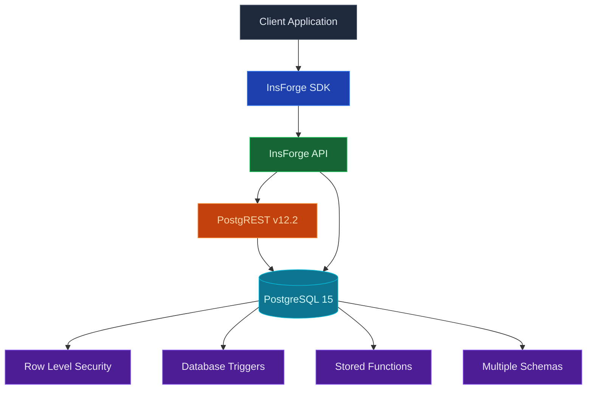

每个 InsForge 项目都配有一个完整的 [Postgres](https://www.postgresql.org/) 数据库。每个表自动成为类型化的 REST 和 SDK 端点。身份验证令牌通过行级安全范围化每个读写。相同的 Postgres 处理关系查询、通过 pgvector 的语义搜索和实时更改源。

<Frame caption="表编辑器：类型化列、内联编辑、CSV 导入和 SQL 工作室。">
  
</Frame>

<Note>
  **在寻找文件存储？** 使用 [Storage](/core-concepts/storage/overview) 来存储图像、PDF 和其他二进制内容。数据库存储行；存储存储对象。
</Note>

## 功能

### 表作为 API

定义表，您立即获得 REST 端点加上类型化的 SDK 客户端。没有代码生成步骤。身份验证 JWT 通过 RLS 范围化每个查询。

### 迁移

跟踪和应用有序的 SQL 变更。[Migrations](/core-concepts/database/migrations) 在您的存储库中作为普通 `.sql` 文件提供，使用 `npx @insforge/cli db migrations up --all` 或通过 MCP 工具应用。

### 分支

旋转隔离的数据库分支来根据生产数据副本测试风险架构变更。查看 [Branching](/agent-native/branching)。

### pgvector

用于嵌入的原生向量搜索，具有 HNSW 和 IVFFlat 索引。查看 [pgvector](/core-concepts/database/pgvector)。

### 行级安全

Postgres RLS 策略在行级别强制执行访问。策略读取身份验证 JWT，因此相同的规则适用于 REST 查询、SDK 调用、实时订阅和存储请求。

## 概念

<CardGroup cols={2}>
  <Card title="Migrations" icon="layer-group" href="/core-concepts/database/migrations">
    安全地依次应用 SQL 变更。
  </Card>
  <Card title="Branching" icon="code-branch" href="/agent-native/branching">
    用于预览和风险变更的隔离数据库。
  </Card>
  <Card title="pgvector" icon="brain" href="/core-concepts/database/pgvector">
    用于嵌入的向量搜索。
  </Card>
</CardGroup>

## 使用它进行构建

<CardGroup cols={2}>
  <Card title="TypeScript SDK" icon="js" href="/sdks/typescript/database">
    从 Node、浏览器和边缘进行类型化查询、插入和更新。
  </Card>

  <Card title="Swift SDK" icon="swift" href="/sdks/swift/database">
    用于 iOS 和 macOS 的原生 Swift 数据库客户端。
  </Card>

  <Card title="Kotlin SDK" icon="android" href="/sdks/kotlin/database">
    用于 Android 和 JVM 的协程优先数据库客户端。
  </Card>

  <Card title="REST API" icon="code" href="/sdks/rest/database">
    普通 HTTP 数据库端点，可从任何语言调用。
  </Card>
</CardGroup>

## 下一步

- 设置 [CLI](/quickstart) 以链接您的项目（推荐的路径）。
- 浏览 [TypeScript SDK 参考](/sdks/typescript/database) 以了解类型化查询。
