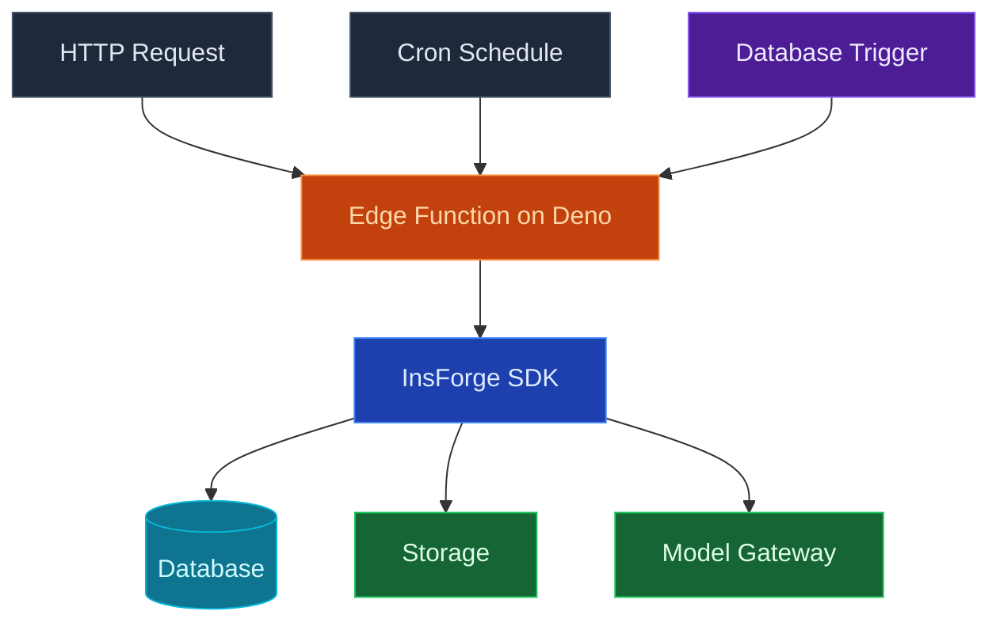

使用 InsForge Edge Functions 在 [Deno](https://deno.com) 上运行 TypeScript，部署在接近您的用户的地方以实现低延迟。函数可以从任何客户端按需调用、从数据库触发器链接，或安排在 cron 表达式上运行。运行时开箱即用地提供标准 fetch、流式响应和 ESM 导入。

<Note>
  **需要一个保持运行的流程？** 使用 [Compute](/core-concepts/compute/overview) 以获取队列工作者、AI 推理循环和任何有状态的东西。Edge Functions 用于请求/响应和短期作业。
</Note>

## 功能

### HTTP 触发器

每个函数都可在 `https://<project>.insforge.dev/functions/<name>` 上访问。标准 fetch 输入，标准 `Response` 输出。流式处理、JSON、重定向和 websocket 都可以工作。

### 时间表

将 cron 表达式附加到函数，InsForge 会按时调用它，失败时重试。有关 cron 语法和执行模型，请查看 [Schedules](/core-concepts/functions/schedules)。

### 数据库触发器

将函数连接以在对表的 `INSERT`、`UPDATE` 或 `DELETE` 上触发。函数接收行有效负载并使用服务角色 JWT 运行，因此它可以执行特权后续写入。

### 秘密和环境变量

为每个函数设置环境变量和秘密。仪表盘、CLI 和 MCP 都读写相同的存储；秘密永远不会通过您的存储库往返。

### 日志

每次调用都会捕获结构化日志，可按状态、持续时间和函数名称查询。InsForge MCP `get-function-logs` 工具允许您的代理在不离开编辑器的情况下诊断失败。

### Deno 标准库

使用 [Deno 标准库](https://jsr.io/@std) 和来自 `jsr.io`、`esm.sh` 或 `npm:` 说明符的任何 ESM 模块。您无需运行打包程序，也没有 `node_modules` 目录来运输。

## 概念

<CardGroup cols={2}>
  <Card title="Schedules" icon="clock" href="/core-concepts/functions/schedules">
    在 cron 表达式上运行函数，而不是响应请求。
  </Card>
</CardGroup>

## 使用它进行构建

<CardGroup cols={2}>
  <Card title="TypeScript SDK" icon="js" href="/sdks/typescript/functions">
    从 Node、浏览器和边缘调用和流式处理函数。
  </Card>

  <Card title="Swift SDK" icon="swift" href="/sdks/swift/functions">
    从 iOS 和 macOS 应用调用函数。
  </Card>

  <Card title="Kotlin SDK" icon="android" href="/sdks/kotlin/functions">
    从 Android 和 JVM 应用调用函数。
  </Card>

  <Card title="REST API" icon="code" href="/sdks/rest/functions">
    普通 HTTP 函数端点，可从任何语言调用。
  </Card>
</CardGroup>

## 下一步

- 设置 [CLI](/quickstart) 以链接您的项目（推荐的路径）。
- 浏览 [TypeScript SDK 参考](/sdks/typescript/functions) 以了解调用模式。
