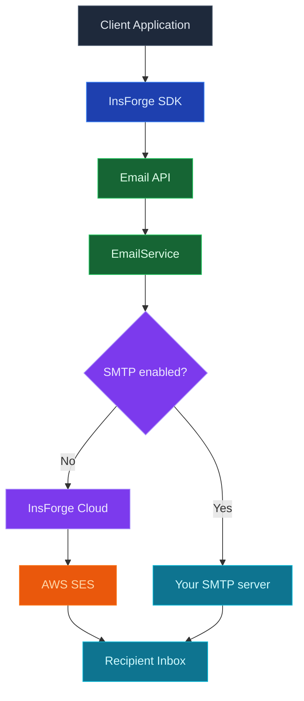

InsForge Messaging 从您的项目发送事务性通知：收据、摘要、密码重置代码、通知汇总、任何您本来会为其接入 SendGrid、Postmark 或 Twilio 的东西。电子邮件是第一个渠道；SMS 和推送在路线图上，将共享相同的 API 表面。

<Note>
  **只是发送身份验证电子邮件？** 魔法链接、验证代码和密码重置已内置在 [Authentication](/core-concepts/authentication/overview) 中。您只需要这个产品用于身份验证之外的事务性消息。
</Note>

<Warning>
  **自托管？** 托管的 InsForge Cloud 发件服务仅对已连接云的项目可用。在自托管实例上，必须先配置 [Custom SMTP](/core-concepts/messaging/custom-smtp)，任何电子邮件才能发出，包括身份验证邮件。否则，一旦开启电子邮件验证，新注册用户会卡在未验证状态且永远收不到邮件，因为发送失败被记录并吞掉，而不会向外暴露。请先配置 SMTP，或将电子邮件验证保持关闭（默认值）。
</Warning>

## 渠道

<CardGroup cols={3}>
  <Card title="Email" icon="envelope" href="/core-concepts/messaging/custom-smtp">
    托管 SMTP 或使用您自己的提供商。模板、交付跟踪和 webhook 事件。
  </Card>

  <Card title="SMS" icon="message">
    即将推出。相同的 API，后端使用 Twilio 或 Sinch。
  </Card>

  <Card title="Push" icon="bell">
    即将推出。通过单个端点的 APNs 和 FCM。
  </Card>
</CardGroup>

## 功能

### 一个 API，每个渠道

今天电子邮件的相同 `emails.send()` 形状，当它们着陆时 SMS 和推送跟随。切换渠道是字段变更，而不是重写。

### 托管交付或使用您自己的

通过 InsForge Cloud（今天用于电子邮件的 AWS SES）发送以获得零设置，或在您需要控制交付能力和发件人声誉时插入您自己的提供商。请参阅 [Custom SMTP](/core-concepts/messaging/custom-smtp)。

### 模板

按名称选择模板，传递变量，InsForge 呈现并发送。模板可编辑每个项目；四个身份验证模板 (`email-verification-*`、`reset-password-*`) 带有合理的默认值。

### 交付跟踪

发送事件 (`accepted`、`delivered`、`bounced`、`complained`) 按消息记录。在 Postgres 中查询审计表、通过 webhook 订阅或观察仪表板。

### 速率限制

按项目和按计划的限制可以防止流氓循环融化交付能力。从仪表板配置，在网关处强制执行。

## 概念

<CardGroup cols={2}>
  <Card title="Custom SMTP" icon="envelope" href="/core-concepts/messaging/custom-smtp">
    使用您自己的 SMTP 提供商（SendGrid、Postmark、AWS SES 等）。
  </Card>
</CardGroup>

## 使用它进行构建

<CardGroup cols={2}>
  <Card title="TypeScript SDK" icon="js" href="/sdks/typescript/email">
    从 Node、浏览器和边缘运行时发送邮件。
  </Card>

  <Card title="REST API" icon="code" href="/sdks/rest/overview">
    普通 HTTP 消息端点，可从任何语言调用。
  </Card>
</CardGroup>

## 下一步

- 设置 [CLI](/quickstart) 以链接您的项目（推荐的路径）。
- 浏览 [TypeScript SDK 参考](/sdks/typescript/email) 以了解发送模式。
