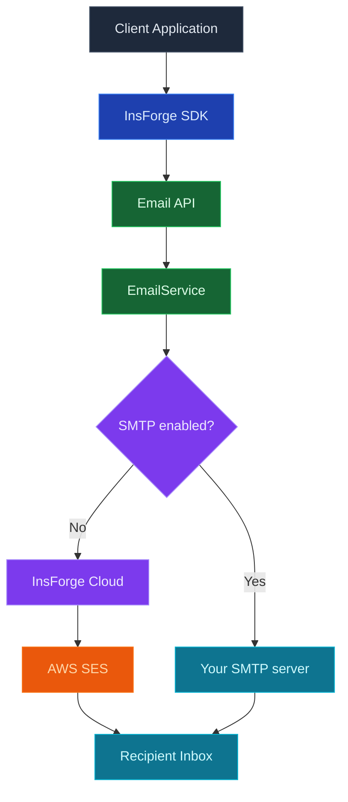

InsForge Messaging 从您的项目发送事务性通知：收据、摘要、密码重置代码、通知汇总、任何您本来会为其接入 SendGrid、Postmark 或 Twilio 的东西。电子邮件是第一个渠道；SMS 和推送在路线图上，将共享相同的 API 表面。

<Note>
  **只是发送身份验证电子邮件？** 魔法链接、验证代码和密码重置已内置在 [Authentication](/core-concepts/authentication/overview) 中。您只需要这个产品用于身份验证之外的事务性消息。
</Note>

<Warning>
  **自托管？** 托管的 InsForge Cloud 发件服务仅对已连接云的项目可用。在自托管实例上，必须先配置 [Custom SMTP](/core-concepts/messaging/custom-smtp)，任何电子邮件才能发出，包括身份验证邮件。邮件提供方可用前，InsForge 会拒绝开启强制电子邮件验证；验证仍为强制状态时，也无法关闭唯一的 SMTP 提供方。如果注册时验证邮件发送失败，API 会返回错误，并提示通过 `POST /api/auth/email/send-verification` 重试。
</Warning>

```mermaid
graph TB
    Client[Client Application] --> SDK[InsForge SDK]
    SDK --> API[Email API]
    API --> Service[EmailService]
    Service --> Decision{SMTP enabled?}
    Decision -->|No| Cloud[InsForge Cloud]
    Cloud --> SES[AWS SES]
    Decision -->|Yes| SMTP[Your SMTP server]
    SES --> Inbox[Recipient Inbox]
    SMTP --> Inbox

    style Client fill:#1e293b,stroke:#475569,color:#e2e8f0
    style SDK fill:#1e40af,stroke:#3b82f6,color:#dbeafe
    style API fill:#166534,stroke:#22c55e,color:#dcfce7
    style Service fill:#166534,stroke:#22c55e,color:#dcfce7
    style Decision fill:#7c3aed,stroke:#a78bfa,color:#ede9fe
    style Cloud fill:#7c3aed,stroke:#a78bfa,color:#ede9fe
    style SES fill:#ea580c,stroke:#f97316,color:#fed7aa
    style SMTP fill:#0e7490,stroke:#06b6d4,color:#cffafe
    style Inbox fill:#0e7490,stroke:#06b6d4,color:#cffafe
```

## 渠道

<CardGroup cols={3}>
  <Card title="Email" icon="envelope" href="/core-concepts/messaging/custom-smtp">
    托管 SMTP 或使用您自己的提供商。模板、交付跟踪和 webhook 事件。
  </Card>

  <Card title="SMS" icon="message">
    即将推出。相同的 API，后端使用 Twilio 或 Sinch。
  </Card>

  <Card title="Push" icon="bell">
    即将推出。通过单个端点的 APNs 和 FCM。
  </Card>
</CardGroup>

## 功能

### 一个 API，每个渠道

今天电子邮件的相同 `emails.send()` 形状，当它们着陆时 SMS 和推送跟随。切换渠道是字段变更，而不是重写。

### 托管交付或使用您自己的

通过 InsForge Cloud（今天用于电子邮件的 AWS SES）发送以获得零设置，或在您需要控制交付能力和发件人声誉时插入您自己的提供商。请参阅 [Custom SMTP](/core-concepts/messaging/custom-smtp)。

### 模板

按名称选择模板，传递变量，InsForge 呈现并发送。模板可编辑每个项目；四个身份验证模板 (`email-verification-*`、`reset-password-*`) 带有合理的默认值。

### 交付跟踪

发送事件 (`accepted`、`delivered`、`bounced`、`complained`) 按消息记录。在 Postgres 中查询审计表、通过 webhook 订阅或观察仪表板。

### 速率限制

按项目和按计划的限制可以防止流氓循环融化交付能力。从仪表板配置，在网关处强制执行。

## 各计划的可用性与发送限制

在 InsForge Cloud 上，托管的按需邮件 API——用于事务性消息的 [`emails.send()`](/sdks/typescript/email) 调用——**仅对付费计划可用**。在免费计划上，发送会被拒绝并返回 `On-demand email service is only available for paid plans`，因此在免费计划上通过托管发件服务能触达的客户数量为零。要从免费项目发送事务性邮件，请升级到付费计划，或使用自带 SMTP 提供方的[自托管](/core-concepts/messaging/custom-smtp)实例。

<Note>
  **身份验证邮件是独立的。** 验证、密码重置、魔法链接和一次性验证码邮件属于[身份验证](/core-concepts/authentication/overview)，在免费计划上仍会通过托管发件服务发送。上述仅付费计划可用的限制只适用于事务性 Messaging API。
</Note>

在付费计划上，发送按小时进行限流，并在网关处强制执行。**每个收件人都算作一封邮件**——`to`、`cc` 和 `bcc` 地址会被合并计数，这与 SES/SMTP 按每个地址计一次投递的方式一致。当一次发送会超过每小时上限时，API 会返回 `Rate limit exceeded` 错误，并附带距离窗口重置的分钟数；请在窗口重置后重试，或将大批量发送分散到多个小时。具体的每小时上限随计划提升——参见[定价页面](https://insforge.dev/pricing)。

自托管实例通过你自己的 [Custom SMTP](/core-concepts/messaging/custom-smtp) 提供方发送，不受这些基于计划的限制约束。

## 概念

<CardGroup cols={2}>
  <Card title="Custom SMTP" icon="envelope" href="/core-concepts/messaging/custom-smtp">
    使用您自己的 SMTP 提供商（SendGrid、Postmark、AWS SES 等）。
  </Card>
</CardGroup>

## 使用它进行构建

<CardGroup cols={2}>
  <Card title="TypeScript SDK" icon="js" href="/sdks/typescript/email">
    从 Node、浏览器和边缘运行时发送邮件。
  </Card>

  <Card title="REST API" icon="code" href="/sdks/rest/overview">
    普通 HTTP 消息端点，可从任何语言调用。
  </Card>
</CardGroup>

## 下一步

- 设置 [CLI](/quickstart) 以链接您的项目（推荐的路径）。
- 浏览 [TypeScript SDK 参考](/sdks/typescript/email) 以了解发送模式。
