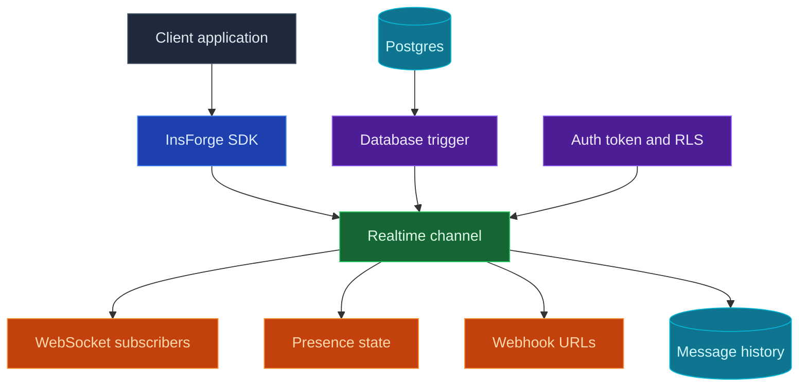

当您的应用需要在不刷新页面的情况下进行更新时，使用 InsForge Realtime。客户端订阅通道，如 `order:123` 或 `chat:room-1`，然后通过 WebSocket 接收数据库更改、广播和状态更新。通道也可以将相同的消息扇出到 webhook URL，当另一项服务应接收事件时。

<Frame caption="实时仪表板：通道模式、消息历史、权限和保留设置。">
  
</Frame>

<Note>
  **需要在数据库更改后运行服务器端代码？** 将该业务逻辑放在 [Edge Function](/core-concepts/functions/overview) 中，并从数据库触发器调用它。当更改应传递给已连接的客户端或配置的 webhook 端点时，使用 Realtime。
</Note>



## 功能

### 通道

通道是客户端可以加入的命名主题。对共享房间使用确切的名称，或在每条记录需要自己的实时流时使用如 `order:%` 的模式。

### 数据库更改

当表写入应成为实时应用事件时，使用数据库更改。在您想要监视的表上创建触发器。在其触发器函数中，调用预定义的 `realtime.publish(channel, event, payload)` 函数来决定哪个通道接收消息、客户端处理哪个事件名称以及他们接收什么有效负载。

对于如 `order:%` 的通道模式，触发器可以为每个订单发布一个事件：

```sql
CREATE OR REPLACE FUNCTION public.notify_order_status()
RETURNS TRIGGER AS $$
BEGIN
  PERFORM realtime.publish(
    'order:' || NEW.id::text,
    'status_changed',
    jsonb_build_object(
      'id', NEW.id,
      'status', NEW.status,
      'updatedAt', NEW.updated_at
    )
  );

  RETURN NEW;
END;
$$ LANGUAGE plpgsql SECURITY DEFINER;

CREATE TRIGGER order_status_realtime
  AFTER UPDATE OF status ON public.orders
  FOR EACH ROW
  WHEN (OLD.status IS DISTINCT FROM NEW.status)
  EXECUTE FUNCTION public.notify_order_status();
```

然后从应用使用 SDK 订阅：

```typescript
const channel = `order:${orderId}`;

await insforge.realtime.connect();

const subscription = await insforge.realtime.subscribe(channel);
if (!subscription.ok) {
  throw new Error(subscription.error.message);
}

insforge.realtime.on('status_changed', (message) => {
  renderOrderStatus(message.status);
});
```

### 客户端广播

客户端可以将消息发布到他们已加入的通道。将其用于聊天、输入指示器、光标、协作编辑信号和其他不需要从数据库写入开始的用户对用户更新。

```typescript
await insforge.realtime.publish(`chat:${roomId}`, 'typing', {
  userId,
  isTyping: true
});
```

### Webhooks

当另一项服务应接收每个消息时，将 webhook URL 附加到通道。InsForge 将事件有效负载发布到每个配置的 URL，包括事件名称、通道和消息 ID 的标头，重试暂时性网络故障，并在消息历史中记录 webhook 交付计数。

### 状态

状态跟踪谁在通道中处于在线状态。客户端在订阅时接收当前成员快照，然后在成员来去时接收 `presence:join` 和 `presence:leave` 事件。在您自己的表中存储持久的房间成员资格、角色和权限；状态仅是在线状态。

```typescript
const response = await insforge.realtime.subscribe(`chat:${roomId}`);

if (response.ok) {
  renderOnlineMembers(response.presence.members);
}

insforge.realtime.on('presence:join', (message) => {
  addOnlineMember(message.member);
});

insforge.realtime.on('presence:leave', (message) => {
  removeOnlineMember(message.member.presenceId);
});
```

### 行级安全

Realtime 在原型化时可以是开放的，然后使用 Postgres RLS 锁定。在 `realtime.channels` 上使用 `SELECT` 策略来控制谁可以订阅，在 `realtime.messages` 上使用 `INSERT` 策略来控制谁可以从客户端发布。

此策略让已验证的用户仅当订单属于他们时才订阅 `order:<id>` 通道：

```sql
ALTER TABLE realtime.channels ENABLE ROW LEVEL SECURITY;

CREATE POLICY "users_subscribe_own_orders"
ON realtime.channels
FOR SELECT
TO authenticated
USING (
  pattern = 'order:%'
  AND EXISTS (
    SELECT 1
    FROM public.orders
    WHERE id = NULLIF(split_part(realtime.channel_name(), ':', 2), '')::uuid
      AND user_id = auth.uid()
  )
);
```

在订阅策略中使用 `realtime.channel_name()` 因为客户端订阅已解析的通道，如 `order:123`，而 `realtime.channels` 存储模式，如 `order:%`。

### 消息历史

每个交付的事件都用 WebSocket 和 webhook 交付计数记录。当您需要调试实时行为时，仪表板可以检查最近的消息、交付统计信息和保留设置。

## 使用它进行构建

<CardGroup cols={2}>
  <Card title="TypeScript SDK" icon="js" href="/sdks/typescript/realtime">
    从 Node、浏览器和边缘订阅通道、发布事件和跟踪状态。
  </Card>

  <Card title="Swift SDK" icon="swift" href="/sdks/swift/realtime">
    用于 iOS 和 macOS 的原生 Swift 实时客户端。
  </Card>

  <Card title="Kotlin SDK" icon="android" href="/sdks/kotlin/realtime">
    用于 Android 和 JVM 的协程优先实时客户端。
  </Card>

  <Card title="REST 和 WebSocket API" icon="code" href="/sdks/rest/realtime">
    从任何语言使用原始 Socket.IO 契约。
  </Card>
</CardGroup>

## 下一步

- 设置 [CLI](/quickstart) 以链接您的项目。
- 在实时仪表盘中创建通道。
- 使用 [TypeScript SDK 参考](/sdks/typescript/realtime) 进行客户端订阅。
- 当另一项服务需要相同的事件流时，向通道添加 webhook URL。
