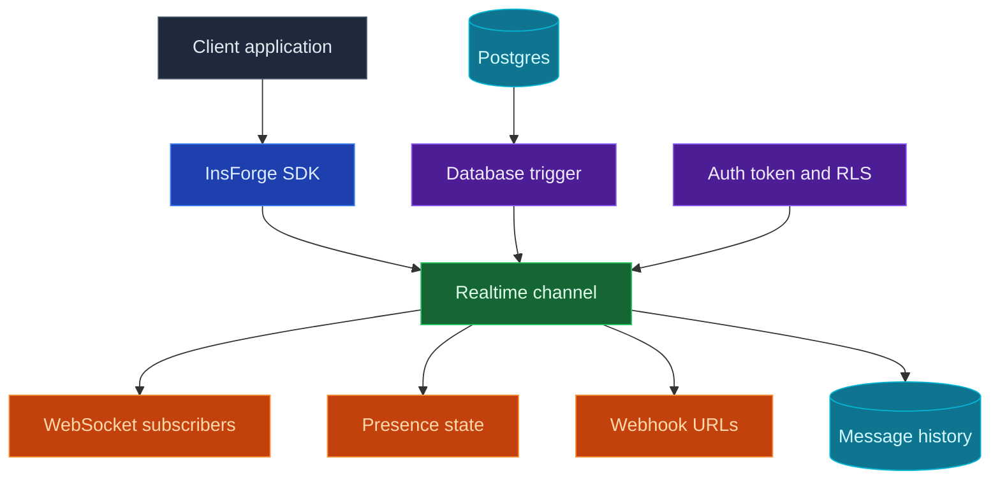

当你的应用需要在不刷新页面的情况下更新时，可以使用 InsForge Realtime。客户端订阅诸如 `order:123` 或 `chat:room-1` 这样的频道，然后通过 WebSocket 接收数据库更改、广播和状态呈现更新。当另一个服务需要接收事件时，频道还可以将相同的消息分发到 webhook URL。

<Frame caption="Realtime 控制台：频道模式、消息历史、权限和保留设置。">
  
</Frame>

<Note>
  **需要在数据库更改后运行服务器端代码？** 将该业务逻辑放入 [Edge Function](/core-concepts/functions/overview)，并从数据库触发器中调用它。当更改需要传递给已连接的客户端或已配置的 webhook 端点时，请使用 Realtime。
</Note>



## 功能

### 频道

频道是客户端可以加入的命名主题。对于共享房间，使用精确的名称；当每条记录都需要自己的实时流时，可以使用类似 `order:%` 的模式。

### 数据库更改

当一次表写入需要变成实时的应用事件时，请使用数据库更改功能。在你要监听的表上创建一个触发器。在其触发器函数中，调用预定义的 `realtime.publish(channel, event, payload)` 函数，以决定哪个频道接收消息、客户端处理哪个事件名称，以及它们接收什么负载。

对于像 `order:%` 这样的频道模式，一个触发器可以为每个订单发布一个事件：

```sql
CREATE OR REPLACE FUNCTION public.notify_order_status()
RETURNS TRIGGER AS $$
BEGIN
  PERFORM realtime.publish(
    'order:' || NEW.id::text,
    'status_changed',
    jsonb_build_object(
      'id', NEW.id,
      'status', NEW.status,
      'updatedAt', NEW.updated_at
    )
  );

  RETURN NEW;
END;
$$ LANGUAGE plpgsql SECURITY DEFINER;

CREATE TRIGGER order_status_realtime
  AFTER UPDATE OF status ON public.orders
  FOR EACH ROW
  WHEN (OLD.status IS DISTINCT FROM NEW.status)
  EXECUTE FUNCTION public.notify_order_status();
```

然后从应用中通过 SDK 订阅：

```typescript
const channel = `order:${orderId}`;

await insforge.realtime.connect();

const subscription = await insforge.realtime.subscribe(channel);
if (!subscription.ok) {
  throw new Error(subscription.error.message);
}

insforge.realtime.on('status_changed', (message) => {
  renderOrderStatus(message.status);
});
```

### 客户端广播

客户端可以向已经加入的频道发布消息。可将其用于聊天、输入提示、光标、协同编辑信号等不需要从数据库写入开始的用户间更新。

```typescript
await insforge.realtime.publish(`chat:${roomId}`, 'typing', {
  userId,
  isTyping: true
});
```

### Webhook

当另一个服务需要接收每条消息时，可以为频道附加 webhook URL。InsForge 会将事件负载发布到每个已配置的 URL，包含事件名称、频道和消息 ID 的请求头，重试瞬时网络故障，并在消息历史中记录 webhook 投递次数。

### 状态呈现（Presence）

状态呈现（Presence）用于跟踪频道中谁在线。客户端在订阅时会收到当前成员快照，随后会在成员上线或离线时收到 `presence:join` 和 `presence:leave` 事件。请将持久化的房间成员关系、角色和权限存储在你自己的数据表中；状态呈现只提供在线状态。

```typescript
const response = await insforge.realtime.subscribe(`chat:${roomId}`);

if (response.ok) {
  renderOnlineMembers(response.presence.members);
}

insforge.realtime.on('presence:join', (message) => {
  addOnlineMember(message.member);
});

insforge.realtime.on('presence:leave', (message) => {
  removeOnlineMember(message.member.presenceId);
});
```

### 行级安全性

实时功能在原型开发阶段可以保持开放，之后可以使用 Postgres RLS 进行锁定。使用 `realtime.channels` 上的 `SELECT` 策略来控制谁可以订阅，使用 `realtime.messages` 上的 `INSERT` 策略来控制谁可以从客户端发布消息。

以下策略只允许已通过身份验证的用户在订单属于自己时订阅 `order:<id>` 频道：

```sql
ALTER TABLE realtime.channels ENABLE ROW LEVEL SECURITY;

CREATE POLICY "users_subscribe_own_orders"
ON realtime.channels
FOR SELECT
TO authenticated
USING (
  pattern = 'order:%'
  AND EXISTS (
    SELECT 1
    FROM public.orders
    WHERE id = NULLIF(split_part(realtime.channel_name(), ':', 2), '')::uuid
      AND user_id = auth.uid()
  )
);
```

请在订阅策略中使用 `realtime.channel_name()`，因为客户端订阅的是已解析的频道（例如 `order:123`），而 `realtime.channels` 存储的是模式（例如 `order:%`）。

### 消息历史

每个已投递的事件都会记录 WebSocket 和 webhook 的投递次数。当你需要调试实时行为时，控制台可以查看最近的消息、投递统计信息和保留设置。

## 开始构建

<CardGroup cols={2}>
  <Card title="TypeScript SDK" icon="js" href="/sdks/typescript/realtime">
    从 Node、浏览器和边缘环境中订阅频道、发布事件并跟踪状态呈现。
  </Card>

  <Card title="Swift SDK" icon="swift" href="/sdks/swift/realtime">
    面向 iOS 和 macOS 的原生 Swift 实时客户端。
  </Card>

  <Card title="Kotlin SDK" icon="android" href="/sdks/kotlin/realtime">
    面向 Android 和 JVM、以协程为先的实时客户端。
  </Card>

  <Card title="REST and WebSocket API" icon="code" href="/sdks/rest/realtime">
    从任何语言使用原始的 Socket.IO 协议。
  </Card>
</CardGroup>

## 后续步骤

- 设置 [CLI](/quickstart) 以关联你的项目。
- 在实时控制台中创建频道。
- 使用 [TypeScript SDK 参考文档](/sdks/typescript/realtime) 了解客户端订阅。
- 当另一个服务需要相同的事件流时，为频道添加 webhook URL。
