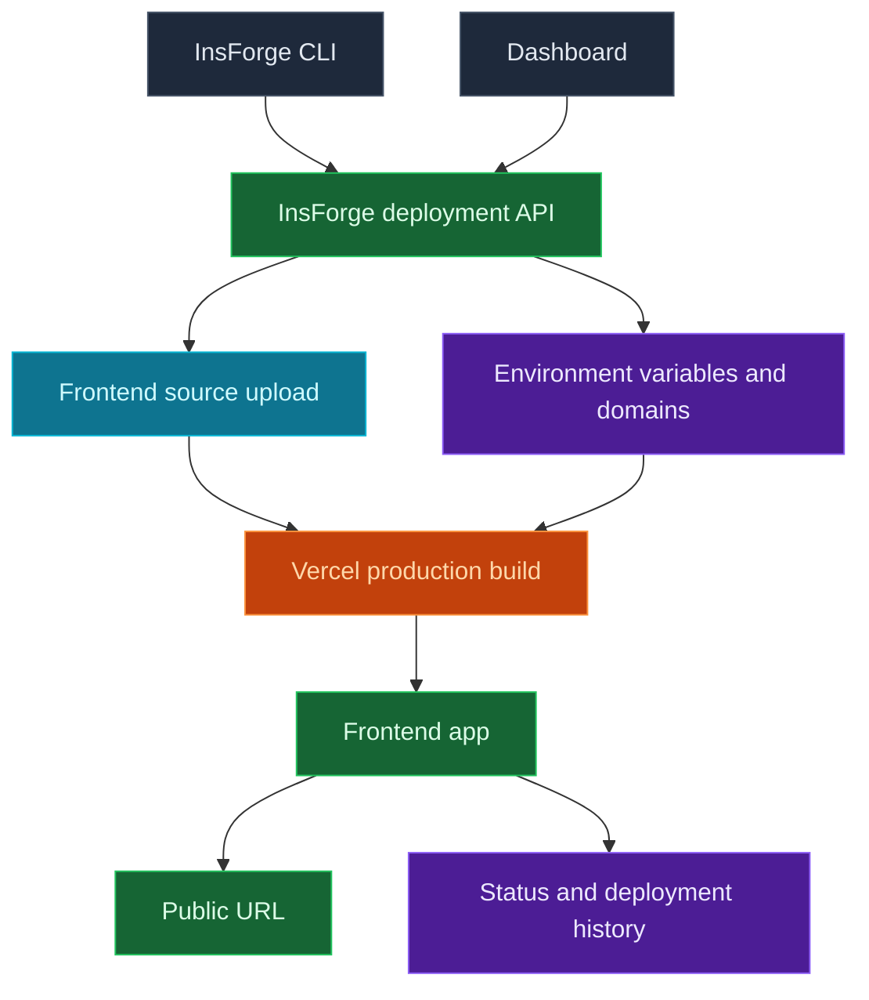

使用 InsForge Sites 来部署属于您的项目的面向浏览器的应用。InsForge CLI 通过 InsForge 上传您的前端源，它创建一个 Vercel 生产部署。仪表板跟踪 URL、状态、部署历史、环境变量和域。

<Frame caption="Sites 仪表板：状态、域、环境变量和部署历史。">
  
</Frame>

<Note>
  **需要部署容器或后端服务？** 对工作者、队列、WebSocket 服务器和长期运行的服务使用 [Compute](/core-concepts/compute/overview)。Sites 用于前端网站和产生托管 Web 应用的框架构建。
</Note>



## 功能

### CLI 部署

从您的应用源目录部署。CLI 上传源树，跳过仅本地文件（如 `node_modules`、`.git`、构建输出和 `.env` 文件），然后通过 InsForge 启动 Vercel 构建。

```bash
npx @insforge/cli deployments deploy ./frontend
```

### 框架构建

部署 React、Vue、Svelte、Next.js、静态网站和其他前端项目。InsForge 将源文件发送到 Vercel，其中框架检测和项目文件（如 `package.json` 和 `vercel.json`）决定应用的构建方式。

### 环境变量

从仪表板管理提供商环境变量。仅对安全暴露在浏览器代码中的值使用公开前缀，如 `VITE_` 或 `NEXT_PUBLIC_`。

```bash
npx @insforge/cli deployments env list
npx @insforge/cli deployments env set VITE_INSFORGE_URL https://your-project.region.insforge.app
npx @insforge/cli deployments env set VITE_INSFORGE_ANON_KEY ik_xxx
```

### 部署历史

从部署日志页面查看以前的运行、同步 Vercel 状态、检查元数据和取消正在进行的部署。

```bash
npx @insforge/cli deployments list
npx @insforge/cli deployments status deployment_123 --sync
npx @insforge/cli deployments cancel deployment_123
```

### 域

每个就绪的部署都获得一个默认 URL `https://<appkey>.insforge.site`。您也可以在 `https://<slug>.insforge.site` 设置一个 InsForge 管理的 slug。对于自定义域，在仪表板中添加域并配置它返回的 DNS 记录，通常是子域的 CNAME。

## 故障排除

### 客户端路由上的 404: NOT_FOUND

在浏览器中处理路由的单页应用（React Router、Vue Router 等）在深层链接或刷新页面命中服务器上没有对应文件的路径时，可能会返回 `404: NOT_FOUND`。由于 InsForge 在 Vercel 上构建您的站点，请在项目根目录添加一个 `vercel.json`，将所有路径重写到 `index.html`，让浏览器端路由接管：

```json
{
  "rewrites": [{ "source": "/(.*)", "destination": "/index.html" }]
}
```

然后重新部署：

```bash
npx @insforge/cli deployments deploy ./frontend
```

如果 404 出现在首次加载时，而不仅仅是在子路由上，那么很可能是构建输出目录与您的框架不匹配。Vercel 会从 `package.json` 和 `vercel.json` 检测该目录，因此请确认您的构建生成了预期的输出文件夹。

## 使用它进行部署

<CardGroup cols={2}>
  <Card title="CLI 快速入门" icon="terminal" href="/quickstart">
    连接您的项目并从您的应用目录运行 InsForge CLI 命令。
  </Card>
</CardGroup>

## 下一步

- 设置 [CLI](/quickstart) 并连接您的项目。
- 从仪表板或使用 `npx @insforge/cli deployments env set` 添加浏览器安全环境变量。
- 运行 `npx @insforge/cli deployments deploy ./frontend`。
