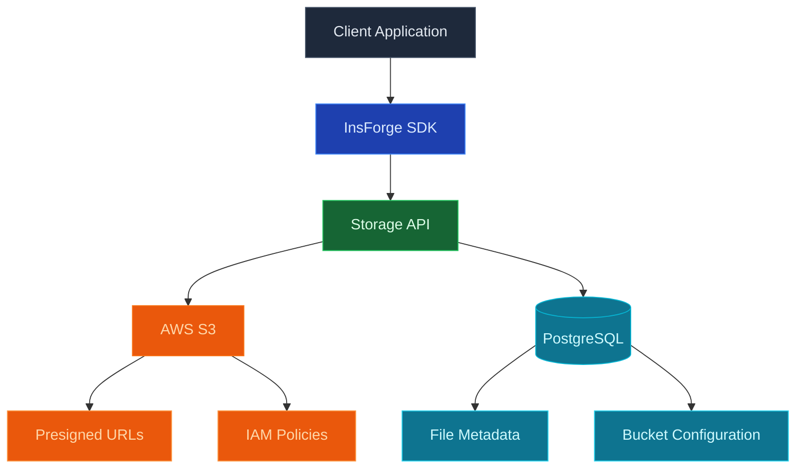

使用 InsForge 来存储和提供大型二进制文件：图像、视频、PDF、音频、备份、任何您不会放在数据库行中的东西。每个项目都获得一个 S3 兼容的桶。文件通过签署的 URL 提供，访问策略遵循与数据库相同的行级安全模型，S3 API 与 rclone、AWS CLI、Terraform 和任何语言的 SDK 配合使用。

<Frame caption="存储浏览器：桶、文件列表和上传，都在与数据库相同的 RLS 后面。">
  
</Frame>

<Note>
  **在寻找结构化数据？** 使用 [Database](/core-concepts/database/overview) 来获取行、关系和查询。存储保存对象；数据库保存行。将文件元数据（所有者、名称、大小、内容类型）保留在数据库表中，将字节保留在存储中。
</Note>

## 功能

### S3 兼容的 API

将任何 S3 客户端指向您的项目的桶。原生 AWS 凭证、原生多部分上传、原生预签署 URL。请参阅 [S3 compatibility](/core-concepts/storage/s3-compatibility)。

### 签署的 URL

生成有时间限制的 URL 以共享私有对象，无需暴露您的凭证。SDK 和 REST API 都为上传和下载发出签署的 URL。

### 行级安全

存储策略读取与数据库查询相同的身份验证 JWT。可以 `SELECT` 行的同一用户可以 `GET` 行引用的文件，所以您永远不需要维护一套单独的存储权限。

### 桶

使用单独的访问策略将对象分组到桶中。公开桶直接通过 HTTPS 提供文件；私有桶需要签署的 URL 或经过身份验证的请求。

### 直接上传

浏览器和移动客户端使用预签署的 URL 直接上传到存储。后端从不代理字节。

## 概念

<CardGroup cols={2}>
  <Card title="S3 compatibility" icon="bucket" href="/core-concepts/storage/s3-compatibility">
    使用原生凭证将任何 S3 客户端指向您的项目的桶。
  </Card>
</CardGroup>

## 使用它进行构建

<CardGroup cols={2}>
  <Card title="TypeScript SDK" icon="js" href="/sdks/typescript/storage">
    从 Node、浏览器和边缘上传、下载、列表和管理对象。
  </Card>

  <Card title="Swift SDK" icon="swift" href="/sdks/swift/storage">
    用于 iOS 和 macOS 的原生 Swift 存储客户端。
  </Card>

  <Card title="Kotlin SDK" icon="android" href="/sdks/kotlin/storage">
    用于 Android 和 JVM 的协程优先存储客户端。
  </Card>

  <Card title="REST API" icon="code" href="/sdks/rest/storage">
    普通 HTTP 存储端点，可从任何语言调用。
  </Card>
</CardGroup>

## 下一步

- 设置 [CLI](/quickstart) 以链接您的项目（推荐的路径）。
- 浏览 [TypeScript SDK 参考](/sdks/typescript/storage) 以了解上传和下载。
