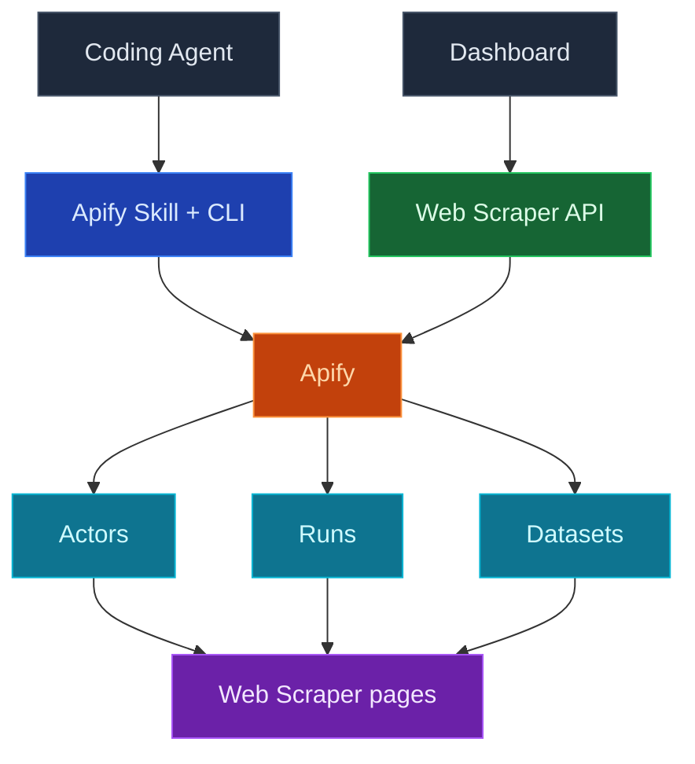

使用 InsForge Web Scraper 让您的编码代理实时访问外部数据：只需连接一次您自己的 Apify 账户，您的代理就可以按需运行爬虫（Apify 称之为 actor），同时仪表盘会显示您的 actor、运行历史和爬取到的数据集，无需离开 InsForge。

一键连接 Apify，然后将爬取提示粘贴到您的编码代理中。代理使用您由 InsForge 托管的 Apify 令牌进行身份验证，为任务挑选合适的 actor，并返回结果。

<Frame caption="Web Scraper 仪表盘：已连接的 actor 及其最近一次运行时间和总运行次数。">
  
</Frame>

<Note>
  Apify 始终是 actor、运行记录和数据集的权威来源。InsForge 展示了用于日常检查的一个精简子集，对于超出该范围的内容，会深链到 Apify 控制台。Web Scraper 集成仅在 InsForge Cloud 上可用；自托管部署在这些路由上会返回 `501 Not Implemented`。
</Note>



## 功能

### 一键连接 Apify

在仪表盘中的 Web Scraper 页面连接 Apify。InsForge 会引导您完成 Apify OAuth 流程，在服务端存储凭证，并为您持续刷新访问令牌。原始令牌永远不会出现在您的代码仓库或前端中；代理和函数在需要时会从后端获取一个实时令牌。

### 通过您的编码代理进行爬取

连接完成后，空状态界面会提供一段爬取提示，您可以将其粘贴到您的编码代理中：

```
Use the insforge webscraper apify skill to scrape <what you want> and return the results.
```

在该提示背后，`npx @insforge/cli webscraper apify login` 会获取您由 InsForge 托管的 Apify 令牌，以无头方式（无需浏览器 OAuth）对本地 Apify CLI 进行身份验证，并安装 Apify 代理技能。此后，代理会从 Apify Store 中挑选一个 actor，启动运行，并读回结果。

### Actors

您最近使用过或创建的 actor，包含其最近运行时间和总运行次数。每一行都会深链到 Apify 控制台，以进行完整的 actor 配置。

### Runs

最近的爬虫执行记录，包含状态（成功、失败、运行中）、开始时间以及以美元计的费用。无需打开 Apify，即可快速核实"昨晚的爬取任务是否成功执行，花费了多少"。

### Dataset

由您的运行产生的数据集，包含条目数量、创建时间以及产生该数据集的 actor。深链到 Apify 存储，您可以在其中查看或导出条目。

### 将爬取到的数据存入您的数据库

爬取结果默认存放在 Apify 数据集中；除非您需要，否则不会写入您项目的 Postgres 数据库。对于小规模爬取，您的代理可以直接返回结果。对于任何您想要保留或按计划刷新的内容，可以让代理部署一个[边缘函数](/core-concepts/functions/overview)或[计算服务](/core-concepts/compute/overview)，从 Apify 获取数据集并将行数据插入或更新到表中。

### 设置与断开连接

Web Scraper 配置对话框（侧边栏中的齿轮图标）显示已连接的 Apify 账户、套餐和数据保留策略，链接到 Apify 控制台，并允许管理员断开连接。断开连接只会阻止 InsForge 使用您的 Apify 凭证；您的 Apify 账户、actor 和数据集将保持完整，您随时可以重新连接。

## 概念

<CardGroup cols={2}>
  <Card title="Apify actor" icon="robot" href="https://docs.apify.com/platform/actors">
    每次运行背后的无服务器爬虫，从现成的 Store actor 到您自己的 actor 皆可。
  </Card>

  <Card title="Apify 存储" icon="database" href="https://docs.apify.com/platform/storage/dataset">
    数据集如何存储爬取的条目，以及如何通过 API 导出或获取它们。
  </Card>
</CardGroup>

## 基于此构建

<CardGroup cols={2}>
  <Card title="InsForge CLI" icon="terminal" href="/quickstart">
    `npx @insforge/cli webscraper apify connect` 将您的项目关联到 Apify，然后登录您的本地代理。
  </Card>

  <Card title="Apify Store" icon="store" href="https://apify.com/store">
    数以千计针对常见目标的现成 actor，从 Google Maps 到社交平台应有尽有。
  </Card>

  <Card title="Apify API 客户端" icon="js" href="https://docs.apify.com/api/client/js/">
    从您的边缘函数或计算服务中调用 actor 并读取数据集。
  </Card>
</CardGroup>

## 下一步

- 打开仪表盘中的 Web Scraper 页面，点击 **Connect Apify**。
- 将爬取提示粘贴到您的编码代理中，并告诉它您想要爬取的内容。
- 当某次爬取值得保留时，让您的代理通过[边缘函数](/core-concepts/functions/overview)或[计划任务](/core-concepts/functions/schedules)将数据集存入表中。
