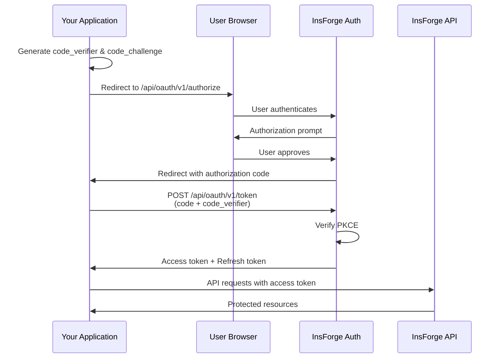

## 概述

InsForge 可以作为 OAuth 2.0 身份提供商，允许第三方应用程序通过"使用 InsForge 登录"来验证用户身份。这使得在您的平台上进行开发的开发者能够利用 InsForge 的身份验证系统，而无需管理自己的用户凭据。

## 使用场景

<CardGroup cols={2}>
  <Card title="开发者平台" icon="code">
    允许第三方开发者使用"使用 InsForge 登录"构建集成，同时您仍保持对用户数据访问的控制。
  </Card>

  <Card title="AI 智能体与 MCP" icon="robot">
    通过基于 OAuth 的授权，使用模型上下文协议（Model Context Protocol）验证 AI 智能体和 LLM 工具的身份。
  </Card>

  <Card title="合作伙伴应用" icon="handshake">
    允许合作伙伴应用程序针对您的 InsForge 项目验证用户身份，而无需共享凭据。
  </Card>

  <Card title="CLI 与桌面应用" icon="terminal">
    为需要 API 访问权限的命令行工具和桌面应用程序颁发 OAuth 令牌。
  </Card>
</CardGroup>

## OAuth 2.0 流程

InsForge 实现了带 PKCE（Proof Key for Code Exchange，代码交换验证密钥）的**授权码流程**（Authorization Code flow），这是适用于 Web 和原生应用程序的最安全的 OAuth 流程。



## 快速开始

<Steps>
  <Step title="注册您的应用程序">
    联系 InsForge 将您的应用程序注册为 OAuth 客户端。您将获得：
    - **Client ID（客户端 ID）**：您应用程序的公开标识符
    - **Client Secret（客户端密钥）**：用于服务器端令牌交换的机密密钥
    - **Allowed Redirect URIs（允许的重定向 URI）**：用户在授权后可被重定向到的 URL
  </Step>

  <Step title="配置作用域">
    定义您的应用程序需要哪些权限：

    | 作用域 | 说明 |
    |-------|-------------|
    | `user:read` | 读取用户资料信息 |
    | `organizations:read` | 列出用户所属的组织 |
    | `projects:read` | 读取项目元数据 |
    | `projects:write` | 创建和修改项目 |
  </Step>

  <Step title="实现授权流程">
    使用下方的端点将 OAuth 流程集成到您的应用程序中。
  </Step>
</Steps>

## 端点

### 授权端点

将用户重定向到此端点以启动 OAuth 流程。

```
GET https://api.insforge.dev/api/oauth/v1/authorize
```

**查询参数：**

| 参数 | 是否必需 | 说明 |
|-----------|----------|-------------|
| `client_id` | 是 | 您应用程序的客户端 ID |
| `redirect_uri` | 是 | 授权后重定向的 URL（必须预先注册） |
| `response_type` | 是 | 必须为 `code` |
| `scope` | 是 | 以空格分隔的作用域列表 |
| `state` | 是 | 用于 CSRF 防护的随机字符串 |
| `code_challenge` | 是 | PKCE 代码质询（经 base64url 编码的 SHA256 哈希值） |
| `code_challenge_method` | 是 | 必须为 `S256` |

**示例：**

```
https://api.insforge.dev/api/oauth/v1/authorize?
  client_id=clf_abc123xyz&
  redirect_uri=https://example.com/callback&
  response_type=code&
  scope=user:read%20organizations:read&
  state=random_state_string&
  code_challenge=E9Melhoa2OwvFrEMTJguCHaoeK1t8URWbuGJSstw-cM&
  code_challenge_method=S256
```

### 令牌端点

用授权码交换访问令牌和刷新令牌。

```
POST https://api.insforge.dev/api/oauth/v1/token
```

**请求正文（JSON）：**

```json
{
  "grant_type": "authorization_code",
  "code": "AUTH_CODE_FROM_CALLBACK",
  "redirect_uri": "https://example.com/callback",
  "client_id": "clf_abc123xyz",
  "client_secret": "your_client_secret",
  "code_verifier": "your_original_code_verifier"
}
```

**响应：**

```json
{
  "access_token": "eyJhbGciOiJIUzI1NiIs...",
  "refresh_token": "eyJhbGciOiJIUzI1NiIs...",
  "token_type": "Bearer",
  "expires_in": 3600
}
```

### 刷新令牌

用刷新令牌交换新的访问令牌。

```
POST https://api.insforge.dev/api/oauth/v1/token
```

**请求正文（JSON）：**

```json
{
  "grant_type": "refresh_token",
  "refresh_token": "your_refresh_token",
  "client_id": "clf_abc123xyz",
  "client_secret": "your_client_secret"
}
```

### 用户资料端点

获取已验证用户的资料信息。

```
GET https://api.insforge.dev/auth/v1/profile
Authorization: Bearer {access_token}
```

**响应：**

```json
{
  "user": {
    "id": "uuid-string",
    "email": "user@example.com",
    "profile": {
      "name": "John Doe",
      "avatar_url": "https://..."
    },
    "email_verified": true,
    "created_at": "2025-01-01T00:00:00Z"
  }
}
```

## 实现指南

### 生成 PKCE 参数

PKCE 通过确保发起流程的应用程序与完成流程的应用程序是同一个，增加了一层额外的安全保障。

<Tabs>
  <Tab title="Node.js">
```javascript
const crypto = require('crypto');

// Generate a random code verifier (keep this secret, stored server-side)
function generateCodeVerifier() {
  return crypto.randomBytes(32).toString('base64url');
}

// Generate the code challenge from the verifier
function generateCodeChallenge(verifier) {
  return crypto
    .createHash('sha256')
    .update(verifier)
    .digest('base64url');
}

// Usage
const codeVerifier = generateCodeVerifier();
const codeChallenge = generateCodeChallenge(codeVerifier);

// Store codeVerifier in session, send codeChallenge to authorization endpoint
```
  </Tab>
  <Tab title="Python">
```python
import secrets
import hashlib
import base64

def generate_code_verifier():
    return secrets.token_urlsafe(32)

def generate_code_challenge(verifier):
    digest = hashlib.sha256(verifier.encode()).digest()
    return base64.urlsafe_b64encode(digest).rstrip(b'=').decode()

# Usage
code_verifier = generate_code_verifier()
code_challenge = generate_code_challenge(code_verifier)

# Store code_verifier in session, send code_challenge to authorization endpoint
```
  </Tab>
  <Tab title="浏览器（Web Crypto）">
```javascript
async function generateCodeVerifier() {
  const array = new Uint8Array(32);
  crypto.getRandomValues(array);
  return base64UrlEncode(array);
}

async function generateCodeChallenge(verifier) {
  const encoder = new TextEncoder();
  const data = encoder.encode(verifier);
  const digest = await crypto.subtle.digest('SHA-256', data);
  return base64UrlEncode(new Uint8Array(digest));
}

function base64UrlEncode(buffer) {
  return btoa(String.fromCharCode(...buffer))
    .replace(/\+/g, '-')
    .replace(/\//g, '_')
    .replace(/=+$/, '');
}
```
  </Tab>
</Tabs>

### 完整的服务器端示例

这是一个完整的 Express.js 实现示例。首先，创建一个包含您凭据的 `.env` 文件：

```bash
# .env - DO NOT commit this file to version control
SESSION_SECRET=your-secure-random-secret-min-32-chars
INSFORGE_CLIENT_ID=clf_your_client_id
INSFORGE_CLIENT_SECRET=your_client_secret
INSFORGE_URL=https://api.insforge.dev
REDIRECT_URI=http://localhost:3000/auth/callback
```

<Note>
使用以下命令生成安全的会话密钥：`node -e "console.log(require('crypto').randomBytes(32).toString('hex'))"`
</Note>

接下来实现 OAuth 流程：

```javascript
require('dotenv').config();
const express = require('express');
const crypto = require('crypto');
const session = require('express-session');

const app = express();

// Validate required environment variables
const requiredEnvVars = ['SESSION_SECRET', 'INSFORGE_CLIENT_ID', 'INSFORGE_CLIENT_SECRET'];
for (const envVar of requiredEnvVars) {
  if (!process.env[envVar]) {
    console.error(`Missing required environment variable: ${envVar}`);
    process.exit(1);
  }
}

app.use(express.json());
app.use(session({
  secret: process.env.SESSION_SECRET,
  resave: false,
  saveUninitialized: true,
  cookie: { secure: process.env.NODE_ENV === 'production' }
}));

const config = {
  clientId: process.env.INSFORGE_CLIENT_ID,
  clientSecret: process.env.INSFORGE_CLIENT_SECRET,
  insforgeUrl: process.env.INSFORGE_URL || 'https://api.insforge.dev',
  redirectUri: process.env.REDIRECT_URI || 'http://localhost:3000/auth/callback',
  scopes: 'user:read organizations:read'
};

// Step 1: Initiate OAuth flow
app.get('/auth/login', (req, res) => {
  // Generate PKCE parameters
  const codeVerifier = crypto.randomBytes(32).toString('base64url');
  const codeChallenge = crypto
    .createHash('sha256')
    .update(codeVerifier)
    .digest('base64url');

  // Generate state for CSRF protection
  const state = crypto.randomBytes(16).toString('hex');

  // Store in session
  req.session.codeVerifier = codeVerifier;
  req.session.oauthState = state;

  // Build authorization URL
  const authUrl = new URL(`${config.insforgeUrl}/api/oauth/v1/authorize`);
  authUrl.searchParams.set('client_id', config.clientId);
  authUrl.searchParams.set('redirect_uri', config.redirectUri);
  authUrl.searchParams.set('response_type', 'code');
  authUrl.searchParams.set('scope', config.scopes);
  authUrl.searchParams.set('state', state);
  authUrl.searchParams.set('code_challenge', codeChallenge);
  authUrl.searchParams.set('code_challenge_method', 'S256');

  res.redirect(authUrl.toString());
});

// Step 2: Handle callback
app.get('/auth/callback', async (req, res) => {
  const { code, state, error } = req.query;

  // Check for errors
  if (error) {
    return res.status(400).send(`OAuth error: ${error}`);
  }

  // Validate state to prevent CSRF
  if (state !== req.session.oauthState) {
    return res.status(403).send('Invalid state parameter');
  }

  try {
    // Exchange code for tokens
    const tokenResponse = await fetch(`${config.insforgeUrl}/api/oauth/v1/token`, {
      method: 'POST',
      headers: { 'Content-Type': 'application/json' },
      body: JSON.stringify({
        grant_type: 'authorization_code',
        code,
        redirect_uri: config.redirectUri,
        client_id: config.clientId,
        client_secret: config.clientSecret,
        code_verifier: req.session.codeVerifier
      })
    });

    const tokens = await tokenResponse.json();

    if (!tokenResponse.ok) {
      throw new Error(tokens.error || 'Token exchange failed');
    }

    // Fetch user profile
    const profileResponse = await fetch(`${config.insforgeUrl}/auth/v1/profile`, {
      headers: { 'Authorization': `Bearer ${tokens.access_token}` }
    });

    const { user } = await profileResponse.json();

    // Store tokens and user in session
    req.session.accessToken = tokens.access_token;
    req.session.refreshToken = tokens.refresh_token;
    req.session.user = user;

    // Clean up PKCE data
    delete req.session.codeVerifier;
    delete req.session.oauthState;

    res.redirect('/dashboard');
  } catch (err) {
    console.error('OAuth callback error:', err);
    res.status(500).send('Authentication failed');
  }
});

// Step 3: Use access token for API calls
app.get('/api/organizations', async (req, res) => {
  if (!req.session.accessToken) {
    return res.status(401).json({ error: 'Not authenticated' });
  }

  const response = await fetch(`${config.insforgeUrl}/organizations/v1`, {
    headers: { 'Authorization': `Bearer ${req.session.accessToken}` }
  });

  const data = await response.json();
  res.json(data);
});

app.listen(3000, () => console.log('Server running on http://localhost:3000'));
```

### 单页应用的弹窗模式

对于单页应用程序（SPA），您可以在弹出窗口中打开 OAuth 流程：

```javascript
function loginWithPopup() {
  const width = 500;
  const height = 600;
  const left = window.screenX + (window.outerWidth - width) / 2;
  const top = window.screenY + (window.outerHeight - height) / 2;

  const popup = window.open(
    '/auth/login?mode=popup',
    'insforge-oauth',
    `width=${width},height=${height},left=${left},top=${top}`
  );

  // Listen for completion message from popup
  window.addEventListener('message', (event) => {
    if (event.origin !== window.location.origin) return;

    if (event.data.type === 'oauth-complete') {
      popup.close();
      // Handle successful authentication
      window.location.reload();
    }
  });
}
```

在您的回调处理程序中，向父窗口发送消息：

```javascript
// In callback route, after successful token exchange
if (req.query.mode === 'popup') {
  res.send(`
    <script>
      window.opener.postMessage({ type: 'oauth-complete' }, window.location.origin);
      window.close();
    </script>
  `);
}
```

## 安全注意事项

<CardGroup cols={2}>
  <Card title="务必使用 PKCE" icon="shield-check">
    所有 OAuth 流程都必须使用 PKCE。它可以防止授权码被拦截攻击。
  </Card>

  <Card title="验证 State 参数" icon="fingerprint">
    始终在回调中验证 state 参数，以防止 CSRF 攻击。
  </Card>

  <Card title="安全的令牌存储" icon="lock">
    将访问令牌存储在内存中或安全的 httpOnly cookie 中。切勿将令牌暴露在 URL 或 localStorage 中。
  </Card>

  <Card title="使用 HTTPS" icon="globe">
    生产环境中所有 OAuth 端点都要求使用 HTTPS。切勿通过未加密的连接传输令牌。
  </Card>

  <Card title="较短的令牌有效期" icon="clock">
    访问令牌将在 1 小时后过期。使用刷新令牌可以在无需重新验证身份的情况下获取新的访问令牌。
  </Card>

  <Card title="最小化作用域" icon="minimize">
    仅请求您应用程序所需的作用域。用户更有可能批准有限的权限。
  </Card>
</CardGroup>

## 令牌声明

访问令牌是包含以下声明的 JWT：

| 声明 | 说明 |
|-------|-------------|
| `sub` | 用户 ID（UUID） |
| `email` | 用户的电子邮件地址 |
| `role` | 用户角色（`authenticated`） |
| `client_id` | 请求该令牌的 OAuth 客户端 ID |
| `scope` | 已授予的作用域 |
| `iat` | 签发时间戳 |
| `exp` | 过期时间戳 |
| `iss` | 签发者（`insforge`） |
| `aud` | 受众（`insforge-api`） |

## 错误处理

### 授权错误

如果授权失败，用户将被重定向到您的 `redirect_uri`，并附带错误参数：

```
https://example.com/callback?error=access_denied&error_description=User%20denied%20access
```

常见错误代码：

| 错误 | 说明 |
|-------|-------------|
| `invalid_request` | 缺少参数或参数无效 |
| `unauthorized_client` | 客户端未获授权使用此授权类型 |
| `access_denied` | 用户拒绝了授权请求 |
| `invalid_scope` | 请求的作用域无效或未知 |

### 令牌错误

令牌端点的错误将以 JSON 格式返回：

```json
{
  "error": "invalid_grant",
  "error_description": "Authorization code has expired"
}
```

| 错误 | 说明 |
|-------|-------------|
| `invalid_grant` | 授权码已过期、已被使用，或验证器不匹配 |
| `invalid_client` | 客户端身份验证失败 |
| `invalid_request` | 缺少必需的参数 |

## 速率限制

OAuth 端点受到速率限制以防止滥用：

| 端点 | 限制 |
|----------|-------|
| `/authorize` | 每个 IP 每分钟 100 次请求 |
| `/token` | 每个客户端每分钟 50 次请求 |
| `/profile` | 每个令牌每分钟 100 次请求 |

## 资源

<Card title="OAuth 示例仓库" icon="github" href="https://github.com/InsForge/insforge-oauth-example">
  完整可运行的示例，展示如何将"使用 InsForge 登录"集成到您的应用程序中。
</Card>
