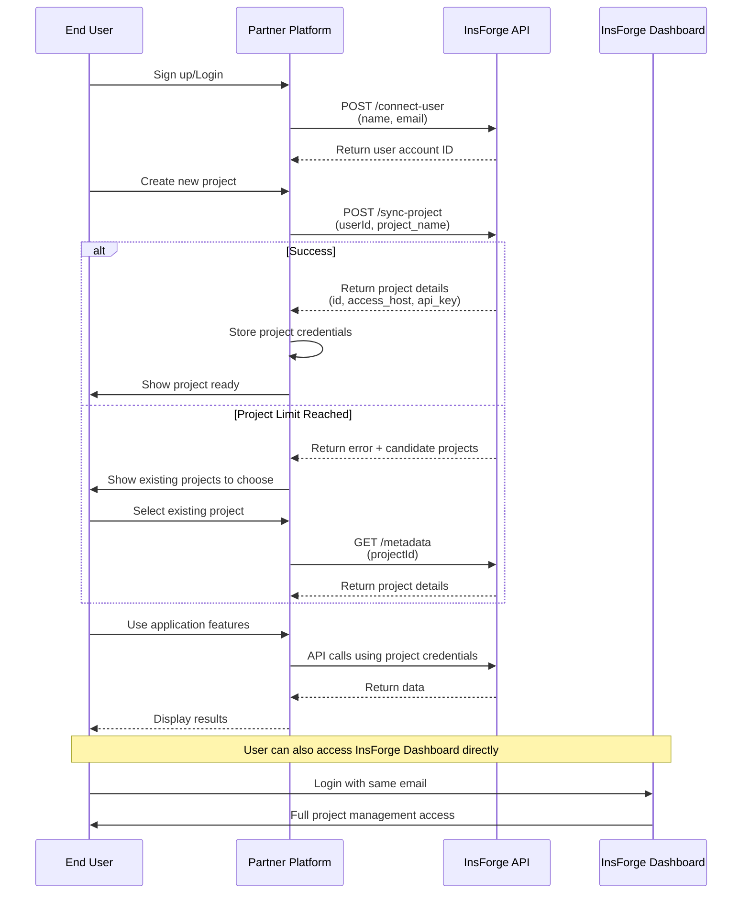
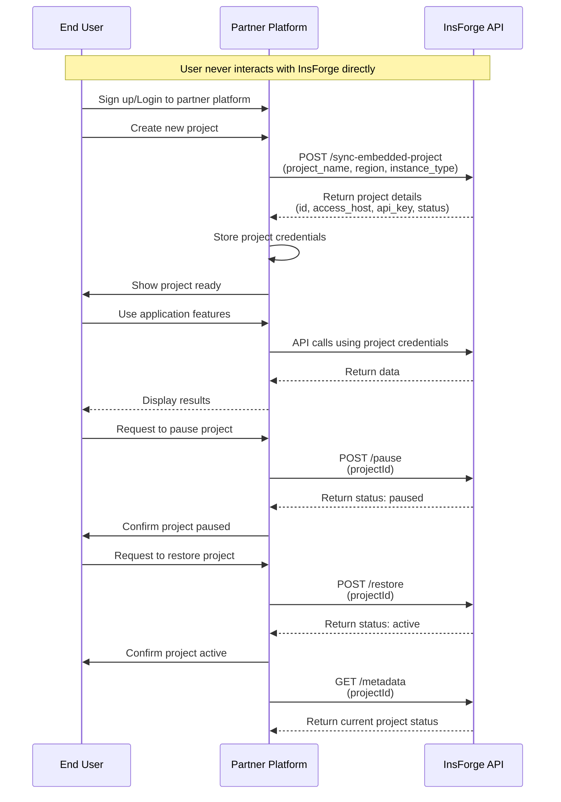

## 概述

InsForge 提供两种合作伙伴模式，能够将我们的后端即服务（Backend-as-a-Service）平台无缝集成到您的应用程序中。无论您是在寻找联合品牌解决方案，还是完全白标的体验，我们都有适合您的合作伙伴模式。

## 合作伙伴模式

<CardGroup cols={2}>
  <Card title="联合品牌合作伙伴关系" icon="handshake">
    非常适合希望将 InsForge 与自身服务一并提供的平台。
    集成过程非常简单——开发者只需一键即可连接到 InsForge 平台，无需复杂的 OAuth 流程。
  </Card>
  <Card title="白标合作伙伴关系" icon="tag">
    适合寻求对用户体验拥有完全掌控权的平台。
    提供完整的项目生命周期管理，包括项目仪表盘集成。开发者无需离开您的合作伙伴平台即可完成所有操作。
  </Card>
</CardGroup>

## 合作伙伴权益

<CardGroup cols={2}>
  <Card title="可扩展的基础设施" icon="server">
    利用我们强大的后端基础设施，无需承担维护和扩展的开销
  </Card>
  <Card title="灵活的集成方式" icon="plug">
    从多种集成选项中选择最适合您应用需求的方式
  </Card>
  <Card title="收入分成" icon="handshake">
    享受我们为合作伙伴应用提供的有竞争力的收入分成模式
  </Card>
  <Card title="技术支持" icon="headset">
    获得专属的技术支持和资源，确保集成顺利进行
  </Card>
</CardGroup>

## 快速开始

<Steps>
  <Step title="申请合作伙伴关系">
    通过我们的[合作伙伴邮箱](mailto:partnerships@insforge.dev)提交您的合作伙伴申请。
    请注明您感兴趣的是联合品牌还是白标合作伙伴关系。
  </Step>

  <Step title="获取合作伙伴凭证">
    一经批准，您将获得：
    - **合作伙伴 ID**：您唯一的合作伙伴标识符
    - **密钥**：用于 API 访问的身份验证密钥
    - 集成文档和支持
  </Step>

  <Step title="配置身份验证">
    所有 API 请求都必须包含您的密钥以进行身份验证：

    ```bash
    curl -X POST https://api.insforge.dev/partnership/v1/YOUR_PARTNER_ID/endpoint \
      -H "Content-Type: application/json" \
      -H "X-Partnership-Secret: YOUR_SECRET_KEY"
    ```
  </Step>

  <Step title="开始集成">
    根据您的合作伙伴模式，使用我们的 API 端点开始集成。
  </Step>
</Steps>

## 按合作伙伴类型划分的功能

### 联合品牌功能
在联合品牌模式下，开发者明确知道自己是 InsForge 平台的用户（通过相同的电子邮件地址关联）。登录 InsForge 平台后，开发者对通过合作伙伴创建的项目拥有完整的管理权限，并需要按照 InsForge 的计费方案付费。

合作伙伴平台可以：
- 将用户账户（姓名、邮箱）与 InsForge 同步
- 将项目同步到 InsForge
- 查询项目连接信息，以利用已完成的后端能力。

### 白标功能
在白标模式下，开发者不知道 InsForge 的存在，也无法在 InsForge 平台上看到合作伙伴创建的项目。

合作伙伴平台可以：
- 创建嵌入式项目
- 查询项目元数据，以利用已完成的后端能力。
- 暂停项目
- 恢复项目
- 删除项目
- 获取项目的访问授权令牌
- 获取项目的使用情况
- 获取所有合作伙伴项目的汇总使用情况（用于计费）

## API 参考

<Tabs>
  <Tab title="联合品牌 API">

    ### 连接用户账户
    将用户账户信息与 InsForge 同步。

    ```bash
    POST /partnership/v1/:partnerId/connect-user
    ```

    **请求体：**
    ```json
    {
      "name": "John Doe",      // required
      "email": "john@example.com" // required
    }
    ```

    **响应：**
    ```json
    {
      "account": {
        "id": "uuid-string"
      }
    }
    ```

    ### 同步项目
    为特定用户创建或同步项目。

    ```bash
    POST /partnership/v1/:partnerId/:userId/sync-project
    ```

    **请求体：**
    ```json
    {
      "project_name": "my-project",  // required
      "region": "us-east",         // optional, "us-east", "us-west", "ap-southeast", "eu-central", default: "us-east"
      "instance_type": "nano"      // optional, "nano", "micro", "small", "medium", "large", "xl", "2xl", "4xl", "8xl", "16xl", default: "nano"
    }
    ```

    **响应：**
    ```json
    {
      "success": true,
      "project": {
        "id": "uuid-string",
        "access_host": "https://project.us-east.insforge.app",
        "api_key": "project-api-key",
        "status": "active"
      }
    }
    ```

    #### 处理项目数量限制
    注意：由于 InsForge 免费方案存在项目数量限制，来自合作伙伴平台的项目同步操作可能会失败。在这种情况下，响应内容将为：

    ```json
    {
      "success": false,
      "message": "Free plan allows up to 2 active projects. Please upgrade your plan to create more projects.",
      "candidate_projects": [
        {
          "id": "uuid-string",
          "access_host": "https://project2.us-east.insforge.app",
          "api_key": "project-api-key",
          "status": "active"
        }
      ]
    }
    ```

    合作伙伴可以引导用户选择现有项目进行连接，而不是每次都创建新项目。

    ### 获取项目元数据
    检索特定项目的连接信息。

    ```bash
    GET /partnership/v1/:partnerId/:userId/:projectId/metadata
    ```

    **响应：**
    ```json
    {
      "project": {
        "id": "uuid-string",
        "access_host": "https://project.us-east.insforge.app",
        "api_key": "project-api-key",
        "status": "active"
      }
    }
    ```

  </Tab>
  <Tab title="白标 API">

    ### 同步嵌入式项目
    为白标合作伙伴创建嵌入式项目。

    ```bash
    POST /partnership/v1/:partnerId/sync-embedded-project
    ```

    **请求体：**
    ```json
    {
      "project_name": "embedded-project",  // required
      "region": "us-east",               // optional, "us-east", "us-west", "ap-southeast", "eu-central", default: "us-east"
      "instance_type": "nano"            // optional, "nano", "micro", "small", "medium", "large", "xl", "2xl", "4xl", "8xl", "16xl", default: "nano"
    }
    ```

    **响应：**
    ```json
    {
      "success": true,
      "project": {
        "id": "uuid-string",
        "access_host": "https://project.us-east.insforge.app",
        "api_key": "project-api-key",
        "status": "active"
      }
    }
    ```

    ### 获取项目元数据
    检索特定项目的元数据。

    ```bash
    GET /partnership/v1/:partnerId/:projectId/metadata
    ```

    **响应：**
    ```json
    {
      "project": {
        "id": "uuid-string",
        "access_host": "https://project.us-east.insforge.app",
        "api_key": "project-api-key",
        "region": "us-east",
        "instance_type": "nano",
        "last_activity_at": "2025-01-21T10:30:00Z",
        "status": "active"
      }
    }
    ```

    ### 暂停项目
    暂停一个正在运行的项目以节省资源。

    ```bash
    POST /partnership/v1/:partnerId/:projectId/pause
    ```

    **请求体：**
    ```json
    {
      "wait_for_completion": true  // optional
    }
    ```

    **响应：**
    ```json
    {
      "project": {
        "id": "uuid-string",
        "status": "paused"
      }
    }
    ```

    ### 恢复项目
    将已暂停的项目恢复为运行状态。

    ```bash
    POST /partnership/v1/:partnerId/:projectId/restore
    ```

    **请求体：**
    ```json
    {
      "wait_for_completion": true  // optional
    }
    ```

    **响应：**
    ```json
    {
      "project": {
        "id": "uuid-string",
        "status": "active"
      }
    }
    ```

    ### 删除项目
    永久删除一个项目。此操作无法撤销。

    ```bash
    DELETE /partnership/v1/:partnerId/:projectId
    ```

    **响应 (200 OK)：**
    ```json
    {
      "message": "Project deleted successfully",
      "requestId": "xhiahif-fehfe-feae"
    }
    ```

    ### 生成项目授权
    生成一个用于项目访问的短期非对称 JWT 令牌。该令牌使用 RSA 私钥签名，可通过公共 JWKS 端点进行验证。令牌有效期为 10 分钟。

    ```bash
    POST /partnership/v1/:partnerId/:projectId/authorization
    ```

    **响应：**
    ```json
    {
      "code": "eyJhbGciOiJSUzI1NiIsInR5cCI6IkpXVCIsImtpZCI6Imluc2ZvcmdlLWtleS0yMDI1LTA4LTEzIn0...",
      "expires_in": 600,
      "type": "Bearer"
    }
    ```

    ### 获取项目使用情况
    检索特定项目在指定日期范围内的使用指标。返回汇总统计数据以及按日细分的使用指标。如果未指定日期，则返回最近 7 天的数据。

    ```bash
    GET /partnership/v1/:partnerId/:projectId/usage?start_date=2025-11-10&end_date=2025-11-18
    ```

    **查询参数：**
    - `start_date`（可选）：起始日期，格式为 YYYY-MM-DD（默认为 7 天前）
    - `end_date`（可选）：结束日期，格式为 YYYY-MM-DD（默认为今天）

    **响应：**
    ```json
    {
      "project": {
        "id": "uuid-string",
        "name": "project-name",
        "status": "active",
        "last_activity_at": "2025-11-18T10:30:00Z"
      },
      "period": {
        "start": "2025-11-10T00:00:00Z",
        "end": "2025-11-18T23:59:59Z"
      },
      "summary": {
        "max_database_size_bytes": 1048576,
        "max_file_storage_bytes": 5242880,
        "total_ai_tokens": 15000,
        "total_mcp_calls": 120,
        "total_egress_bytes": 2097152,
        "total_ai_credits": 1.5,
        "total_email_requests": 50,
        "total_function_calls": 300,
        "total_ec2_compute": 3600
      },
      "daily_usage": [
        {
          "usage_date": "2025-11-10",
          "database_size_bytes": 1048576,
          "file_storage_bytes": 5242880,
          "ai_tokens": 1500,
          "mcp_calls": 12,
          "egress_bytes": 204800,
          "ai_credits": 0.15,
          "email_requests": 5,
          "function_calls": 30,
          "ec2_compute": 3600
        }
      ]
    }
    ```

    ### 获取合作伙伴总使用量
    检索您合作伙伴关系下所有项目在指定日期范围内的汇总使用指标。此端点专为计费和报告用途设计，提供资源消耗的统一视图。

    ```bash
    GET /partnership/v1/:partnerId/usage?start_date=2025-11-01&end_date=2025-11-30
    ```

    **查询参数：**
    - `start_date`（可选）：起始日期，格式为 YYYY-MM-DD（默认为 7 天前）
    - `end_date`（可选）：结束日期，格式为 YYYY-MM-DD（默认为今天）

    **响应：**
    ```json
    {
      "partnership": {
        "id": "ps_abc123xyz",
        "name": "Partner Name"
      },
      "period": {
        "start": "2025-11-01T00:00:00Z",
        "end": "2025-11-30T23:59:59Z"
      },
      "summary": {
        "database_bytes": 10485760,
        "storage_bytes": 52428800,
        "ai_tokens": 150000,
        "mcp_calls": 1200,
        "egress_bytes": 20971520,
        "ai_credits": 15.5,
        "email_requests": 500,
        "function_calls": 3000,
        "ec2_compute": 36000
      }
    }
    ```

    **使用指标类型：**

    | 指标 | 类型 | 说明 |
    |--------|------|-------------|
    | `database_bytes` | 峰值 | 峰值数据库总占用量（每日求和，取跨日最大值） |
    | `storage_bytes` | 峰值 | 峰值存储总占用量（每日求和，取跨日最大值） |
    | `ai_tokens` | 累计 | 消耗的 AI token 总数 |
    | `mcp_calls` | 累计 | 发起的 MCP/工具调用总数 |
    | `egress_bytes` | 累计 | 数据传输总量（源站 + CDN） |
    | `ai_credits` | 累计 | 消耗的 AI 额度总量 |
    | `email_requests` | 累计 | 发送的邮件总数 |
    | `function_calls` | 累计 | 无服务器函数调用总数 |
    | `ec2_compute` | 累计 | 使用的计算秒数总量 |

    <Note>
    此端点包含指定日期范围内已删除项目的使用情况，以确保计费准确无误。
    </Note>

  </Tab>
</Tabs>

## 集成示例

### 联合品牌集成流程

以下时序图展示了联合品牌合作伙伴关系的集成流程：



```typescript
// 1. Connect user account
const connectUser = async (name: string, email: string) => {
  const response = await fetch(
    `https://api.insforge.dev/partnership/v1/${PARTNER_ID}/connect-user`,
    {
      method: 'POST',
      headers: {
        'X-Partnership-Secret': `${SECRET_KEY}`,
        'Content-Type': 'application/json'
      },
      body: JSON.stringify({ name, email })
    }
  );

  const { account } = await response.json();
  return account.id;
};

// 2. Create project for user
const createProject = async (userId: string, projectName: string) => {
  const response = await fetch(
    `https://api.insforge.dev/partnership/v1/${PARTNER_ID}/${userId}/sync-project`,
    {
      method: 'POST',
      headers: {
        'X-Partnership-Secret': `${SECRET_KEY}`,
        'Content-Type': 'application/json'
      },
      body: JSON.stringify({
        project_name: projectName,
        region: 'us-east',
        instance_type: 'nano'
      })
    }
  );

  const data = await response.json();
  if (data.success) {
    return data.project;
  }
  throw new Error(data.message);
};

// 3. Use project credentials
console.log(project.access_host);
console.log(project.api_key);
```

### 白标集成流程

以下时序图展示了白标合作伙伴关系的集成流程：



```typescript
// 1. Create embedded project
const createEmbeddedProject = async (projectName: string) => {
  const response = await fetch(
    `https://api.insforge.dev/partnership/v1/${PARTNER_ID}/sync-embedded-project`,
    {
      method: 'POST',
      headers: {
        'X-Partnership-Secret': `${SECRET_KEY}`,
        'Content-Type': 'application/json'
      },
      body: JSON.stringify({
        project_name: projectName,
        region: 'eu-west',
        instance_type: 'small'
      })
    }
  );

  const data = await response.json();
  if (data.success) {
    return data.project;
  }
  throw new Error(data.message);
};

// 2. Manage project lifecycle
const pauseProject = async (projectId: string) => {
  const response = await fetch(
    `https://api.insforge.dev/partnership/v1/${PARTNER_ID}/${projectId}/pause`,
    {
      method: 'POST',
      headers: {
        'X-Partnership-Secret': `${SECRET_KEY}`,
        'Content-Type': 'application/json'
      },
      body: JSON.stringify({
        wait_for_completion: true
      })
    }
  );

  const { project } = await response.json();
  console.log(`Project ${project.id} status: ${project.status}`);
};

const restoreProject = async (projectId: string) => {
  const response = await fetch(
    `https://api.insforge.dev/partnership/v1/${PARTNER_ID}/${projectId}/restore`,
    {
      method: 'POST',
      headers: {
        'X-Partnership-Secret': `${SECRET_KEY}`,
        'Content-Type': 'application/json'
      },
      body: JSON.stringify({
        wait_for_completion: true
      })
    }
  );

  const { project } = await response.json();
  console.log(`Project ${project.id} status: ${project.status}`);
};

// 3. Delete project
const deleteProject = async (projectId: string) => {
  const response = await fetch(
    `https://api.insforge.dev/partnership/v1/${PARTNER_ID}/${projectId}`,
    {
      method: 'DELETE',
      headers: {
        'X-Partnership-Secret': `${SECRET_KEY}`
      }
    }
  );

  if (response.ok) {
    const data = await response.json();
    console.log(data.message); // "Project deleted successfully"
    console.log(`Request ID: ${data.requestId}`);
  } else {
    throw new Error(`Failed to delete project: ${response.status}`);
  }
};

// 4. Get partnership total usage (for billing)
const getPartnershipUsage = async (startDate: string, endDate: string) => {
  const params = new URLSearchParams({ start_date: startDate, end_date: endDate });
  const response = await fetch(
    `https://api.insforge.dev/partnership/v1/${PARTNER_ID}/usage?${params}`,
    {
      method: 'GET',
      headers: {
        'X-Partnership-Secret': `${SECRET_KEY}`
      }
    }
  );

  const data = await response.json();
  console.log(`Period: ${data.period.start} to ${data.period.end}`);
  console.log(`Database: ${data.summary.database_bytes} bytes (peak)`);
  console.log(`Storage: ${data.summary.storage_bytes} bytes (peak)`);
  console.log(`AI Credits: ${data.summary.ai_credits}`);
  console.log(`Egress: ${data.summary.egress_bytes} bytes`);
  return data;
};
```

## 参数与响应参考

### 项目区域取值
InsForge 提供全球化的部署能力。每个项目都可以部署到不同的区域：
- `us-east` - 美国东海岸
- `us-west` - 美国西海岸
- `ap-southeast` - 亚太东南
- `eu-central` - 欧洲中部

未来将根据需求添加更多区域。

### 项目实例类型取值
根据您项目的业务需求，InsForge 提供以下资源类型：
- `nano` - 用于开发的最小资源
- `micro` - 用于测试和开发的基础资源
- `small` - 轻量级工作负载
- `medium` - 标准应用程序
- `large` - 生产环境工作负载
- `xl` - 高性能应用程序
- `2xl` - 企业级应用程序
- `4xl` - 大规模运营
- `8xl` - 关键任务系统
- `16xl` - 最高性能

### 项目状态取值

项目可以具有以下状态值：

- **active**：项目正在运行且可访问
- **paused**：项目已暂停（仅限白标）

## 错误处理

所有 API 端点都返回一致的错误响应：

```json
{
  "success": false,
  "message": "Detailed error message describing what went wrong"
}
```

常见错误场景：
- 身份验证凭证无效
- 未找到项目
- 请求的操作权限不足
- 请求参数无效

## 下一步

- 与我们的团队安排一次[技术评审](https://calendly.com/tony-chang-insforge/45min)
