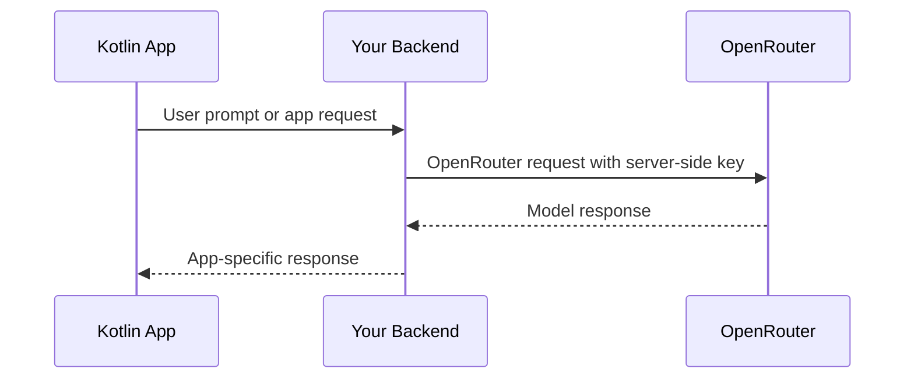

## 概述

InsForge 为模型网关项目预配了一个 OpenRouter API 密钥。新的 Kotlin 应用程序应从受信任的服务器端代码、后端 API 或其他安全边界调用 OpenRouter。不要将 OpenRouter 密钥嵌入 Android 或桌面客户端二进制文件中。

以前的 InsForge Kotlin AI SDK 方法已弃用为兼容性包装器。使用 InsForge SDK 来实现数据库、身份验证、存储、函数和实时功能；使用 OpenRouter 来进行模型调用。

## 推荐架构



## 服务器端 OpenRouter 调用

从您的后端使用 OpenAI SDK 或 REST。对于 TypeScript 后端：

```typescript
import OpenAI from 'openai';

const openai = new OpenAI({
  baseURL: 'https://openrouter.ai/api/v1',
  apiKey: process.env.OPENROUTER_API_KEY,
});

const completion = await openai.chat.completions.create({
  model: 'openai/gpt-4o-mini',
  messages: [{ role: 'user', content: 'Summarize this note.' }],
});
```

## 从 Kotlin 调用您的后端

```kotlin
import io.ktor.client.HttpClient
import io.ktor.client.call.body
import io.ktor.client.plugins.contentnegotiation.ContentNegotiation
import io.ktor.client.request.header
import io.ktor.client.request.post
import io.ktor.client.request.setBody
import io.ktor.http.ContentType
import io.ktor.http.contentType
import io.ktor.serialization.kotlinx.json.json
import kotlinx.serialization.Serializable

@Serializable
data class ChatRequest(val prompt: String)

@Serializable
data class ChatResponse(val text: String)

val http = HttpClient {
    install(ContentNegotiation) {
        json()
    }
}

suspend fun sendPrompt(prompt: String, sessionToken: String): ChatResponse {
    return http.post("https://your-app.example/api/chat") {
        header("Authorization", "Bearer $sessionToken")
        contentType(ContentType.Application.Json)
        setBody(ChatRequest(prompt))
    }.body()
}
```

对您的后端路由使用应用会话令牌或另一个用户范围的凭证。切勿从 Kotlin 客户端发送 OpenRouter 密钥。

## 旧版 InsForge AI 方法

这些 Kotlin SDK 方法已为新的 AI 集成弃用：

- `client.ai.listModels()`
- `client.ai.chatCompletion(...)`
- `client.ai.chatCompletionStream(...)`
- `client.ai.generateEmbeddings(...)`
- `client.ai.generateImage(...)`

它们针对已弃用的 InsForge AI 代理。新的集成应使用仪表板中的 OpenRouter 密钥，并遵循 OpenRouter 当前的 API 文档来了解模型参数和功能。
