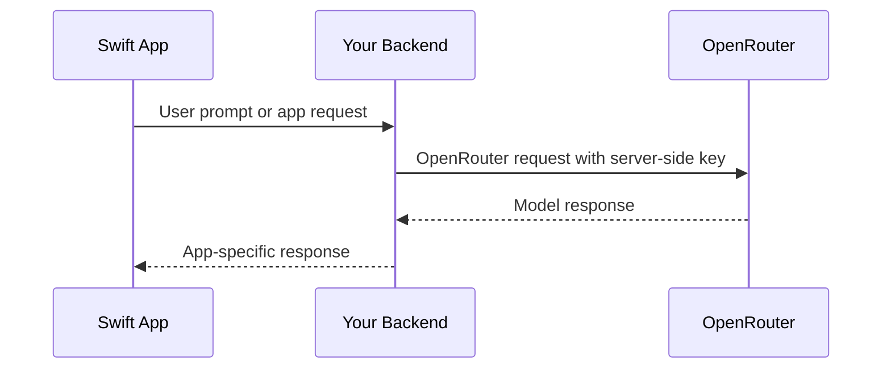

## 概览

InsForge 为模型网关项目提供 OpenRouter API 密钥。新的 Swift 应用应该从受信的服务端代码、后端 API 或其他安全边界直接调用 OpenRouter。不要在 iOS、macOS、tvOS 或 watchOS 应用二进制文件中嵌入 OpenRouter 密钥。

之前的 InsForge Swift AI SDK 方法已弃用，是兼容性包装器。使用 InsForge SDK 处理数据库、身份验证、存储、函数和实时通信；使用 OpenRouter 进行模型调用。

## 推荐架构



## 服务端 OpenRouter 调用

使用 OpenAI SDK 或 REST 从后端调用。对于 TypeScript 后端：

```typescript
import OpenAI from 'openai';

const openai = new OpenAI({
  baseURL: 'https://openrouter.ai/api/v1',
  apiKey: process.env.OPENROUTER_API_KEY,
});

const completion = await openai.chat.completions.create({
  model: 'openai/gpt-4o-mini',
  messages: [{ role: 'user', content: 'Summarize this note.' }],
});
```

## 从 Swift 调用后端

```swift
struct ChatRequest: Encodable {
    let prompt: String
}

struct ChatResponse: Decodable {
    let text: String
}

func sendPrompt(_ prompt: String, sessionToken: String) async throws -> ChatResponse {
    let url = URL(string: "https://your-app.example/api/chat")!
    var request = URLRequest(url: url)
    request.httpMethod = "POST"
    request.setValue("Bearer \\(sessionToken)", forHTTPHeaderField: "Authorization")
    request.setValue("application/json", forHTTPHeaderField: "Content-Type")
    request.httpBody = try JSONEncoder().encode(ChatRequest(prompt: prompt))

    let (data, response) = try await URLSession.shared.data(for: request)
    guard let httpResponse = response as? HTTPURLResponse,
          (200..<300).contains(httpResponse.statusCode) else {
        throw URLError(.badServerResponse)
    }

    return try JSONDecoder().decode(ChatResponse.self, from: data)
}
```

为后端路由使用应用会话令牌或其他用户范围的凭证。不要从 Swift 客户端发送 OpenRouter 密钥。

## 遗留 InsForge AI 方法

这些 Swift SDK 方法已弃用，不应用于新的 AI 集成：

- `insforge.ai.chatCompletion(...)`
- `insforge.ai.generateEmbeddings(...)`
- `insforge.ai.generateImage(...)`
- `insforge.ai.listModels()`

它们针对已弃用的 InsForge AI 代理。新集成应使用仪表板中的 OpenRouter 密钥，并按照 OpenRouter 当前 API 文档了解模型参数和功能。
